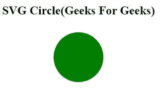
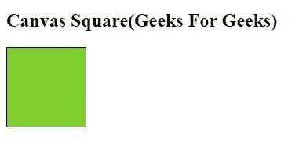

# SVG 和 HTML 5 画布的区别

> 原文:[https://www . geesforgeks . org/difference-SVG-and-html-5-canvas/](https://www.geeksforgeeks.org/difference-between-svg-and-html-5-canvas/)

**SVG:** 可缩放矢量图形(SVG)是一种基于 XML 的图像格式，用于为 web 定义基于矢量的二维图形。与光栅图像不同(例如。jpg，。gif，。巴布亚新几内亚等。)，矢量图像可以放大或缩小到任何程度，而不会损失图像质量。

使用一系列遵循 XML 模式的语句来绘制 SVG 图像，这意味着可以使用任何文本编辑器(如记事本)来创建和编辑 SVG 图像。与 JPEG、GIF、PNG 等其他图像格式相比，使用 SVG 还有其他一些优势。

**示例:**

```html
<!DOCTYPE html>
<html>

<head>
    <style>
        #svgelem {
            position: relative;
            left: 50%;
            -webkit-transform: translateX(-20%);
            -ms-transform: translateX(-20%);
            transform: translateX(-20%);
        }
    </style>
    <title>HTML5 SVG</title>
</head>

<body>
    <h2 align="center">
        SVG Circle(Geeks For Geeks)
    </h2>

    <svg id="svgelem" height="200">
        <circle id="greencircle" cx="60"
            cy="60" r="50" fill="green" />
    </svg>
</body>

</html>
```

**输出:**


**画布:**HTML 元素用于通过脚本(通常是 JavaScript)动态绘制图形。元素只是图形的容器。您必须使用脚本来实际绘制图形。Canvas 有几种绘制路径、框、圆、文本和添加图像的方法。

**示例:**

```html
<!DOCTYPE html>
<html>

<head>
    <title>HTML5 Canvas Tag</title>
</head>

<body>
    <h2>Canvas Square(Geeks For Geeks)</h2>

    <canvas id="newCanvas" width="100" height="100"
        style="border:1px solid #000000;">
    </canvas>

    <script>
        var c = document.getElementById('newCanvas');
        var ctx = c.getContext('2d');
        ctx.fillStyle = '#7cce2b';
        ctx.fillRect(0, 0, 100, 100);
    </script>
</body>

</html>
```

**输出:**


**SVG 和 HTML5 画布的区别:**

| 挽救（saving 的简写） | 帆布 |
| --- | --- |
| 基于向量(由形状组成) | 基于光栅(由像素组成) |
| SVG 具有更好的可扩展性。因此可以以任何分辨率高质量打印。 | Canvas 的可扩展性很差。因此，它不适合以更高的分辨率打印。 |
| SVG 在对象数量较少或表面较大的情况下具有更好的性能。 | 使用较小的表面或较大数量的对象，画布可以提供更好的性能。 |
| SVG 可以通过脚本和 CSS 进行修改。 | 画布只能通过脚本修改。 |
| 多个图形元素，它们成为页面 DOM 树的一部分。 | 行为上类似的单一元素。画布图表可以保存为 PNG 或 JPG 格式。 |