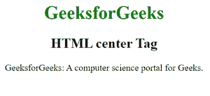
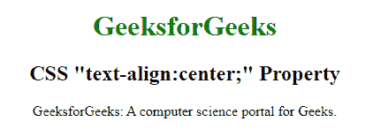

# HTML

<center>标签与 CSS“文本对齐:居中”的区别</center>

物业

> 原文:[https://www . geesforgeks . org/differences-html-center-tag-and-CSS-text-align-center-property/](https://www.geeksforgeeks.org/differences-between-html-center-tag-and-css-text-align-center-property/)

如果你在设计一个简单的网页，那么没有太大的区别是显而易见的，但是了解这两者之间的基本区别是非常必要的。由于我们只关注文本，这些元素没有单独的含义。
[**HTML <居中>标签:**](https://www.geeksforgeeks.org/html-center-tag/)HTML 中的<居中>标签用于设置文本的居中对齐。HTML 5 不支持这个标签。CSS 属性用于设置元素的对齐方式，而不是 HTML 5 中的中心标记。它是一个块级元素，用于水平显示标签中的文本。大多数常见的浏览器，如谷歌 Chrome、Mozilla Firefox、互联网浏览器都支持这个标签。

*   **示例:**下面的代码在 HTML 4 和更早的版本中用于将文本居中对齐。

    ## 超文本标记语言

    ```html
    <!DOCTYPE html>
    <html>

    <head>
        <style>
            h1 {
                color: green;
            }
        </style>
    </head>

    <body>
        <center>
            <h1>GeeksforGeeks</h1>
            <h2>HTML center Tag</h2>

            <p>
                GeeksforGeeks: A computer science portal for Geeks.
            </p>

        </center>
    </body>

    </html>
    ```

*   **输出:**
    

[**CSS“文字-对齐:居中；”属性:**](https://www.geeksforgeeks.org/css-text-align-property/) 是一个用来居中对齐文本的 CSS 属性，可以用在很多组件中，包括表格、按钮等。

*   **例:**实现“文字对齐:居中”属性如下:

    ## 超文本标记语言

    ```html
    <!DOCTYPE html> 
    <html> 

    <head> 
        <title>
            text-align: center property
        </title> 

        <style> 
            h1 { 
                color:green; 
            } 
        </style> 
    </head> 

    <body> 
        <h1 style="text-align:center;">
            GeeksforGeeks
        </h1> 

        <h2 style="text-align:center;">
            CSS "text-align:center;" Property
        </h2> 

        <p style="text-align:center;">
            GeeksforGeeks: 
            A computer science portal for Geeks.
        </p>

    </body> 

    </html>       
    ```

*   **输出:**
    

您可以注意到两个输出是相同的，但是在 HTML5 代码的情况下，我们使用内联 CSS 将文本对齐到中心。在之前的 HTML4 和旧版本的代码中，我们特别使用了

<center>标签。
**HTML<居中>标签与 CSS“文本对齐:居中；”的区别属性:**

<figure class="table">

| HTML 【T0] tag | CSS "Text-Alignment: Center;" attribute |
| --- | --- |
| HTML 【T0] tags are block-level elements. | CSS "Text-Alignment: Center;" Attribute is an inline element. |
| It is best to attach it to a certain part of the web page. | It's best to paste it on a short paragraph of a line in the webpage. |
| HTML 5 does not support the central tag, and the upcoming HTML version does not support it either. | HTML 5 supports the "text alignment: center" attribute, and the upcoming HTML version will also support it. |
| This label should be used to wrap a section and center that section. | This tag should be used to package any specific words you want to put in the center of the webpage. |

</figure>

</center>