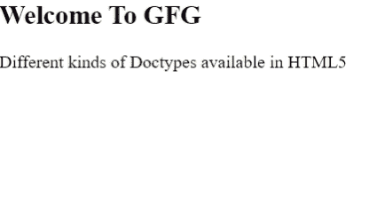

# html 5 中不同种类的 Doctype】

> 原文:[https://www . geeksforgeeks . org/不同种类的文档类型-在 html5 中可用/](https://www.geeksforgeeks.org/different-kinds-of-doctype-available-in-html5/)

在本文中，我们将了解 Doctype &它在 HTML5 中的类型。在学习 [HTML5](https://www.geeksforgeeks.org/html5-introduction/) 中不同种类的 Doctype 之前，首先要熟悉术语“ [Doctype](https://www.geeksforgeeks.org/html-doctypes/) ”。当你查看任何一个[网站](https://www.geeksforgeeks.org/what-is-a-website/#:~:text=A%20website%20is%20a%20collection,HTML(HyperText%20Markup%20Language).&text=Such%20computers%20are%20known%20as,a%20common%20interface%20and%20design.)的时候，你可能已经注意到在 [< html >](https://www.geeksforgeeks.org/html-html-tag/) 标签开始之前，<！DOCTYPE html >编写完成。

**文档类型:**文档类型或文档类型声明基本上是创建 HTML 文档时需要的第一行代码。它告诉浏览器当前网页的具体 HTML 版本。所有不同的网络浏览器将使用相同版本的 HTML 呈现网页，因此网页在不同的网络浏览器中看起来是相同的。这是在 HTML 中使用 Doctype 的主要目的。

**注意:**Doctype 不是 HTML 标记或元素，不区分大小写。

**类型:**在 HTML 的早期版本中，每个版本的 HTML 中都声明了不同种类的 Doctype，但是在 HTML5 中，只有一种类型的 Doctype 可用。

**用法:**在 HTML 的早期版本中，Doctype 的主要用法是创建对 [DTD(文档类型定义)](https://www.geeksforgeeks.org/document-type-definition-dtd/)的引用，并且强制引用 DTD，但是在 HTML5 中，它不需要引用 DTD。文档类型定义(DTD)主要用于定义具有一系列有效属性和元素的结构。

**语法:**现在大部分网页都是用 HTML5 创建的，为此，我们只需要创建一个简单的 doctype 语法。以下是 Doctype 的语法:

```html
<!DOCTYPE html>
```

**方法:**我们只需要声明 Doctype，如 HTML 代码开头的语法所示。

**示例:**这个示例展示了一个简单的 HTML 代码，带有 Doctype 的声明。

## 超文本标记语言

```html
<!-- Declaration of Doctype -->
<!DOCTYPE html>
<html>
<head>
    <title>Doctypes in HTML5</title>
</head>

<body>
    <h2>Welcome To GFG</h2>
    <p>
          Different kinds of Doctypes 
          available in HTML5
      </p>
</body>
</html>
```

**输出:**



**支持的浏览器:**

*   谷歌 Chrome
*   微软公司出品的 web 浏览器
*   微软边缘
*   火狐浏览器
*   歌剧
*   旅行队