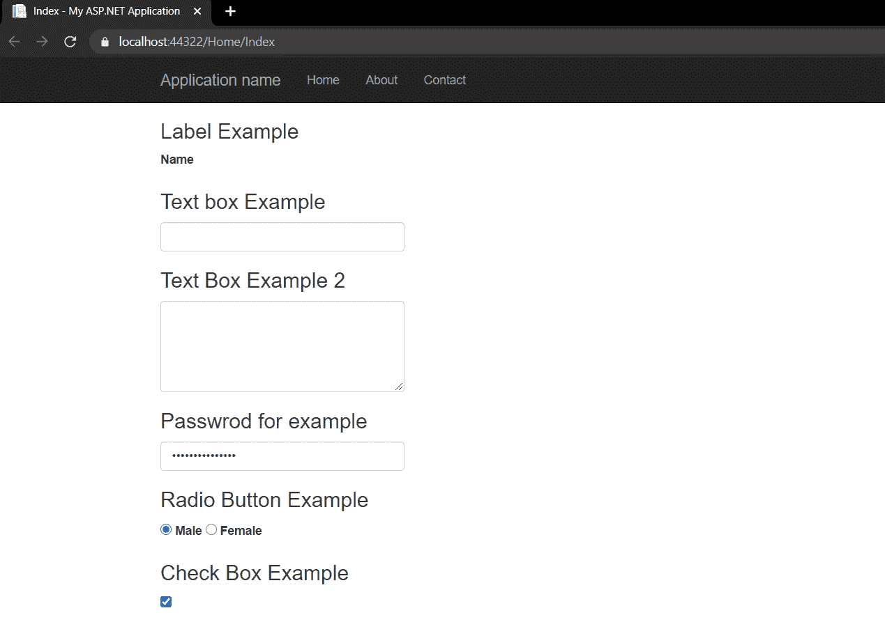

# ASP.NET MVC 中不同类型的 HTML 助手

> 原文:[https://www . geesforgeks . org/不同类型的 html-helper-in-ASP-net-MVC/](https://www.geeksforgeeks.org/different-types-of-html-helpers-in-asp-net-mvc/)

[ASP.NET](https://www.geeksforgeeks.org/introduction-to-asp-net/)提供了广泛的内置 [HTML](https://www.geeksforgeeks.org/html-tutorials/) 助手，可以根据用户的选择使用，因为有多种覆盖可供他们使用。ASP.NET 提供了三种内置的 HTML 助手。

### 1.标准超文本标记语言助手

主要用于呈现诸如文本框、复选框、单选按钮和下拉列表等 HTML 元素的 HTML 助手。被称为标准 HTML 助手。

**标准 HTML 助手列表**

```html
@Html.ActionLink() - Used to create link on html page
@Html.TextBox() - Used to create text box
@Html.CheckBox() - Used to create check box
@Html.RadioButton() - Used to create Radio Button
@Html.BeginFrom() - Used to start a form
@Html.EndFrom() - Used to end a form
@Html.DropDownList() - Used to create drop down list
@Html.Hidden() - Used to create hidden fields
@Html.label() - Used for creating HTML label is on the browser
@Html.TextArea() - The TextArea Method renders textarea element on browser
@Html.Password() - This method is responsible for creating password input field on browser
@Html.ListBox() - The ListBox helper method creates html ListBox with scrollbar on browser
```

## 超文本标记语言

```html
@{
    Layout = null;
}

<!DOCTYPE html>

<html>
<head>
    <meta name="viewport" content="width=device-width" />
    <title>Built-in HTML Helper</title>
</head>
<body>
    <div>
        <h3>Label example</h3>
        @Html.Label("firstName", "First Name")

        <h3>Text Box Example</h3>
        @Html.TextBox("txtFirstName", "", new { @class = "form-control", placeholder = "First Name" })

        <h3>Text Area Example</h3>
        @Html.TextArea("address", new { @class = "form-control", rows = "5" })

        <h3>password Example</h3>
        @Html.Password("password", " ", new { @class = "form-control" })

        <h3>Radio Button Example</h3>
        @Html.RadioButton("MaritalStatus", "Married", new { id = "IsMarried" }) Married

        <h3>Check Box Example</h3>
        @Html.CheckBox("htmlSkill") HTML 5

        <h3>List Box Example</h3>
        @Html.ListBox("Skills", new List<SelectListItem> {
            new SelectListItem { Text="ASP.NET",Value="1"},
            new SelectListItem { Text="MVC",Value="2"},
            new SelectListItem { Text="SQL Server",Value="3"},
            new SelectListItem { Text="Angular",Value="4"},
            new SelectListItem { Text="Web API",Value="5"}
        }, new { @class = "form-control" })

        <h3>drop down List Example</h3>
        @Html.DropDownList("Gender", new List<SelectListItem> {
                    new SelectListItem {Text="Select Gender",Value="-1" },
                    new SelectListItem {Text="Male",Value="1" },
                    new SelectListItem {Text="Female", Value="2" }
                    }, new { @class = "custom-select" })

    </div>
</body>
</html>
```


### 2.强类型的 HTML 帮助程序

强类型的 HTML 帮助器接受一个 lambda 作为参数，告诉帮助器在类型化视图中使用模型的哪个元素。强类型视图用于呈现特定种类的模型对象，而不是使用整个视图-数据结构。

**强类型 HTML 助手列表**

```html
@Html.HiddenFor()
@Html.LabelFor()
@Html.TextBoxFor()
@Html.RadioButtonFor()
@Html.DropDownListFor()
@Html.CheckBoxFor()
@Html.TextAreaFor()
@Html.PasswordFor()
@Html.ListBoxFor()
```

所有这些的功能与上面相同，但是它们与模态类一起使用。现在，正如我们所知，我们需要一个模型类来使用强类型的 HTML。所以首先我们将添加一个模型类如下

## C#

```html
using System;
using System.Collections.Generic;
using System.Linq;
using System.Web;

namespace HTML_Helper_Demo.Models
{
    public class Employee
    {
        public int EmpId { get; set; }
        public string Name { get; set; }
        public string Gender { get; set; }
        public city city { get; set; }
        public skills skills { get; set; }
        public string Address { get; set; }
        public string Password { get; set; }
        public bool AgreeTerm { get; set; }
    }
}
public enum city
{
    Dehli,
    Mumbai,
    Kolkata,
    Channai,
    Bangalore
}
public enum skills
{
    HTML5,
    CSS3,
    Bootstrap,
    JavaScript,
    JQuery,
    Angular,
    MVC,
    WebAPI
}
```

现在在控制器中编写以下代码。然后添加一个具有默认属性的视图。

## C#

```html
using System;
using System.Collections.Generic;
using System.Linq;
using System.Web;
using System.Web.Mvc;
using HTML_Helper_Demo.Models;

namespace HTML_Helper_Demo.Controllers
{
    public class HomeController : Controller
    {
        public ActionResult Index()
        {
            return View();
        }
        [HttpPost]
        public ActionResult Index(Employee emp)
        {
            return View();
        }
    }
}
```

现在编写如下的 HTML:

## 超文本标记语言

```html
@using HTML_Helper_Demo.Models
@model Employee
@{
    ViewBag.Title = "Index";
}

<div>
    <h3>Label  Example</h3>
    @Html.LabelFor(model => model.Name, new { @class = "label-control" })

    <h3>Text box Example</h3>
    @Html.TextBoxFor(model => model.Name, new { @class = "form-control" })

    <h3>Text Box Example 2</h3>
    @Html.TextAreaFor(model => model.Address, new { @class = "form-control", rows = "5" })

    <h3>Password for example</h3>
    @Html.PasswordFor(model => model.Password, new { @class = "form-control" })

    <h3>Radio Button Example</h3>
    @Html.RadioButtonFor(model => model.Gender, true, new { id = "male-true" })
    @Html.Label("male-true", "Male")
    @Html.RadioButtonFor(model => model.Gender, false, new { id = "female-true" })
    @Html.Label("female-true", "Female")

    <h3>Check Box Example</h3>
    @Html.CheckBoxFor(model => model.AgreeTerm)

    <h3>List Box Example</h3>
    @Html.ListBoxFor(model => model.skills, new SelectList(Enum.GetValues(typeof(skills))),
                                            new { @class = "form-control" })

    <h3>Drop Down List Example</h3>
    @Html.DropDownListFor(model => model.city, new SelectList(Enum.GetValues(typeof(city))),
                                             "Select City", new { @class = "form-control" })

</div>
```

输出如下:




### 3.模板化的 HTML 帮助器

模板化的 HTML 帮助器用于数据显示和输入。它根据模型属性自动生成 HTML，并且可以用一个标签为一个完整的模型生成 HTML。这些分为两类

*   显示模板
*   编辑器模板

**模板化 HTML 助手列表**

```html
Display

@Html.Display()
@Html.DisplayFor()
@Html.DisplayName()
@Html.DisplayNameFor()
@Html.DisplayText()
@Html.DisplayTextFor()
@Html.DisplayModelFor()

Edit / Input

@Html.Editor()
@Html.EditorFor()
@Html.EditorForModel()
```

现在，这里我们可以使用之前创建的模型类，然后我们应该在控制器
中编写这段代码

## C#

```html
using System;
using System.Collections.Generic;
using System.Linq;
using System.Web;
using System.Web.Mvc;
using HTML_Helper_Demo.Models;

namespace HTML_Helper_Demo.Controllers
{
    public class HomeController : Controller
    {
        public ActionResult Details()
        {
            //Here we are hardcoded the Employee Details
            //In Realtime you will get the data from any data source
            Employee employee = new Employee()
            {
                EmpId = 1,
                Name = "Rishabh Tyagi",
                Gender = "Male",
                city = city.Dehli,
                skills = skills.WebAPI,
                Address = "lajpat Nagar",
                AgreeTerm = true
            };
            ViewData["EmployeeData"] = employee;
            return View();
        }
    }
}
```

现在添加具有所有默认属性的视图，并编写以下代码

## 超文本标记语言

```html
@{
    ViewBag.Title = "Details";
}
<fieldset>
    <legend>Employee Details</legend>
    @Html.Display("EmployeeData")
</fieldset>
```

输出如下

