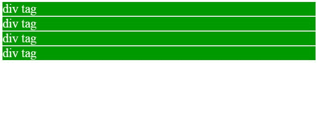
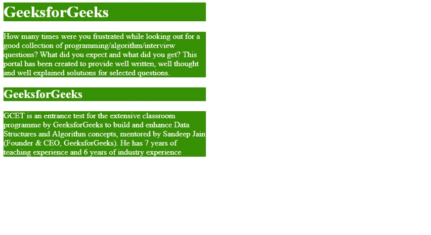
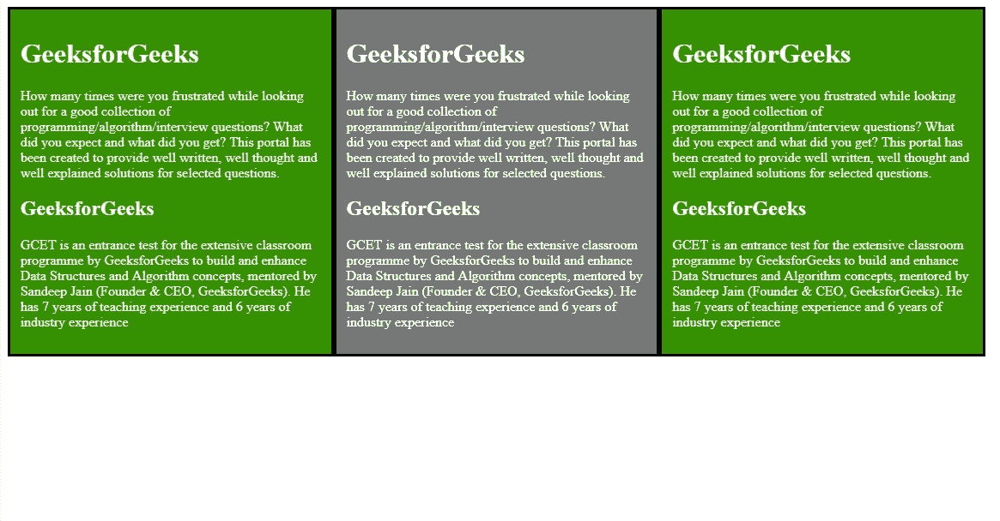
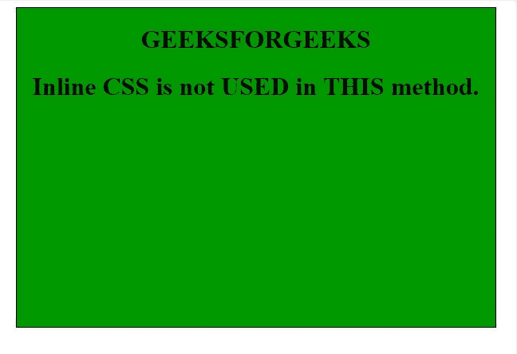
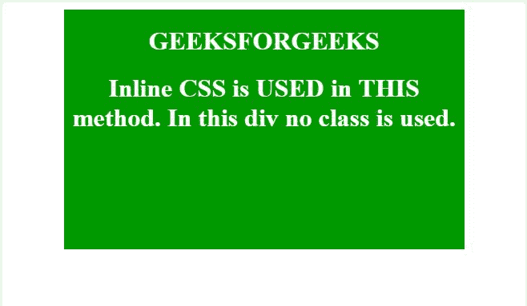
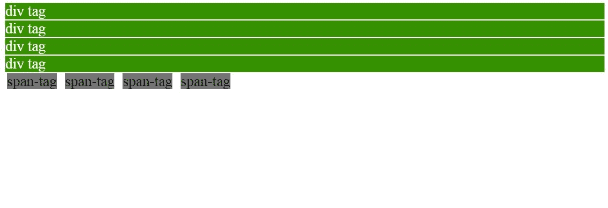

# html | div 标签

> 哎哎哎:# t0]https://www . geeksforgeeks . org/div 标签-html/

div 标签被称为分部标签。在 HTML 中，div 标签用于划分网页中的内容，如(文本、图像、页眉、页脚、导航栏等)。Div 标签既有打开(

)标签，也有关闭()标签，必须关闭标签。Div 是网络开发中最有用的标签，因为它帮助我们分离出网页中的数据，我们可以为网页中的特定数据或功能创建一个特定的部分。

*   Div 标签是块级标签
*   这是一个通用的容器标签
*   它用于对 HTML 的各种标签进行分组，以便可以创建部分并对其应用样式。

我们知道 div 标签是块级标签，在这个例子中 Div 标签包含整个宽度。它将在新的一行显示 div 标签，而不是在同一行。
**例 1:**

```html
<html>
   <head>
      <title>gfg</title>
<style type=text/css>

p{
  background-color:gray;
  margin: 10px;
}

div
{
  color: white;
  background-color: 009900;
  margin: 2px;
  font-size: 25px;
}
</style>

</head>

 <body>
   <div > div tag   </div>
   <div > div tag   </div>
   <div > div tag   </div>
   <div > div tag   </div>

   </body>
</html>
```

**输出:**



正如我们所知，div 标签用于将 HTML 元素分组在一起，并对它们应用 CSS 和网页布局。让我们看看下面的例子，而不使用 div 标签。我们需要为每个标签应用 CSS(在使用 **H1 H2** 和两段 **p** 标签的例子中)

**例 2:**

```html
<html>
   <head>
      <title>gfg</title>
      <style type=text/css>
         p{
         color: white;
         background-color: 009900;
         width: 400px;
         }
         h1
         {
         color: white;
         background-color: 009900;
         width: 400px;
         }
         h2
         {
         color: white;
         background-color: 009900;
         width: 400px;
         }
      </style>
   </head>
   <body>
      <h1>GeeksforGeeks</h1>
      <p>How many times were you frustrated while looking out
       for a good collection of programming/algorithm/interview
       questions? What did you expect and what did you get?
       This portal has been created to provide well written,
       well thought and well-explained solutions for selected
       questions.
      </p>
      <h2>GeeksforGeeks</h2>
      <p>GCET is an entrance test for the extensive classroom 
      program by GeeksforGeeks to build and enhance Data 
      Structures and Algorithm concepts, mentored by Sandeep 
      Jain (Founder & CEO, GeeksforGeeks).He has 7 years of 
      teaching experience and 6 years of industry experience.
      </p>
   </body>
</html>
```

**输出:**



**使用 div 标签创建网页布局**
Div 标签是一个容器标签在 Div 标签里面我们可以放多个 HTML 元素，可以组合在一起，可以为它们应用 CSS。
div 标签可用于创建网页布局在下面的示例中显示了创建网页布局
我们也可以使用 tables 标签创建网页布局，但是 table 标签修改布局非常复杂
div 标签在创建网页布局时非常灵活并且易于修改。在下面例子中将显示使用 div 标签的 HTML 元素的分组，并创建块方式的网页布局。
**例:**

```html
<html>
   <head>
      <title>gfg</title>
      <style type=text/css>
         .leftdiv
         {
         float: left;
         }
         .middlediv
         {
         float: left;
         background-color:gray
         }
         .rightdiv
         {
         float: left;
         }
         div{
         padding : 1%;
         color: white;
         background-color: 009900;
         width: 30%;
         border: solid black;
         }
      </style>
   </head>
   <body>
      <div class="leftdiv">
         <h1>GeeksforGeeks</h1>
         <p>How many times were you frustrated while looking out
         for a good collection of programming/algorithm/interview
         questions? What did you expect and what did you get?
         This portal has been created to provide well written,
         well thought and well-explained solutions for selected
         questions.
      </p>
         <h2>GeeksforGeeks</h2>
         <p>GCET is an entrance test for the extensive classroom 
         programme by GeeksforGeeks to build and enhance Data 
         Structures and Algorithm concepts, mentored by Sandeep 
         Jain (Founder & CEO, GeeksforGeeks).He has 7 years of 
         teaching experience and 6 years of industry experience.
      </p>
      </div>
      <div class="middlediv">
         <h1>GeeksforGeeks</h1>
         <p>How many times were you frustrated while looking out
         for a good collection of programming/algorithm/interview
         questions? What did you expect and what did you get?
         This portal has been created to provide well written,
         well thought and well-explained solutions for selected
         questions.
         </p>
         <h2>GeeksforGeeks</h2>
         <p>GCET is an entrance test for the extensive classroom 
         programme by GeeksforGeeks to build and enhance Data 
         Structures and Algorithm concepts, mentored by Sandeep 
         Jain (Founder & CEO, GeeksforGeeks).He has 7 years of 
         teaching experience and 6 years of industry experience.
         </p>
      </div>
      <div class="rightdiv">
         <h1>GeeksforGeeks</h1>
         <p>How many times were you frustrated while looking out
         for a good collection of programming/algorithm/interview
         questions? What did you expect and what did you get?
         This portal has been created to provide well written,
         well thought and well-explained solutions for selected
         questions.
         </p>
         <h2>GeeksforGeeks</h2>
         <p>How many times were you frustrated while looking out
         for a good collection of programming/algorithm/interview
         questions? What did you expect and what did you get?
         This portal has been created to provide well written,
         well thought and well-explained solutions for selected
         questions.     
         </p>
      </div>
   </body>
</html>
```

使用 Div 标签，我们可以覆盖标题标签和段落标签之间的间隙，在这个例子中将显示三块网页布局。

输出:


我们可以使用以下方法在任何部门中使用 CSS:

**1。使用类:**
我们可以在内部 CSS 或外部 CSS 中的特定 div 上使用类

*   **如果是内部 CSS:** 我们需要在 **<样式>** 元素内的 **<头部>** 部分定义 Class。
*   **In case of External CSS:** we need to create a separate .css file and include it in HTML code in **<head>** section using **<link>** element.

    类名应该与其他 div 中的其他类名不同，否则一个 div 中使用的 CSS 会影响另一个 div。

*   **代码:**

    ```html
    <html>
       <head>
          <link rel="stylesheet" href="color.css">
          <title>
             gfg
          </title>
       </head>
       <body>
          <center>
             <div class="color">
                <!--open tag of Div!-->
                <caption>
                   <h1>GEEKSFORGEEKS</h1>
                </caption>
                <h1>Inline CSS is not  USED in THIS method.
                </h1>
             </div>
             <!--closing tag of Div!-->
          </center>
       </body>
    </html>
    ```

*   CSS for color class: File name **color.css**

    ```html
    .color
    {
    height:400px;
    width:600px;
    border:1px solid;
    background-color: 009900;
    }
    ```

    在这个例子中，我们使用了一个类来表示那个特定的 Div。用 color.css 命名 div 的哪些属性。它是一个单独的文件，在这个 HTML 代码中由链接标签链接

*   **输出:**
    

**2。内联 CSS:**
我们可以直接在 div 中使用 CSS，这个方法也不需要 CLASS。HTML 编码中的 Div 被用作容器标签，也是因为它可以包含所有其他标签。

*   **Code:**

    ```html
    <html>
       <head>
          <title>
             gfg
          </title>
       </head>
       <body>
          <center>
             <div style="height:300px; width:500px; color:white;
                border:1px solid; background-color: 009900;">
                <!--open tag of Div!-->
                <caption>
                   <h1>GEEKSFORGEEKS</h1>
                </caption>
                <h1>Inline CSS is USED in THIS method.
                   In this div no class is used.
                </h1>
             </div>
             <!--closing tag of Div!-->
          </center>
       </body>
    </html>
    ```

    在这个方法中，我们在 div 标签中应用内联 CSS。通过使用样式属性，该样式将应用于特定的 div。

*   **输出:**
    

**Div 标签和 span 标签的区别**

当使用 HTML 创建页面时，div 和 span 标签是两个常见的标签，并在它们上面执行不同的功能
而 div 标签是块级元素，span 是内联元素 div 标签创建一个换行符，默认情况下在标签后面的文本之间创建一个分隔线，直到标签以< /div >结束。div 标签为标签中的所有元素(如文本、图像、段落)创建单独的框或容器。

| 性能 | Div 梓 | 跨度标签 |
| --- | --- | --- |
| 元素类型 | 块级 | 在一条直线上的 |
| 空间/宽度 | 包含可用的整个宽度 | 仅采用所需的宽度 |
| 例子 | 标题、段落、形式 | 属性，图像 |
| 使用 | 网页布局 | 容器用于存储文本 |
| 属性 | 不需要，使用普通 css，类 | 不需要，使用普通 css，类 |

span 标签不会创建类似于 div 标签的**换行符**，而是允许用户在同一行内将内容与页面上的其他元素分开。避免换行符，只导致所选文本改变，保持周围所有其他元素不变。
下面的示例将显示 span 和 div 标记之间的区别，而 div 标记包含整个宽度，span 标记只包含所需的宽度，其余部分可用于另一个元素。
T4【代码:

```html
<html>
   <head>
      <title>gfg</title>
      <style type=text/css>
         p{
         background-color:gray;
         margin: 10px;
         }

         div
         {
         color: white;
         background-color: 009900;
         margin: 2px;
         font-size: 25px;
         }
         span
         {
         color: black;
         background-color: gray;
         margin: 5px;
         font-size: 25px;
         }
      </style>
   </head>
   <body>
<!-- below some div tags -->      

      <div > div tag   </div>
      <div > div tag   </div>
      <div > div tag   </div>
      <div > div tag   </div>

<!-- below some span tags -->      
      <span>span-tag</span>
      <span>span-tag</span>
      <span>span-tag</span>
      <span>span-tag</span>
   </body>
</html>
```

**输出:**



**支持的浏览器:**下面列出了< div >标签支持的浏览器:

*   谷歌 Chrome
*   微软公司出品的 web 浏览器
*   火狐浏览器
*   歌剧
*   旅行队

HTML 是网页的基础，通过构建网站和网络应用程序用于网页开发。您可以通过以下 [HTML 教程](https://www.geeksforgeeks.org/html-tutorials/)和 [HTML 示例](https://www.geeksforgeeks.org/html-examples/)从头开始学习 HTML。

CSS 是网页的基础，通过设计网站和网络应用程序用于网页开发。你可以通过以下 [CSS 教程](https://www.geeksforgeeks.org/css-tutorials/)和 [CSS 示例](https://www.geeksforgeeks.org/css-examples/)从头开始学习 CSS。