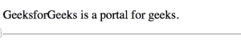
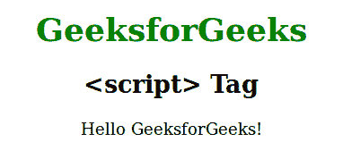

# HTML 页面头部使用的元素

> 原文:[https://www . geesforgeks . org/elements-in-use-in-head-section-of-html-page/](https://www.geeksforgeeks.org/elements-that-are-used-in-head-section-of-html-page/)

元素就像一个元数据的容器，即关于数据的数据，它也位于标签和标签之间。元数据是关于 HTML 文档的数据，不显示在网页上。它定义了文档标题、样式、脚本和其他元信息。

HTML 元素是以下元素的容器:

**<称号><链接><meta><基地><风格><剧本>等。**

*   **[<标题>元素](https://www.geeksforgeeks.org/html-title-tag/) :** 标题>元素定义了网页的标题。标题必须是文本，我们将能够在浏览器的页面标签中看到标题。

**为什么使用:**

搜索引擎使用页面标题来决定在搜索结果中列出页面的顺序。所以，使用有意义和准确的标题有助于你通过搜索引擎优化排名更好。

```html
<!DOCTYPE html>
<html lang="en">

<head>
    <title>HTML Head Tag </title>
</head>

<body>
    <p>GeeksforGeeks is a portal for geeks.</p>
    <hr>
</body>

</html>
```

**输出:**


*   **[<link> element](https://www.geeksforgeeks.org/html-link-tag/):** The <link> tag is most often used to link an external CSS file. It defines the relationship between current document and external resources.

    ```html
    <!DOCTYPE html>

    <html>

    <head>
        <link rel="stylesheet" 
            type="text/css" href="mystyle.css">
    </head>

    <body>
        <h1>GeeksforGeeks</h1>
        <p>It is a portal for geeks.</p>
    </body>

    </html>
    ```

    **输出:**
    

    *   **[<meta> element](https://www.geeksforgeeks.org/html-meta-tag/):** The <meta> element is used to specify the Character set, Page description, Keywords, Author of the document and Viewport settings.
    The meta data will not be displayed but are used by browsers on how to display content or reload page and by search engine, and other web services.

    ```html
    <!DOCTYPE html>
    <html>
        <head>
            <title>meta tag examples</title>
            <meta name = "keywords" 
                content = "Meta Tags, Metadata"/>
        </head>

        <body>
            <p>Hello GeeksforGeeks!</p>
        </body>
    </html>                    
    ```

    **输出:**

    ```html
    Hello GeeksforGeeks!

    ```

    *   **[<base> element](https://www.geeksforgeeks.org/html-base-tag/):**

    元素用于为相对网址指定基本网址或目标。

    一个文档中只能有一个元素。

    ```html
    <!DOCTYPE html>
    <html>

    <head>

        <!-- Declaring the BASE URL -->
        <base href=
    "https://media.geeksforgeeks.org/wp-content/uploads/" 
            target="_blank">
    </head>

    <body>
        
    </body>

    </html>
    ```

    **输出:**
    

    *   **[<style> element](https://www.geeksforgeeks.org/html-style-tag/):** The <style> element is used to make internal CSS within our HTML webpage. We can modify text and view of our web page using various properties and its values. Some of the properties include background-color, text align etc.

    ```html
    <!DOCTYPE html>

    <html>

    <head>
        <style>
            body {
                background: skyblue;
            }

            h1 {
                color: red;
            }

            p {
                color: blue;
            }
        </style>
    </head>

    <body>
        <h1>GeeksforGeeks</h1>
        <p>It is a portal for geeks.</p>
    </body>

    </html>
    ```

    **输出:**
    

    *   **[<script> element](https://www.geeksforgeeks.org/html-script-tag/):** The <script> element is used to define within the HTML webpage.

    例如，下面的 JavaScript 代码将“GeeksforGeeks”写入一个 id =“demo”的 HTML 元素中。

    ```html
    <!DOCTYPE html>
    <html>
        <head>
            <title>script tag</title>
            <style>
                body {
                    text-align:center;
                }
                h1 {
                    color:green;
                }
            </style>
        </head>
        <body>
            <h1>GeeksforGeeks</h1>
            <h2><script> Tag</h2>
            <p id="Geeks"></p>
            <script>
                document.getElementById("Geeks").innerHTML = 
                                     "Hello GeeksforGeeks!";
            </script> 
        </body>
    </html>                    
    ```

    **输出:**
    