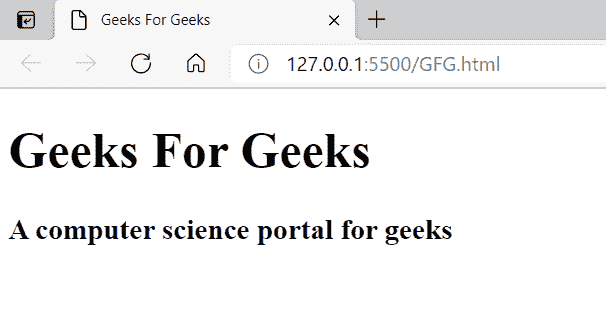
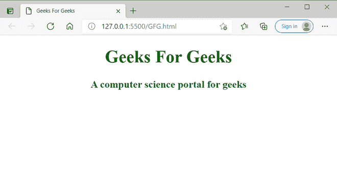
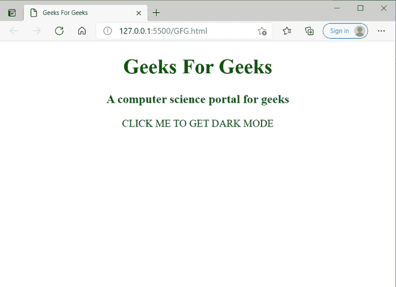
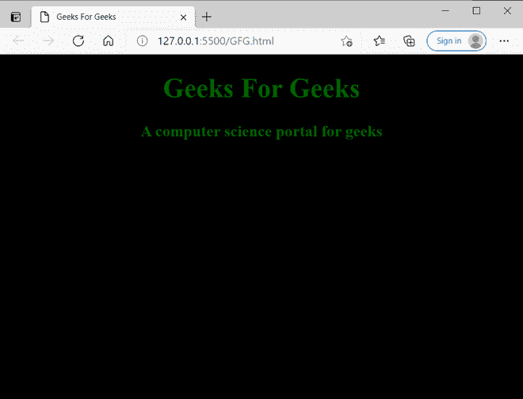

# 基本 HTML 标签

> 原文:[https://www.geeksforgeeks.org/essential-html-tags/](https://www.geeksforgeeks.org/essential-html-tags/)

[**HTML**](https://www.geeksforgeeks.org/html-tutorials/) 代表超文本标记语言**。**是设计网页或网站的重要语言。互联网上的任何人都可以看到这些网站。超文本标记语言是超文本和标记语言的结合。其中超文本是网页之间的链接，标记语言用于定义标签内的文本文档，标签定义网页的结构。

HTML 使用预定义的标签告诉浏览器如何显示内容。标签只不过是用角括号括起来的一些说明(即<>)。它分为三个部分，即开始标签、内容(将显示在浏览器上)和结束标签，但有些标签是特殊标签，不像
标签那样包含结束标签。当您使用 HTML 标签时，一定要记住包含结束标签。如果您忘记关闭标签，浏览器将应用开始标签的效果，直到页面结束。HTML 包含构成任何网页或 HTML 文件基本结构的四个基本标签:

现在让我们逐一讨论每个标签:

**1。【T2 字幕 ocr:贾宝玉字幕校对:贾宝玉！doctype html>t1 的类型**

它也被称为文档类型，应该包含在一个 HTML 文件中。它实际上告诉浏览器这是一个 HTML 文档。它不是标签或元素，但它是信息。

**语法:**

**2。<html>T4】/html>T1】**

这个标签标记了 HTML 文档的开始和结束，浏览器会完全考虑这些标签之间的任何代码。此外，它告诉浏览器该文档是一个 HTML 文档。这些标签之间的所有其他标签只被浏览器考虑。

**语法:**

> 内容

**3。<头>T4】/头>T1】**

这个标签存储了实际上没有出现在网页上的数据，但是它提供了更多关于网页的信息。或者换句话说，该标签用于定义包含与网页相关的信息的文档的头部。它还包含像、<title>、<meta/>、<link/>、<style>等标签。</root></style></title>

**语法:**

> <title>网页标题</title>

**4。<称号>T4】/称号>T1】**

该标签存储网页的标题/名称。无论标签中给出什么标题/内容，当浏览器打开时，内容都会出现在标签上。它在标题标签中描述。

**语法:**

> <title>网页标题</title>

**5。<车身>T4】/车身>T1】**

该标签用于显示所有信息或数据，即文本、图像、超链接视频等。，放在网页上给用户。这里，所有的内容像文字、图片、超链接视频等。，包含在此标记之间。

**语法:**

> 内容

其他一些 HTML 标记有:

**1 .<！——comment——>**

这个标签用于在 HTML 代码中添加注释。这些注释有助于程序理解代码。注释标签中的内容在浏览器上不可见。

**语法:**

**2\. < 当 >**

这些元标签用在头标签中，它们描述元数据，即关于数据的数据。这些标签在搜索引擎优化中很有用，这意味着当用户搜索我们的网站时，浏览器推荐我们的网页的机会变高，从而导致网页上的流量增加。一个 HTML 文档可以包含多个标签。

**语法:**

**3。<链接 rel = "样式表" href="file.css " >**

该标签用于包含外部样式表。当您不想在 HTML 文档中包含 CSS 时，请使用此标签。为了更简单，我们用代码创建了一个 CSS 文件，并将这个文件包含在链接标签中。

**语法:**

> <link rel="”stylesheet”" href="”file.css">

**4。<剧本></剧本>**

它用于包含 javascript 代码。外部 javascript 也可以使用开始脚本标签中的 **src** 属性进行链接。它可以包含在头部或身体标签中。

**语法:**

**5。标题:**

HTML 提供了六种类型的标题，即 H1、H2、H3、H4、H5 和 H6。这里，H1 是最高级别的航向，H6 是较低级别的航向。这些标题用来突出重要的主题。

**语法:**

> # 内容
> 
> ## 内容
> 
> ### 内容
> 
> #### 内容
> 
> ##### 内容
> 
> ###### 内容

**例 1:**

简单的 HTML 程序:

## 超文本标记语言

```html
<!DOCTYPE html>
<html lang="en">
<head>

    <!--The description written on title tag get appeared as browser tab name-->
    <title>Geeks For Geeks </title>

</head>

<!-- Whatever content in body tag appears on the webpage-->
<body>

    <h1> Geeks For Geeks </h1>
    <h3> A computer science portal for geeks </h3>

</body>
</html>
```

**输出:**



**例 2:**

我们使用<link>标签添加外部 CSS 的 HTML 程序

## 超文本标记语言

```html
<!DOCTYPE html>
<html lang="en">
<head>

    <!--Meta data-->
    <meta charset="UTF-8">
    <meta http-equiv="X-UA-Compatible" content="IE=edge">
    <meta name="viewport" content="width=device-width, initial-scale=1.0">
    <!--Including css file with name GFG.css-->
    <link rel="stylesheet" href="GFG.css">
    <!--The description written on title tag get appeared as browser tab name-->
    <title>Geeks For Geeks </title>

</head>

<!-- Whatever content in body tag appears on the webpage-->
<body>

    <h1> Geeks For Geeks </h1>
    <h3> A computer science portal for geeks </h3>

</body>
</html>
```

```html
GFG.css
body {

   text-align: center;
}
h1{
    color: darkgreen;
}
h3{
    color:darkgreen;
}:
```

**输出:**



**例 3:**

我们正在其中添加 javascript 文件 GFG 的 HTML 程序。JS 使用

## 超文本标记语言

```html
<!DOCTYPE html>
<html lang="en">
<head>

    <!--Meta data-->
    <meta charset="UTF-8">
    <meta http-equiv="X-UA-Compatible" content="IE=edge">
    <meta name="viewport" content="width=device-width, initial-scale=1.0">
    <!--Including css file with name GFG.css-->
    <link rel="stylesheet" href="GFG.css">
    <!--The description written on title tag get appeared as browser tab name-->
    <title>Geeks For Geeks </title>

</head>

<!-- Whatever content in body tag appears on the webpage-->
<body>

    <!--Including JS file with name GFG.JS-->
    <script src ="GFG.JS"> </script>
    <h1> Geeks For Geeks </h1>
    <h3> A computer science portal for geeks </h3>
    <button onclick="darkMode()"> CLICK ME TO GET DARK MODE</button>

</body>
</html>
```

## java 描述语言

```html
function darkMode() {
    document.body.style.backgroundColor = "black";
}
```

**输出:**





点击按钮。