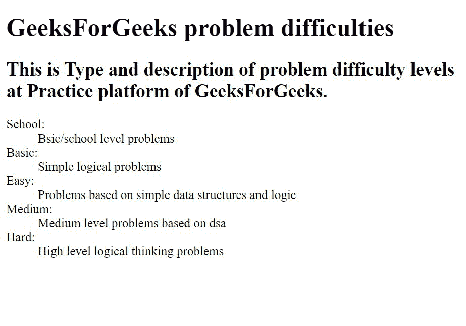

# 使用 HTML 解释描述列表

> 原文:[https://www . geesforgeks . org/explain-description-list-in-html/](https://www.geeksforgeeks.org/explain-description-lists-in-html/)

描述列表是一个术语列表，每个术语都有一个描述。HTML 中的列表用于以列表形式指定特定信息。Html 中有各种类型的列表，如有序列表、无序列表和描述列表。

**描述列表用于:**

*   给我们在列表中定义的特定术语下定义。
*   有一个字典类型的格式(术语和术语的定义)

**描述列表格式:**

*   描述列表与 html 中的描述列表标签一起使用。
*   在标签中，我们有描述术语，它被表示为

    标签。这里我们不使用 li 标签作为其他列表。在

    中写下数据的术语。借助

    标签，我们可以有不同的术语。
*   在本文中，我们使用数据描述标签

    来定义我们所陈述的术语。如果我们将术语定义为比萨饼，那么我们就可以把它描述为一种食品。

**语法:**

```html
<dl> Contents of the list </dl>
```

**例 1:**

## 超文本标记语言

```html
<!DOCTYPE html>
<html>

<head>
    <title>
        Description lists in html
    </title>
</head>

<body>
    <h1>GeeksForGeeks Courses</h1>

    <h2>
        Live courses at GeeksForGeeks 
        and their Description
    </h2>

    <dl>
        <dt>
            Full Stack Development with 
            React & Node JS - Live:
        </dt>
        <dd> 
            Learn how to develop Single 
            Page Web Applications.
        </dd>
        <dt>System Design - Live:</dt>
        <dd>
            For individuals looking to 
            crack SDE job interviews.
        </dd>
        <dt>JAVA Backend Development - Live:</dt>
        <dd>Learn backend development with Java</dd>
        <dt>DSA Live for Working Professionals:</dt>
        <dd>
            A LIVE classroom program designed 
            for Working Professionals
        </dd>
    </dl>
</body>

</html>
```

**输出:**


**例 2:**

## 超文本标记语言

```html
<!DOCTYPE html>
<html>

<head>
    <title>Description lists in html</title>
</head>

<body>
    <h1>GeeksForGeeks problem difficulties</h1>

    <h2>
        This is Type and description of problem 
        difficulty levels <br>at Practice 
        platform of GeeksForGeeks.
    </h2>

    <dl>
        <dt>School:</dt>
        <dd>Bsic/school level problems</dd>
        <dt>Basic:</dt>
        <dd>Simple logical problems</dd>
        <dt>Easy:</dt>
        <dd>
            Problems based on simple 
            data structures and logic
        </dd>
        <dt>Medium:</dt>
        <dd>Medium level problems based on dsa</dd>
        <dt>Hard:</dt>
        <dd>High level logical thinking problems</dd>
    </dl>
</body>

</html>
```

**输出:**

