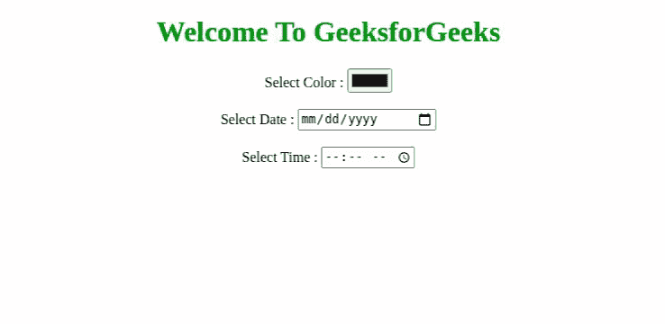
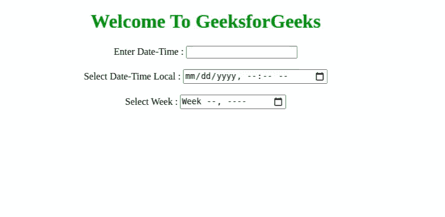
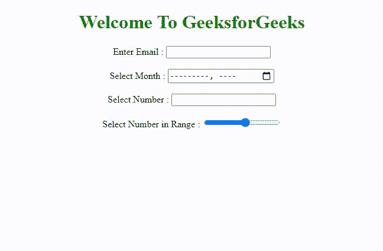
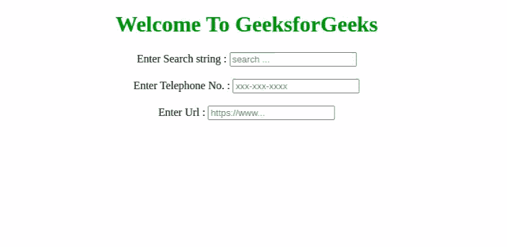

# 解释 HTML5 中的表单新输入类型？

> 原文:[https://www . geesforgeks . org/explain-the-form-new-input-type-in-html 5/](https://www.geeksforgeeks.org/explain-the-form-new-input-types-in-html5/)

在本文中，我们将讨论 HTML5 提供的较新的表单输入类型的功能。有时，在填写登记表或任何在线表格时，需要遵循适当的格式来填写特定的数据。现在很容易使用网络表单填写常见数据，如**日期、电子邮件、url** 等。HTML5 表单中几乎引入了 13 种新的输入类型。我们将看到所有的输入类型&一一理解它们。

**输入类型属性:**

1.  [**颜色**](https://www.geeksforgeeks.org/html-input-typecolor/) **:** 该输入类型允许用户从颜色选择器中选择颜色。
2.  [**日期**](https://www.geeksforgeeks.org/html-input-typedate/) **:** 此输入类型允许用户从下拉日历中选择日期。
3.  [**时间:**](https://www.geeksforgeeks.org/html-input-typetime/) 此输入类型允许用户输入时间。
4.  **日期时间:**该输入类型允许用户选择日期和时间以及时区。
5.  **日期时间-本地:**该输入类型允许用户选择本地日期和时间。
6.  [**周**](https://www.geeksforgeeks.org/html-input-typeweek/) **:** 该输入类型允许用户从下拉日历中选择周和年。
7.  [**电子邮件**](https://www.geeksforgeeks.org/html-input-typeemail/) **:** 此输入类型允许用户输入电子邮件地址。
8.  [**月**](https://www.geeksforgeeks.org/html-input-typemonth/) **:** 该输入类型允许用户从下拉日历中选择月份和年份。
9.  **数字:**该输入类型允许用户输入数值。
10.  **范围:**该输入类型允许用户在指定范围**内输入数值。**
11.  **搜索:**该输入类型允许用户在输入字段中输入搜索字符串。
12.  **电话:**该输入类型允许用户输入电话号码。
13.  **url:** 该输入类型允许用户输入 url。

我们将使用上述属性，并通过示例了解它们的用法。

**示例 1:** 在本例中，您将了解**颜色、日期和时间**输入类型。

**日期语法:**

```html
 <input type="date">
```

**时间语法:**

```html
 <input type="time">
```

**颜色语法:**

```html
 <input type="color">
```

**注意:** **日期**和**时间**不被 Internet Explorer 和 Safari 浏览器支持。

## 超文本标记语言

```html
<!DOCTYPE html>
<html>

<head>
    <style>
        h1 {
            color: green;
            text-align: center;
        }

        body {
            text-align: center;
        }
    </style>
</head>

<body>
    <h1>Welcome To GeeksforGeeks</h1>

    <form>
        <label for="color">Select Color : </label>
        <input type="color" />
    </form>
    <br />

    <form>
        <label for="date">Select Date : </label>
        <input type="date" />
    </form>
    <br />

    <form>
        <label for="time">Select Time :</label>
        <input type="time" />
    </form>
</body>

</html>
```

**输出:**



**示例 2:** 在本例中，您将了解**日期时间、日期时间-本地**和**周**输入类型。

**日期时间语法:**

<input type=”datetime”>

**日期时间-本地语法:**

```html
 <input type="datetime-local">
```

**周语法:**

```html
 <input type="week">
```

**注意:火狐、Safari 和 Internet Explorer 浏览器不支持日期时间-本地**和**周**。

## 超文本标记语言

```html
<!DOCTYPE html>
<html>

<head>
    <style>
        h1 {
            color: green;
            text-align: center;
        }

        body {
            text-align: center;
        }
    </style>
</head>

<body>
    <h1>Welcome To GeeksforGeeks</h1>

    <form>
        <label for="date">Enter Date-Time : </label>
        <input type="datetime" />
    </form>
    <br />

    <form>
        <label for="date">Select Date-Time Local : </label>
        <input type="datetime-local" />
    </form>
    <br />

    <form>
        <label for="time">Select Week : </label>
        <input type="week" />
    </form>
</body>

</html>
```

**输出:**



**示例 3:** 在本例中，您将了解**电子邮件、月份、号码**和**范围**输入类型。

**电子邮件语法:**

```html
<input type="email">
```

**月语法:**

```html
<input type="month">
```

**注意:** **月**不支持火狐、Safari 和 Internet Explorer 浏览器。

**数字语法:**

```html
<input type="number">
```

**范围语法:**

```html
<input type="range">
```

## 超文本标记语言

```html
<!DOCTYPE html>
<html>

<head>
    <style>
        h1 {
            color: green;
            text-align: center;
        }

        body {
            text-align: center;
        }
    </style>
</head>

<body>
    <h1>Welcome To GeeksforGeeks</h1>

    <form>
        <label for="mail">Enter Email : </label>
        <input type="email" />
    </form>
    <br />

    <form>
        <label for="date">Select Month : </label>
        <input type="month" />
    </form>
    <br />

    <form>
        <label for="number">Select Number : </label>
        <input type="number" />
    </form>
    <br />

    <form>
        <label for="number">Select Number in Range : </label>
        <input type="range" min="1" max="10" step="1" />
    </form>
</body>

</html>
```

**输出:**



**示例 4:** 在本例中，您将了解**搜索、电话**和 **url** 输入类型。

**搜索语法:**

```html
<input type="search">
```

**电话语法:**

```html
<input type="tel">
```

**注意:**目前**电话**不被任何浏览器支持。

**Url 语法:**

```html
<input type="url">
```

## 超文本标记语言

```html
<!DOCTYPE html>
<html>

<head>
    <style>
        h1 {
            color: green;
            text-align: center;
        }

        body {
            text-align: center;
        }
    </style>
</head>

<body>
    <h1>Welcome To GeeksforGeeks</h1>

    <form>
        <label for="search">Enter Search string : </label>
        <input type="search" placeholder="search ..." />
    </form>
    <br />

    <form>
        <label for="number">Enter Telephone No. : </label>
        <input type="tel" placeholder="xxx-xxx-xxxx" />
    </form>
    <br />

    <form>
        <label for="url">Enter Url : </label>
        <input type="url" placeholder="https://www..." />
    </form>
</body>

</html>
```

**输出:**

