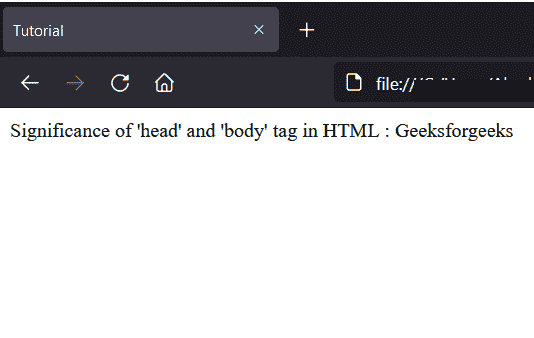
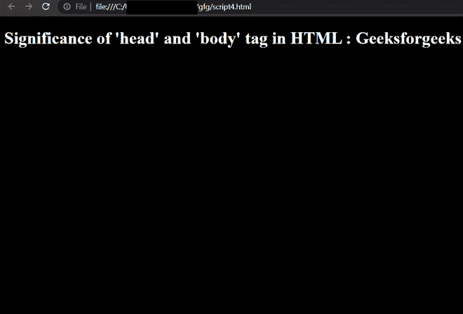

# 解释 HTML 中的和标签的意义

> 原文:[https://www . geesforgeks . org/explain-head-and-body-tag-in-html/](https://www.geeksforgeeks.org/explain-the-significance-of-head-and-body-tag-in-html/)

HTML 中最常用的两个标签是[<>](https://www.geeksforgeeks.org/html-head-tag/)和 [<正文>](https://www.geeksforgeeks.org/html-body-tag/) 标签。很少能找到一个行业级网站不在页面中使用<头>和<体>标签的。在本文中，我们将学习这两个标签在 HTML 文档中的意义。

**HTML<头>标签的意义:**HTML 中的头标签用于包含与文档相关的元数据或信息。它持有一些最重要的标签，如 [<标题>](https://www.geeksforgeeks.org/html-title-tag/)[<元>](https://www.geeksforgeeks.org/html-meta-tag/) ，以及 [<链接>](https://www.geeksforgeeks.org/html-link-tag/) 。

**从浏览器角度:**

*   在 HTML 5 中，不强制在 HTML 文档中包含标签，但是在以前的版本(4.0.1)中，它是强制包含的。
*   像<title>、<meta/>或<link/>这样的标签通常包含在头部内部，没有标签或在标签外部也能正常工作。</title>

**从发展角度来看:**

*   从开发人员的角度来看，在文档中包含标签是很好的，因为这种语法被广泛使用，并且它也为文档提供了一个良好的结构。稍后，这将帮助我们以结构化的方式与 DOM 元素进行交互。

**HTML<正文>标签的意义:**HTML 正文标签是< html >标签的最后一个子标签。它用于包含 HTML 文档的主要内容。它保存了从标题、段落到独特的[](https://www.geeksforgeeks.org/div-tag-html/)*容器的所有内容，这些容器位于<主体>标签内。*

***从浏览器角度:***

*   *在 HTML 5 中，不强制在 HTML 文档中包含标签，但是在以前的版本(4.0.1)中，它是强制包含的。*
*   *像、 [< p >](https://www.geeksforgeeks.org/html-paragraph/) 或 [< a >](https://www.geeksforgeeks.org/html-a-tag/) 这样的标签一般包含在身体内部，没有<身体>标签或在<身体>标签之外也能正常工作。*
*   *尽管不是强制性的，标签有一些属性，如“背景”、“bgcolor”、“a”、“link”等。*

***从开发的角度:**从开发人员的角度来说，在文档里面加入<体>标签就好了。这种语法被广泛使用，它也为文档提供了良好的结构。稍后，这将帮助我们以结构化的方式与 DOM 元素进行交互。*

***例 1:** 以下代码没有<头>和<体>标签。*

## *超文本标记语言*

```html
*<!DOCTYPE html>
<html>
    <p>
        Significance of 'head' and 'body' 
        tag in HTML : Geeksforgeeks
    </p>

    <title>Tutorial</title>
</html>*
```

***输出:***

*

没有头部和身体标签* 

***示例 2:** 以下代码将<头>和<体>标记添加到文档中。即使包含<头>和<体>标签，最后一个中的输出也是一样的，但是它给出了更好的代码结构和更好的理解角度。*

## *超文本标记语言*

```html
*<!DOCTYPE html>
<html>

<head>
    <title>Tutorial</title>
</head>

<body>
    <p>
        Significance of 'head' and 'body'
        tag in HTML : Geeksforgeeks
    </p>
</body>

</html>*
```

***输出:***

*

带有和标签* 

*我们可以清楚地看到，输出没有变化。但是随着惯例的正确遵守，我们很容易理解代码。*

***示例 3:** 下面的代码使用了<主体>标签的属性。在本例中，我们将使用<主体>标签的“ [bgcolor](https://www.geeksforgeeks.org/html-body-bgcolor-attribute/) 属性。它将改变整个文档的背景颜色。没有了<体>标签，我们会失去更多类似[<alink>](https://www.geeksforgeeks.org/html-body-alink-attribute/)<link>等属性。*

## *超文本标记语言*

```html
*<!DOCTYPE html>
<html>

<head>
    <title>Tutorial</title>
    <link rel="stylesheet" href="styles.css">
</head>

<body bgcolor="black">
    <h1>
        Significance of 'head' and 'body' 
        tag in HTML : Geeksforgeeks
    </h1>
</body>

</html>*
```

***输出:***

**