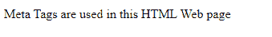
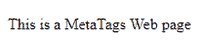
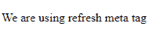
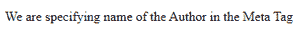
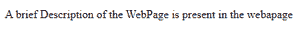

# 解释元标签在 HTML 中的使用？

> 原文:[https://www . geesforgeks . org/explain-of-meta-tags-in-html/](https://www.geeksforgeeks.org/explain-use-of-meta-tags-in-html/)

**元标签** ( <元/ >)是一个 HTML 组件，它给出了关于一个 HTML 文档的元数据。元数据可以被描述为给出不同信息或关于信息的基本信息的数据。它是一个空标签，例如，它只有一个初始标签，没有结束标签。它们总是出现在<标题>标签中，用于描绘页面描述、特定关键词、文档作者、视口设置、确定字符集等。
它们被网络浏览器、搜索引擎和其他网络服务用来对网页进行相应的排名。

**语法:**

```html
<head>
   <meta attribute-name = "value"/>
</head>
```

**属性:**

*   [**名称:**](https://www.geeksforgeeks.org/html-meta-name-attribute/) 该属性用于表示 HTML 文档的字符编码。
*   [**http-equiv:**](https://www.geeksforgeeks.org/html-meta-http-equiv-attribute/) 该属性用于获取 http 响应消息头。
*   [**内容:**](https://www.geeksforgeeks.org/html-meta-content-attribute/) 该属性用于指定属性值。
*   [**字符集:**](https://www.geeksforgeeks.org/html-meta-charset-attribute/) 用于表示 HTML 文档的字符编码。

**示例:**

## 超文本标记语言

```html
<!DOCTYPE html>
<html>

<head>
    <meta charset="UTF-8" />
    <meta name="description" content=
        "Free Computer Science Content" />
    <meta name="keywords" content="HTML" />
    <meta name="author" content="GFG" />
    <meta name="viewport" content=
        "width=device-width, initial-scale=1.0" />
</head>

<body>
    <p>Meta Tags are used in this HTML Web page</p>
</body>

</html>
```

#### **输出:**



**使用元标签**

**元标签在 HTML 中的使用:**

**1。** **指定重要关键词:**元标签包含存在于网页上的重要关键词，并被网络浏览器用于根据搜索对页面进行排名。搜索引擎优化是优化内容搜索引擎优化排名的另一个术语。
**例:**

## 超文本标记语言

```html
<!DOCTYPE html>
<html>

<head>
    <!-- meta tag starts -->
    <meta name="keywords" content=
        "Meta Tags HTML GFG Meta Data " />
    <!-- meta tag ends -->

</head>

<body>
    <p>This is a MetaTags Web page</p>
</body>

</html>
```

**输出:**



**在元标签中指定关键词**

我们可以看到，在上面的例子中提供了几个关键词，这将有助于网络浏览器对网页进行排名。

**2。自动刷新**:在元标签中会提到一个指定的时间，之后网页会自动刷新。

**示例:**

## 超文本标记语言

```html
<!DOCTYPE html>
<html>

<head>

    <!-- meta tag starts -->
    <meta name="revised about" 
        content="GeeksforGeeks" />
    <meta http-equiv="refresh" content="8" />
    <!-- meta tag ends -->
</head>

<body>
    <p>We are using refresh meta tag</p>
</body>

</html>
```

**输出:**如您在上面的示例中所观察到的，网页将在 8 秒后重新加载，如< meta >标签中所述。



**在元标签**中提到了网页必须重新加载的时间

**3。指定网页作者** : MetaTag 允许我们如下提到网页作者的名字。

## 超文本标记语言

```html
<!DOCTYPE html>
<html>

<head>

    <!-- meta tag starts -->
    <meta name="author" content="U Phani Teja" />
    <!-- meta tag ends -->

</head>

<body>
    <p>
        We are specifying name of 
        the Author in the Meta Tag
    </p>
</body>

</html>
```

**输出:**在本例中，作者的名字在< meta >标签中指定



**在元标签中提供作者姓名**

**4。提供网页描述:**可以在 Meta 标签中包含网页的简要描述，这将有助于网页在互联网上的排名。

## 超文本标记语言

```html
<!DOCTYPE html>
<html>

<head>

    <!-- meta tag starts -->
    <meta name="description" 
        content="All About Meta tags" />
    <!-- meta tag ends -->

</head>

<body>
    <p>
        A brief Description of the WebPage 
        is present in the webapage
    </p>
</body>

</html>
```

**输出:**在本例中，< meta >标签中给出了网页的一个小描述。



**在元标签**中提供简要描述