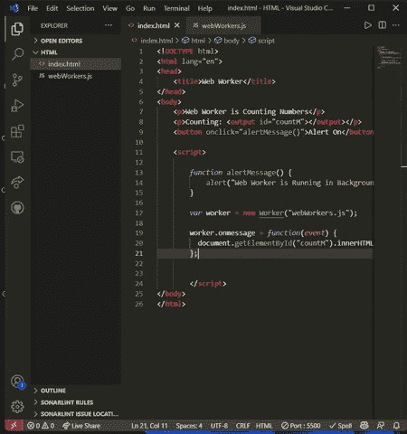

# 使用 HTML 解释网络工作者

> 原文:[https://www.geeksforgeeks.org/explain-web-worker-in-html/](https://www.geeksforgeeks.org/explain-web-worker-in-html/)

[HTML](https://www.geeksforgeeks.org/html-tutorials/) 是一种用于设计网页的标记语言， [JavaScript](https://www.geeksforgeeks.org/javascript-tutorial/) 是一种编程语言，当它应用于 HTML 时，可以在网站上实现动态交互。它帮助用户构建现代网络应用程序。但是这个 Javascript 的问题是被设计成在单线程环境中运行的，所以多个脚本不能同时运行，并且当在一个 HTML 页面上执行 JavaScript 脚本时，页面会变得没有响应，直到脚本完成。因此，为了克服这一点，网络工作者应运而生。网络工作者是一段独立的 JavaScript 代码，它在网页的后台运行，不会影响网页。

**什么是网络工作者？**

Web workers 是多线程对象，用于在后台执行 Javascripts，而不会影响应用程序或网页的性能。Web Workers 允许长时间运行的脚本，这些脚本不会被响应单击或其他用户交互的脚本中断，并且允许长时间执行任务而不影响网页的响应。一般用于大 CPU 密集型任务。

**网络工作者的类型:**

**共享 Web Workers:** 可以被多个脚本共享。

**专用网络工作人员:**专用工作人员只能由调用它的脚本访问。

**创建网络工作者的语法:**

```html
It is used to create a web worker
worker = new Worker("webWorker.js");
```

**终止网络工作者的语法:**

```html
It is used to terminate a web worker.
worker.terminate();
```

**分步实现:**为 Web Worker 创建一个 Javascript 文件，并创建想要在后台运行的代码。这里我们正在创建一个 **webWorker.js** 文件，并使用它在后台从 1 开始计数，并将其显示到我们的网页和前端，我们将使用警报框。

## java 描述语言

```html
// Initialized a variable with 0
var count = 0;

function timedCount() {
  count = count + 1;

  // It is used to send value
  // back to html page
  postMessage(count);

  // It is a timeout function
  setTimeout("timedCount()",1000);
}

timedCount();
```

现在创建一个**index.html**并将以下代码添加到该文件中。

## 超文本标记语言

```html
<!DOCTYPE html>
<html lang="en">

<head>
    <title>Web Worker</title>
</head>

<body>
    <p>Web Worker is Counting Numbers</p>

    <p>Counting: <output id="countM"></output></p>

    <button onclick="alertMessage()">
        Alert On
    </button>

    <script>

        // This is function to run alert
        function alertMessage() {
            alert("Web Worker is Running in Background");
        }

        // Created a web worker and passed script which 
        // needs to execute in background
        var worker = new Worker("webWorkers.js");

        // Called onmessage method to get value from 
        // script file and show it on web page
        worker.onmessage = function (event) {
            document.getElementById("countM")
                .innerHTML = event.data;
        };
    </script>
</body>

</html>
```

**输出:**在这个程序中，Web Worker 正在后台数数，并且仍然，我们可以像这里一样使用我们的网页，我们已经使用了警报框。



输出

**支持的浏览器:**

*   谷歌 Chrome 4.0
*   Firefox 3.5
*   微软边缘 10.0
*   Safari 4.0
*   歌剧 11.5

**注意:** Chrome 不允许你从本地文件运行脚本时加载 **Web Workers** 。所以，对于这种用途，web 主机或者你可以使用 live 服务器扩展。