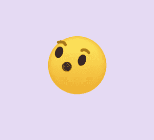

# 脸书 WOW 表情符号使用 HTML 和 CSS

> 原文:[https://www . geesforgeks . org/Facebook-wow-emoji-using-html-and-CSS/](https://www.geeksforgeeks.org/facebook-wow-emoji-using-html-and-css/)

这部动画我们非常熟悉。当我们使用脸书的时候，有一种反应叫做 WOW。所以在本文中，我们通过使用简单的 HTML 和 CSS 做出了这样的反应。同样，这也是学习伪元素概念的最好例子之一。

**做法:**这个动画的基础来自于一些 CSS 属性和 HTML 标签。在这里，我们将做一张脸，看起来像哇。

*   **HTML 部分:**通过使用 HTML，我们将制作一些类，因为我们可以将 div 修改为一张脸。我们将使用 CSS 修改一些 div 和类。主要思想是我们会取身体部分的一些区域，用 CSS 进行修改。

    这是身体部分:

    ```html
    <div class="center">
        <div class="emoji">
            <div class="emoji_face">
                <div class="emoji_brow"></div>
                <div class="emoji_eye"></div>
                <div class="emoji_mouth"></div>
            </div>
        </div>
    </div>
    ```

*   **CSS 代码:**通过使用 CSS，我们将使面部眼眉和嘴巴。首先，我们将区域修改为圆形。在做了脸之后，我们将通过使用像@keyeffect 这样的 CSS 悬停效果来给它一个活力，这将有助于沿着 X 轴或 Y 轴的特定角度移动眼睛-眉毛和嘴巴。

    **示例:**下面是完整的代码

    ```html
    <!DOCTYPE html>
    <html lang="en" dir="ltr">
        <head>
            <meta charset="utf-8" />
            <title>Wow Facebook Reaction</title>
            <style>
                body {
                    margin: 0;
                    padding: 0;
                    background: #e5daf3;
                }
                .center {
                    /*here the position of the 
                  emoji will defined*/
                    position: absolute;
                    top: 50%;
                    left: 50%;
                    transform: translate(-50%, -50%);
                }
                /*here we will make the shape of the emoji*/
                .emoji {
                    position: relative;
                    display: inline-block;
                    height: 120px;
                    width: 120px;
                    border-radius: 50%;
                    box-shadow: inset 0 0 10px 2px #eead2b;
                    background: linear-gradient(#ffed65, #eead2f);
                }
                .emoji_face,
                .emoji_brow,
                .emoji_eye,
                .emoji_mouth {
                    position: absolute;
                }
                .emoji_face {
                    height: 120px;
                    width: 120px;
                    animation: face 3s linear infinite;
                }
                /*here by adding @Keyframes we can 
              move the face along X-axis*/
                @keyframes face {
                    15%,
                    25% {
                      transform: rotate(20deg) translateX(-20px);
                    }
                    45%,
                    65% {
                      transform: rotate(-20deg) translateX(20px);
                    }
                    75%,
                    100% {
                        transform: rotate(0) translateX(0);
                    }
                }
                /*here the eye brow making part starts*/
                .emoji_brow {
                    left: calc(50% - 3px);
                    height: 6px;
                    width: 6px;
                    background: transparent;
                    border-radius: 50%;
                    box-shadow:
                      -18px 0 0 0 #aa7408, -33px 0 0 0 #aa7408,
                      18px 0 0 0 #aa7408, 33px 0 0 0 #aa7408;
                    animation: eye_brow 3s linear infinite;
                }
                /*here we can move the eye brow part*/
                @keyframes eye_brow {
                    15%,
                    65% {
                        top: 25px;
                    }
                    75%,
                    100%,
                    0% {
                        top: 15px;
                    }
                }
                .emoji_brow:before,
                .emoji_brow:after {
                    position: absolute;
                    content: "";
                    left: calc(50% - 12px);
                    top: -3px;
                    width: 24px;
                    height: 20px;
                    border: 6px solid #aa7408;
                    border-radius: 50%;
                    box-sizing: border-box;
                    border-bottom-color: transparent;
                    border-left-color: transparent;
                    border-right-color: transparent;
                }
                /*after movement the face will 
              look like this*/
                .emoji_brow:before {
                    margin-left: -25px;
                }
                .emoji_brow:after {
                    margin-left: 25px;
                }
                /*eye part will defined in this part*/
                .emoji_eye {
                    top: 35px;
                    left: calc(50% - 8px);
                    height: 24px;
                    width: 16px;
                    border-radius: 50%;
                    background: transparent;
                    box-shadow: 25px 0 0 0 #1b2031, 
                      -25px 0 0 0 #1b2031;
                }
                /*mouth will be designed here*/
                .emoji_mouth {
                    top: 50%;
                    left: calc(50% - 15px);
                    width: 30px;
                    height: 40px;
                    border-radius: 50%;
                    background: 
                      linear-gradient(#54290f, #622b0b, #6e3011);
                    animation: mouth 3s linear infinite;
                }
                /*movement of the mouce will be designed here*/
                @keyframes mouth {
                    10%,
                    30% {
                        width: 20px;
                        height: 20px;
                        left: calc(50% - 10px);
                    }
                    50%,
                    70% {
                        width: 30px;
                        height: 40px;
                        left: calc(50% - 15px);
                    }
                    75%,
                    100% {
                        height: 45px;
                    }
                }
            </style>
        </head>
        <body>
            <!-- In this part we will make some div to
     take some different par of area on body part
              and give the div some class-->
            <div class="center">
                <div class="emoji">
                    <div class="emoji_face">
                        <div class="emoji_brow"></div>
                        <div class="emoji_eye"></div>
                        <div class="emoji_mouth"></div>
                    </div>
                </div>
            </div>
        </body>
    </html>
    ```

    **输出:**
    