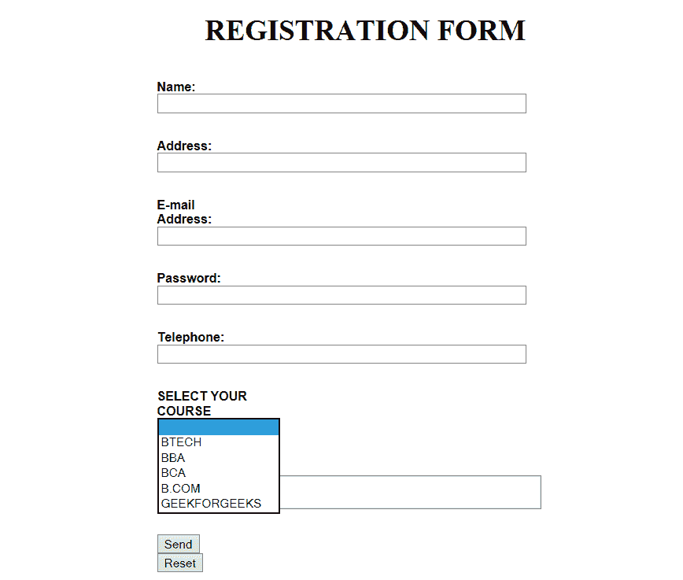

# 使用 HTML 和 JavaScript 的表单验证

> 原文:[https://www . geesforgeks . org/form-validation-use-html-JavaScript/](https://www.geeksforgeeks.org/form-validation-using-html-javascript/)

表单用于网页中，供用户输入所需的详细信息，这些信息会进一步发送到服务器进行处理。表单也称为网络表单或 HTML 表单。表单使用的例子在电子商务网站、网上银行、网上调查等中非常普遍。

**HTML 格式的语法**

```html
<body>
    <h1 style="text-align: center;">REGISTRATION FORM</h1>
    <form name="RegForm" action="/submit.php" 
          onsubmit="return GEEKFORGEEKS()" method="post">
        <p>Name: <input type="text" 
                        size="65" name="Name" /></p>
        <br />
        <p>Address: <input type="text" 
                           size="65" name="Address" /></p>
        <br />
        <p>E-mail Address: <input type="text" 
                               size="65" name="EMail" /></p>
        <br />
        <p>Password: <input type="text" 
                            size="65" name="Password" /></p>
        <br />
        <p>Telephone: <input type="text" 
                             size="65" name="Telephone" /></p>
        <br />

        <p>
            SELECT YOUR COURSE
            <select type="text" value="" name="Subject">
                <option>BTECH</option>
                <option>BBA</option>
                <option>BCA</option>
                <option>B.COM</option>
                <option>GEEKFORGEEKS</option>
            </select>
        </p>
        <br />
        <br />
        <p>Comments: <textarea cols="55" 
                               name="Comment"> </textarea></p>
        <p>
            <input type="submit" 
                   value="send" name="Submit" />
            <input type="reset" 
                   value="Reset" name="Reset" />
        </p>
    </form>
</body>
```

**验证表单:**为了有效使用提交的表单，输入表单的数据需要采用正确的格式，并且需要填写某些字段。用户名、密码、联系信息是表单中强制要求的一些细节，因此需要由用户提供。
下面是验证表单的 HTML、CSS 和 JavaScript 代码。 **HTML** 用来创建表单。 **JavaScript** 验证表单。

**CSS** 设计表单的布局。
T3】表单验证:

```html
<script>
    function GEEKFORGEEKS() {
        var name = document.forms["RegForm"]["Name"];
        var email = document.forms["RegForm"]["EMail"];
        var phone = document.forms["RegForm"]["Telephone"];
        var what = document.forms["RegForm"]["Subject"];
        var password = document.forms["RegForm"]["Password"];
        var address = document.forms["RegForm"]["Address"];

        if (name.value == "") {
            window.alert("Please enter your name.");
            name.focus();
            return false;
        }

        if (address.value == "") {
            window.alert("Please enter your address.");
            address.focus();
            return false;
        }

        if (email.value == "") {
            window.alert(
              "Please enter a valid e-mail address.");
            email.focus();
            return false;
        }

        if (phone.value == "") {
            window.alert(
              "Please enter your telephone number.");
            phone.focus();
            return false;
        }

        if (password.value == "") {
            window.alert("Please enter your password");
            password.focus();
            return false;
        }

        if (what.selectedIndex < 1) {
            alert("Please enter your course.");
            what.focus();
            return false;
        }

        return true;
    }
</script>
```

**造型形式:**

```html
<style>
div { 
    box-sizing: border-box;
    width: 100%;
    border: 100px solid black;
    float: left;
    align-content: center;
    align-items: center;
}

form {   
    margin: 0 auto;
    width: 600px;
}</style>
```

**组合代码【所有上述部分组合在一起】**

```html
<html>
    <head>
        <script>
            function GEEKFORGEEKS() {
                var name = 
                    document.forms["RegForm"]["Name"];
                var email = 
                    document.forms["RegForm"]["EMail"];
                var phone = 
                    document.forms["RegForm"]["Telephone"];
                var what = 
                    document.forms["RegForm"]["Subject"];
                var password = 
                    document.forms["RegForm"]["Password"];
                var address = 
                    document.forms["RegForm"]["Address"];

                if (name.value == "") {
                    window.alert("Please enter your name.");
                    name.focus();
                    return false;
                }

                if (address.value == "") {
                    window.alert("Please enter your address.");
                    address.focus();
                    return false;
                }

                if (email.value == "") {
                    window.alert(
                      "Please enter a valid e-mail address.");
                    email.focus();
                    return false;
                }

                if (phone.value == "") {
                    window.alert(
                      "Please enter your telephone number.");
                    phone.focus();
                    return false;
                }

                if (password.value == "") {
                    window.alert("Please enter your password");
                    password.focus();
                    return false;
                }

                if (what.selectedIndex < 1) {
                    alert("Please enter your course.");
                    what.focus();
                    return false;
                }

                return true;
            }
        </script>

        <style>
            div {
                box-sizing: border-box;
                width: 100%;
                border: 100px solid black;
                float: left;
                align-content: center;
                align-items: center;
            }

            form {
                margin: 0 auto;
                width: 600px;
            }
        </style>
    </head>

    <body>
        <h1 style="text-align: center;">REGISTRATION FORM</h1>
        <form name="RegForm" action="/submit.php" 
              onsubmit="return GEEKFORGEEKS()" method="post">
            <p>Name: <input type="text" 
                            size="65" name="Name" /></p>
            <br />
            <p>Address: <input type="text" 
                               size="65" name="Address" />
          </p>
            <br />
            <p>E-mail Address: <input type="text" 
                            size="65" name="EMail" /></p>
            <br />
            <p>Password: <input type="text" 
                         size="65" name="Password" /></p>
            <br />
            <p>Telephone: <input type="text" 
                        size="65" name="Telephone" /></p>
            <br />

            <p>
                SELECT YOUR COURSE
                <select type="text" value="" name="Subject">
                    <option>BTECH</option>
                    <option>BBA</option>
                    <option>BCA</option>
                    <option>B.COM</option>
                    <option>GEEKFORGEEKS</option>
                </select>
            </p>
            <br />
            <br />
            <p>Comments: <textarea cols="55" 
                              name="Comment"> </textarea></p>
            <p>
                <input type="submit" 
                       value="send" name="Submit" />
                <input type="reset" 
                       value="Reset" name="Reset" />
            </p>
        </form>
    </body>
</html>

// updated by patelshrey115
```

结果表单:



**参考资料:**
[https://en . Wikipedia . org/wiki/form _(html)](https://en.wikipedia.org/wiki/Form_(HTML))

HTML 是网页的基础，通过构建网站和网络应用程序用于网页开发。您可以通过以下 [HTML 教程](https://www.geeksforgeeks.org/html-tutorials/)和 [HTML 示例](https://www.geeksforgeeks.org/html-examples/)从头开始学习 HTML。

JavaScript 最出名的是网页开发，但它也用于各种非浏览器环境。您可以通过以下 [JavaScript 教程](https://www.geeksforgeeks.org/javascript-tutorial/)和 [JavaScript 示例](https://www.geeksforgeeks.org/javascript-examples/)从头开始学习 JavaScript。