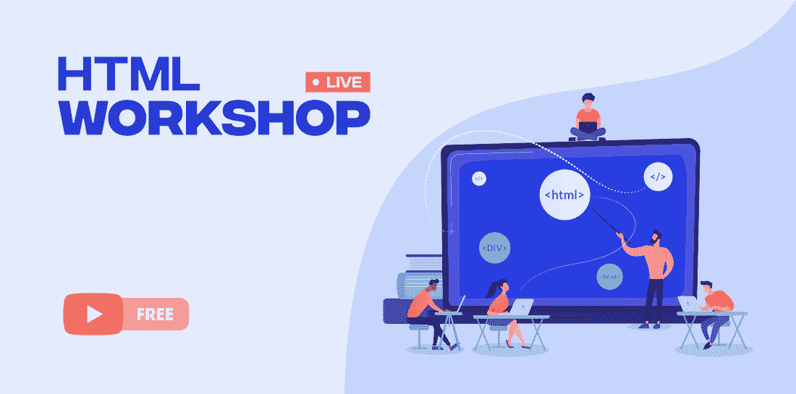

# 初学者免费 HTML 工作坊

> 原文:[https://www . geesforgeks . org/free-html-workshop-for-初学者/](https://www.geeksforgeeks.org/free-html-workshop-for-beginners/)

超文本标记语言是描述网页结构的网页开发的基本单元。该语言负责组织文本、添加图形或视频、定义超链接以及网页上的其他几项核心任务。你可以把它理解为——强大的基础对于一个建筑来说是必不可少的。同样，如果你想在网络开发领域取得成功，这一基本技术技能的知识是非常重要的。

记住这一点，极客博客正在为你提供一个丰富的**基于 HTML 研讨会的课程**，它肯定会帮助你**以一种创新和有趣的方式从头开始学习 HTML，而且不需要任何费用**！！！(是的，你没听错——它在**免费提供……！！**)。请查看以下详细信息:

### 课程详情

在本课程中，将有一个为期 5 周的实时超文本标记语言研讨会，带你了解超文本标记语言的所有基本概念——从标签、元素到表格、类和表单。你将通过各种有趣的活动和例子来学习所有这些 HTML 概念。此外，在每堂课之后，你将会得到一个测验来评估你的技能。

课程已于 2021 年 2 月 16 日**(每周二、三)开始，您可以从这里 直接 [**报名。**](https://practice.geeksforgeeks.org/courses/html-workshop)**

### **课程内容**

**本 HTML 研讨会将提供的详细内容如下:**

### ****第一天(2021 年 2 月 16 日):**[**HTML 简介**](https://practice.geeksforgeeks.org/tracks/html-class1/?batchId=334)**

*   **[*HTML 标签*](https://youtu.be/6n1JH0ZDECs?t=559)**
*   **[*HTML 元素*](https://youtu.be/6n1JH0ZDECs?t=662)**
*   **[*HTML 页面结构*](https://youtu.be/6n1JH0ZDECs?t=695)**
*   **[*HTML 属性*](https://youtu.be/6n1JH0ZDECs?t=1310) *等。***

### ****第二天(2021 年 2 月 17 日):** [**HTML 编辑器**](https://practice.geeksforgeeks.org/tracks/html-class2/?batchId=334)**

*   **[*段落*](https://youtu.be/1XAfZ4vnYsY?t=1024)**
*   **[*标题*](https://youtu.be/1XAfZ4vnYsY?t=1496)**
*   **[*【comment】*](https://youtu.be/1XAfZ4vnYsY?t=1965)*等。***

### ****第三天(2021 年 2 月 23 日):** [**HTML 文本格式**](https://practice.geeksforgeeks.org/tracks/html-class3/?batchId=334)**

*   ***加粗***
*   ***斜体***
*   ***删除***
*   ***插入***
*   ***上标***
*   ***下标等。***

### ****第 4 天(2021 年 2 月 24 日):** [**HTML 样式属性**](https://practice.geeksforgeeks.org/tracks/html-class4/?batchId=334)**

*   ***风格***
*   ***颜色***
*   ***来源***
*   ***比对等。***

### ****第 5 天(2021 年 3 月 2 日):** [**HTML 链接和图片**](https://practice.geeksforgeeks.org/tracks/html-class5/?batchId=334)**

*   ***超链接***
*   ***目标***
*   ***来源***
*   ***影像图***
*   ***背景。等等。***

### ****第 6 天(2021 年 3 月 03 日):** [**HTML 表格**](https://practice.geeksforgeeks.org/tracks/html-class6/?batchId=334)**

*   ***表格样式***
*   ***表格行***
*   ***表头***
*   ***边框***
*   ***填充***
*   ***校准***
*   ***间距等***

### ****第 7 天(2021 年 3 月 09 日):** [**HTML 列表**](https://practice.geeksforgeeks.org/tracks/html-class7/?batchId=334)**

*   ***无序列表***
*   ***订购清单***
*   ***其他列表***
*   ***样本文件说明***

### ****第 8 天(2021 年 3 月 10 日):** [**HTML 类和 id**](https://practice.geeksforgeeks.org/tracks/html-class8/?batchId=334)**

*   ***类及其各种属性***
*   ***标识及其各种属性***
*   ***类别和标识的区别***

### ****第 9 天(2021 年 3 月 16 日):** [**HTML 表单 1**](https://practice.geeksforgeeks.org/tracks/html-class9/?batchId=334)**

*   ***输入***
*   ***标签选择***
*   ***Textarea 等。***

### ****第 10 天(2021 年 3 月 17 日):** [**HTML 表单 2**](youtube.com/watch?v=LeVrSv5NoAo&list=PLJ0OSCymthUwpTMdzMo85mzJd4FUw5KPV&index=10)**

*   ***文字***
*   ***按钮***
*   ***提交等。***

### **常见问题解答**

****Q-1:如何注册课程？****

****Ans。**您需要点击上面提供的注册链接注册研讨会课程，也可以从[官方课程页面](https://practice.geeksforgeeks.org/courses/html-workshop)进行注册。**

****Q-2。谁有资格注册这门课程？****

****Ans。**本课程没有前提条件，假设学生没有之前的编程技能或 it 经验。此外，该课程对每个人免费开放，即免费。**

****Q-3。完成课程后，我会获得任何认证吗？****

****Ans。**可以，一旦完成课程并达到证书标准，考生就可以获得课程完成证书。虽然你需要**至少 60 分**才能获得证书。**

****Q-4。课程将持续多长时间？****

****Ans。**从**2021 年 2 月 16 日**开始为期 5 周的研讨会。课程安排在每周二和周三，从**下午 06:00 到晚上 07:00(IST)**。**

****Q-5。课程内容会在课程结束日期后提供吗？****

****Ans:** 是的，课程内容附带**终身有效**方便学生。**

***这个为期 5 周的 HTML Workshop 是专门为希望踏入编程世界的初学者设计的。在这里，您将学习 HTML 的所有基础知识，并在基于真实场景的项目上进行练习。现在，你还在等什么？注册课程，学习 HTML，把你的想法变成现实世界的网页！***