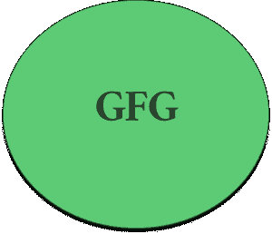
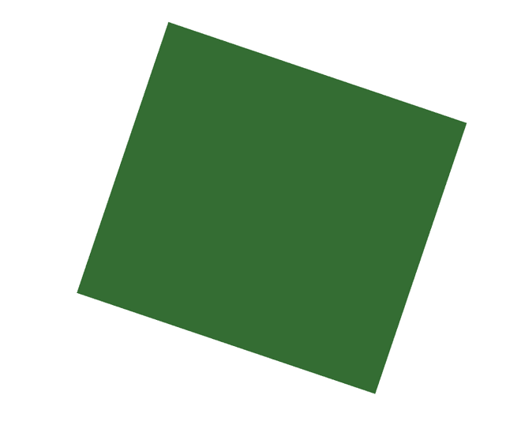
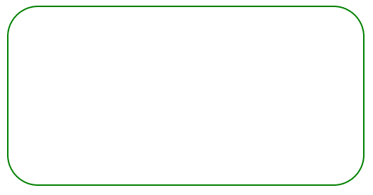

# html 5 中的图形说明

> 原文:[https://www . geeksforgeeks . org/graphics-explain-in-html 5/](https://www.geeksforgeeks.org/graphics-explanation-in-html5/)

在本文中，我们将解释 HTML5 中图形的概念。图形是用于使网页或应用程序在视觉上吸引人的表示，也用于改善用户体验和用户交互。图形的一些例子有照片、流程图、条形图、地图、工程图、建筑设计图等。通常在网页图形中使用的技术有 HTML5 Canvas API、WebCGM、CSS、SVG、PNG、JPG 等。

[**SVG(可伸缩矢量图形)**](https://www.geeksforgeeks.org/html-svg-basics/)

*   这些是由标记语言创建的图像，它们是可重用、简单、高质量的独立图像，也可以导出和导入。
*   它们是跨浏览器友好的，可以在应用程序的客户端和服务器端使用。
*   通过编辑标记语言或使用样式表进行编辑，可以操纵它们来创建动画、混合图像等。
*   文件带有. svg 扩展名。

**示例:**下面演示了标记形式的 SVG。

## 超文本标记语言

```html
<!DOCTYPE html>
<body>
   <svg width="550" height="50" viewBox="0 0 550 50" 
        fill="green" xmlns="http://www.w3.org/2000/svg">
        <text x="0" y="20">I love GeeksforGeeks</text>
    <svg>
</body>
</html>
```

**输出:**


SVG text

**PNG(便携式网络图形)**

*   它们是便携的、静态的和无损的，并带有适当的索引颜色控制。
*   文件带有. png 或。巴布亚新几内亚扩展。
*   跨浏览器友好，并具有流媒体功能。

**示例:**

## 超文本标记语言

```html
<!DOCTYPE html>
<html lang="en">
<head>
    <meta charset="UTF-8">
    <meta http-equiv="X-UA-Compatible" content="IE=edge">
    <meta name="viewport" content="width=device-width, initial-scale=1.0">
</head>
<body>
    
    </img>
</body>
</html>
```

**输出:**



**JPG 或 JPEG(联合摄影专家组)**

*   压缩程度可调的有损压缩。
*   主要用于数字综合摄影，可实现 10:1 的压缩。
*   文件带有. jpg 或 jpeg 扩展名。

**示例:**

## 超文本标记语言

```html
<!DOCTYPE html>
<html lang="en">
<head>
    <meta charset="UTF-8">
    <meta http-equiv="X-UA-Compatible" content="IE=edge">
    <meta name="viewport" content="width=device-width, initial-scale=1.0">    
</head>
<body>
    
    </img>
</body>
</html>
```

**输出:**


**CSS(级联样式表):**

*   这是一种主要用于通过使用代码来设计和显示 HTML 和 SVG 元素的语言。
*   它们是可扩展的，并给用户更多的创造空间。
*   文件通常带有. css 扩展名。

**示例:**

## 超文本标记语言

```html
<!DOCTYPE html>
<html lang="en">
<head>
    <meta charset="UTF-8">
    <meta http-equiv="X-UA-Compatible" content="IE=edge">
    <meta name="viewport" content="width=device-width, initial-scale=1.0">
    <link rel="stylesheet" href="styles.css"></link>
</head>
<body>
   <div class="star"></div>
</body>
</html>
```

**styles.css:** 上面的 HTML 文件中使用了以下代码。

```html
body {
  position: relative;
}

.star {
  position: absolute;
  width: 423px;
  height: 384px;
  left: 456.7px;
  top: 80.34px;
  background: #346d33;
  transform: rotate(18.69deg);
}

```

**输出:**



[**【canvas API:**](https://www.geeksforgeeks.org/html-canvas-basics/)

*   没有 DOM，使用基于矢量的方法来创建对象、图形和形状。
*   画布应用程序接口可以是独立的，也可以与 HTML 或 SVG 集成。
*   广泛用于游戏
*   支持本地现代浏览器的客户端脚本。

**示例:**

## 超文本标记语言

```html
<!DOCTYPE html>
<html lang="en">
<head>
    <meta charset="UTF-8">
    <meta http-equiv="X-UA-Compatible" content="IE=edge">
    <meta name="viewport" content="width=device-width, initial-scale=1.0">   
</head>
<body>
<canvas id="canvas1" width="400" height="200" 
        style="border:2px solid green; border-radius:35px">
    Your browser does not support the canvas element.
</canvas>
</body>
</html>
```

**输出:**



**网络计算机图形元文件**

*   在图形特性方面与 SVG 非常相似。
*   CGM 是矢量图像定义的 ISO 标准。
*   用于航空、汽车工程、技术插图等。
*   它们在传统上没有被广泛使用。更现代的方法是使用支持向量机、画布等。

因此，图形用于制作网页、应用程序或任何需要视觉交互的数字元素，尤其是基于 HTML5 的，需要图形来获得最佳的用户体验。