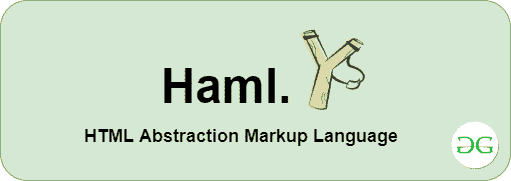

# Haml | HTML 预处理器

> 原文:[https://www.geeksforgeeks.org/haml-html-pre-processor/](https://www.geeksforgeeks.org/haml-html-pre-processor/)

顾名思义，预处理器是整个编译过程的第一阶段，它包括删除注释、扩展宏、包含头文件等。



在 HTML 和 CSS 中，说到编写它，这有点至关重要，因为我们不得不一次又一次地做同样的工作，比如关闭选项卡并对同一元素重复相同的属性，这将导致效率低下。为了克服这些问题，存在预处理器。所以，HTML 中的预处理程序和其他语言中的一样，它接受数据形式的输入，并转换成其他类型的数据。对于像 HTML 和 CSS 这样的标记，流行的预处理器包括 **Haml** 和 **Sass** 。
HTML 预处理器也可以理解为帮助开发者从预处理器的语法中生成 HTML 语法的程序。它将添加一些纯 HTML 语法中没有的独特功能。由于预处理程序是程序，它们总是用某些语言处理，因此 **Haml** 用 HTML 和 **Sass** 处理。
**HAML 预处理器:** Haml 代表汉普顿·卡特林创建的 **HTML 抽象标记语言**，创建它背后唯一的目的就是让标记变得美观。它基本上是一个基于 Ruby 的预处理器，需要 **Ruby** 安装在你的本地机器上，对于苹果操作系统，Ruby 是预先安装的，而对于 windows 用户，可以从[这里](https://rubyinstaller.org/)安装。要安装 Haml，请遵循以下命令。

*   **安装 HAML:**

    ```html
    gem install haml 
    ```

*   **用于将 HAML 转换为 HTML:**

    ```html
    haml index.haml index.html
    ```

**注意:**命令应该在索引文件所在的同一目录下运行。
**例:**

*   **哈默尔预处理器中标题的代码:**

## 超文本标记语言

```html
%body
    %center
        %header
            %h1GeeksforGeeks
        %section
            %bA Computer Science Portal for Geeks
```

*   **HAML 代码转换成 HTML 代码:**

## 超文本标记语言

```html
<body>
    <center>
        <header>
            <h1>GeeksforGeeks</h1>
        </header>
        <section>
            <b>A Computer Science Portal for Geeks</b>
        </section>
    </center>
</body>
```

*   **输出:**上述 HTML 或 HAML 代码的输出。


**注意:**Haml 代码将降低 HTML 代码的代码可读性，但代码在语法上和行上都有所降低。

**优势**

HAML 预处理器被认为对以下几点有用:

*   **更喜欢漂亮的标记:**它以用户友好的体验促进了代码的有组织的标记&也以结构化的方式呈现输出。
*   **DRY(不要重复自己)规则:**它遵循 DRY 方法来丢弃不必要的涉及大量重复的 HTML 代码。

## 超文本标记语言

```html
<body>
2

3
  <!--Heading tags are opened and closed-->
4
<h2>GeeksforGeeks, A Computer Science portal for geeks.</h2>   
5
​
6
  <!--Body is closed-->
7
  </body>
```

HTML 预处理程序通过依赖缩进(而不是文本)来确定元素和代码块的开始和结束位置，从而避免了这一切。它不仅可以在大模板中工作，而且可以生成更小的模板，这使得代码看起来更加清晰。

**输出:**

> %body
> 
> %h2 极客博客，极客的计算机科学门户。

*   **缩进良好的标记应该是首选:**为了改善外观，标记语言应该缩进良好，以便于阅读。它还决定了元素的开始和结束位置。
*   **应该有一个清晰的 HTML 结构:**用一些最小的努力，就有助于保持标记语言有一个清晰的结构&对最终结果的逻辑理解。