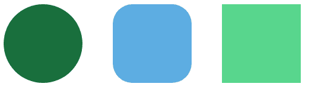
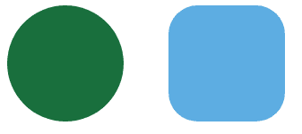
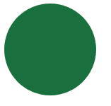

# 使用显示属性

隐藏或显示 HTML 中的元素

> 原文:[https://www . geesforgeks . org/hide-or-show-elements-in-html-using-display-property/](https://www.geeksforgeeks.org/hide-or-show-elements-in-html-using-display-property/)

样式显示属性用于通过使用 JavaScript/jQuery 访问 DOM 元素来隐藏和显示 HTML DOM 的内容。

若要隐藏元素，请将“样式显示”属性设置为“无”。

```html
document.getElementById("element").style.display = "none";

```

若要显示元素，请将“样式显示”属性设置为“块”。

```html
document.getElementById("element").style.display = "block";

```

**Steps to show the working of style display property:**

*   创建一些 div，给它们分配一个 id 或类，然后添加样式。

    ```html
    <div class="circle" id="circle"></div>
    <div class="rounded" id="rounded"></div>
    <div class="square" id="square"></div>
    ```

    *   宽度和高度将设置内容的宽度和高度，边框半径 0%将制作方形边框，50%将制作圆形，25%将制作圆形，浮动将使 div 定位，右边距将使它们在右侧用空格隔开。

    ```html
    <style type="text/css">
           .circle {
               width: 130px;
               height: 130px;
               border-radius: 50%;
               float: left;
               margin-right: 50px;
           }

           .rounded {
               width: 130px;
               height: 130px;
               border-radius: 25%;
               float: left;
               margin-right: 50px;
           }

           .square {
               width: 130px;
               height: 130px;
               border-radius: 0%;
               float: left;
               margin-right: 50px;
           }
    ```

    *   背景色将设置 div 的背景色。

    ```html
    #circle {
               background-color: #196F3D;
           }

    #rounded {
               background-color: #5DADE2;
           }

    #square {
               background-color: #58D68D;
           }
    ```

    *   document.getElementById 将选择具有给定 Id 的 div。

    ```html
    <script type="text/javascript">
            document.getElementById("circle").onclick = function()
    ```

    *   The style.display = "none" will make it disappear when clicked on div.

    ```html
    .style.display = "none";
    ```

    **样式显示属性的实现:**

    ```html
    <html>
    <head>

        <title>Javascript</title>

        <style type="text/css">
            .circle {
                width: 130px;
                height: 130px;
                border-radius: 50%;
                float: left;
                margin-right: 50px;
            }

            .rounded {
                width: 130px;
                height: 130px;
                border-radius: 25%;
                float: left;
                margin-right: 50px;
            }

            .square {
                width: 130px;
                height: 130px;
                border-radius: 0%;
                float: left;
                margin-right: 50px;
            }

            #circle {
                background-color: #196F3D;
            }

            #rounded {
                background-color: #5DADE2;
            }

            #square {
                background-color: #58D68D;
            }
        </style>

    </head>

    <body>

        <div class="circle" id="circle"></div>

        <div class="rounded" id="rounded"></div>

        <div class="square" id="square"></div>

        <script type="text/javascript">
            document.getElementById("circle").onclick = function() {

                document.getElementById("circle").style.display = "none";

            }

            document.getElementById("rounded").onclick = function() {

                document.getElementById("rounded").style.display = "none";

            }

            document.getElementById("square").onclick = function() {

                document.getElementById("square").style.display = "none";

            }
        </script>

    </body>

    </html>
    ```

    **输出:**
    以上代码的输出为:
    

    方形点击后会消失:
    

    同样圆形点击后会消失:
    

    同样，圆形在点击后会消失。

    HTML 是网页的基础，通过构建网站和网络应用程序用于网页开发。您可以通过以下 [HTML 教程](https://www.geeksforgeeks.org/html-tutorials/)和 [HTML 示例](https://www.geeksforgeeks.org/html-examples/)从头开始学习 HTML。