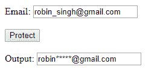

# 使用 HTML 和 JavaScript 隐藏表单中的电子邮件 Id

> 原文:[https://www . geesforgeks . org/hide-the-email-id-in-a-form-using-html-and-JavaScript/](https://www.geeksforgeeks.org/hide-the-email-id-in-a-form-using-html-and-javascript/)

下面的任务将由 HTML 代码构成:
1。**输入字段:**我们将在此字段中输入电子邮件 id。
2。**按钮:**点击此按钮，将显示隐藏的电子邮件 id。
3。**输出字段:**显示隐藏邮件 id 的字段。

## 示例:

```html
Input :robin_singh@gmail.com 
Output :robin*****@gmail.com

Input :geeksforgeeks@gmail.com
Output :geeks*****@gmail.com

```

## HTML 代码:

```html
<!DOCTYPE html>
    <html>
      <head>
         <title></title>
         <script type="text/javascript">
            function test_str(){
               var str = document.getElementById("t1").value ;
               var idx = str.indexOf('@');
               var res = str.replace(str.slice(5, idx), "*".repeat(5));
               document.getElementById("t2").value = res;
             }
         </script>
       </head>
       <body>
         <p>
             Email: <input type="text" placeholder="abc" id="t1"/><br/>
             <input type="button" value="Protect" onclick="test_str()"/><br/>
             Output: <input type="text" id="t2" readonly/>
         </p>
      </body>
  </html>
```

## 输出:

