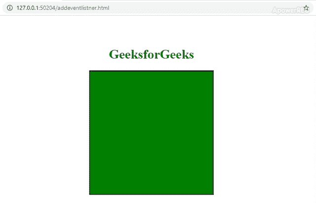

# 【addEventListener 如何在 HTML 5 Canvas 上进行按键操作？

> 原文:[https://www . geeksforgeeks . org/how-addeventlistener-work-for-key down-on-html-5-canvas/](https://www.geeksforgeeks.org/how-addeventlistener-works-for-keydown-on-html-5-canvas/)

[addEventListener()方法](https://www.geeksforgeeks.org/javascript-addeventlistener-with-examples/)是 JavaScript 中的一个内置函数，它接受要监听的事件。每当所描述的事件被触发时要调用的第二个参数意味着每当按下一个键时都会触发**键按下**事件。本文解释了画布上的**按键**事件监听器的工作。

画布需要聚焦以捕捉关键事件。无法将**向下键**事件分配给画布，因为无法用光标聚焦画布。因此，解决这个问题的一个方法是将画布聚焦。

下面的例子说明了 addEventListner 在画布上向下键的工作方式:

**示例:**

```html
<!DOCTYPE html> 
<html>

<head>
    <title>
        Working of addeventlistener
        for keydown on a canvas
    </title>

    <style> 
        body {
            display: block;
            margin-top: 8%;
        }
        h1 { 
            color:green;
            text-align:center; 
        }

        /* Canvas decoration */
        canvas {
            display: block;
            margin: 0 auto;
            background: green;
            border: 2px solid black;
            height: 300px; 
            width: 300px;
        }
    </style>
</head>

<body>
    <h1>GeeksforGeeks</h1>
    <canvas id="canvas"></canvas>

    <script>
        var lastDownTarget, canvas;
        window.onload = function() {
            canvas = document.getElementById('canvas');

            /* For mouse event */
            document.addEventListener('mousedown',
                            function(event) 
            {
                lastDownTarget = event.target;
                alert('Mousedown Event');
            }, false);

            /* For keyboard event */
            document.addEventListener('keydown',
                            function(event) 
            {
                if(lastDownTarget == canvas) {
                    alert('Keydown event! Key pressed: '
                                      + event.key);
                }
            }, false);
        }
    </script>
</body>

</html>
```

**输出:**首先，使用**鼠标向下**事件使画布聚焦。画布聚焦后，触发**按键**事件。
