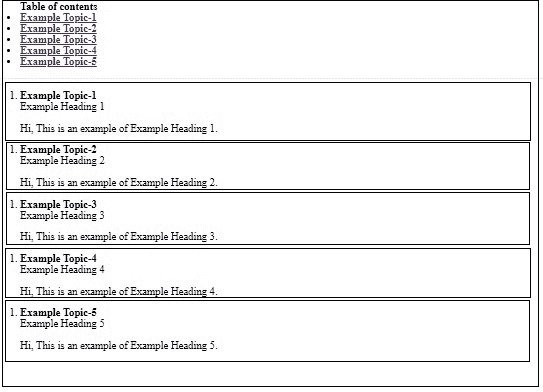
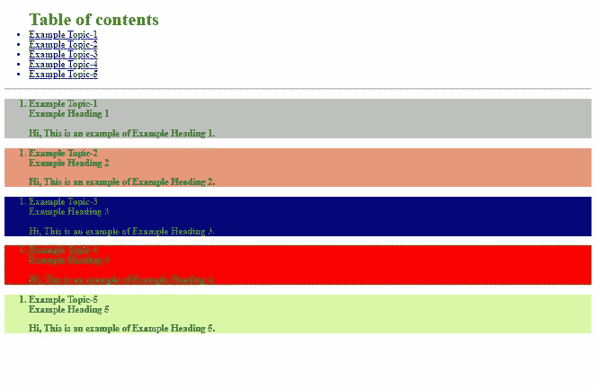

# div 类和 id 在 HTML 中有多大用处？

> 原文:[https://www . geesforgeks . org/how-div-class-and-id-is-in-有用 html/](https://www.geeksforgeeks.org/how-div-class-and-id-is-useful-in-html/)

在本文中，我们将讨论 id、div 和类在 HTML 中是如何有用的。Id、Div 和类是构建 HTML 页面的重要概念。让我们一个一个来讨论。

*   [HTML 中的 Id 属性](https://www.geeksforgeeks.org/html-id-attributes/)*   [HTML 中的 Div 标签](https://www.geeksforgeeks.org/div-tag-html/)*   [Class attributes in HTML](https://www.geeksforgeeks.org/html-class-attribute/)

    现在，考虑一个用例，其中您想要实现任何一本书的目录，并且想要直接进入您想要阅读的主题。在这种情况下，您可以在 HTML5 中实现 Id 属性，并且可以用目录链接所有主题。现在，你可以直接点击，直接进入你想读的话题。

    ```html
    <!DOCTYPE html>
    <html>

    <head>
        <title>Id Div and Class</title>
    </head>

    <body>
        <div>
            <ul>
                <div>
                    <strong>Table of contents</strong>
                    <li>
                        <a href="#T1">
                            <strong>
                                Example Topic-1
                            </strong>
                        </a>
                    </li>

                    <li>
                        <a href="#T2">
                            <strong>
                                Example Topic-2
                            </strong>
                        </a>
                    </li>

                    <li>
                        <a href="#T3">
                            <strong>
                                Example Topic-3
                            </strong>
                        </a>
                    </li>

                    <li>
                        <a href="#T4">
                            <strong>
                                Example Topic-4
                            </strong>
                        </a>
                    </li>

                    <li>
                        <a href="#T5">
                            <strong>
                                Example Topic-5
                            </strong>
                        </a>
                    </li>
                </div>
            </ul>
            <hr />

            <div id="T1">
                <ol>
                    <li>
                        <strong>Example Topic-1</strong>
                        <br />
                        Example Heading 1
                        <p>
                            Hi, This is an example of 
                            Example Heading 1.
                        </p>
                    </li>
                </ol>
            </div>

            <div id="T2">
                <ol>
                    <li>
                        <strong>Example Topic-2</strong>
                        <br />
                        Example Heading 2
                        <p>
                            Hi, This is an example of 
                            Example Heading 2.
                        </p>
                    </li>
                </ol>
            </div>

            <div id="T3">
                <ol>
                    <li>
                        <strong>Example Topic-3</strong>
                        <br />
                        Example Heading 3
                        <p>
                            Hi, This is an example of 
                            Example Heading 3.
                        </p>
                    </li>
                </ol>
            </div>

            <div id="T4">
                <ol>
                    <li>
                        <strong>Example Topic-4</strong>
                        <br />
                        Example Heading 4
                        <p>
                            Hi, This is an example of 
                            Example Heading 4.
                        </p>
                    </li>
                </ol>
            </div>

            <div id="T5">
                <ol>
                    <li>
                        <strong>Example Topic-5</strong>
                        <br />
                        Example Heading 5
                        <p>
                            Hi, This is an example of 
                            Example Heading 5.
                        </p>
                    </li>
                </ol>
            </div>
        </div>
    </body>

    </html>
    ```

    您可以通过执行上面的代码来验证结果。现在，让我们看看页面结构的输出。
    **输出:**
    

    在上面的输出屏幕中，您可以直接看到 Id 和 Div 是如何工作的，也可以看到 Div 对于构建您的网页是如何有用的。

    现在，在这里您将看到如何在 Id 和 Div 以及类的帮助下，通过使用 CSS 为您的网页添加更多的功能。

    ```html
    <!DOCTYPE html>
    <html>

    <head>
        <title>Id Div and Class</title>

        <style>
            #TOC {
                background-color: white;
                color: #009900;
                font-size: 30px;
                font-weight: bold;
                text-align: left;
            }

            .T1 {
                background-color: SILVER;
                color: #009900;
                font-weight: bold;
            }

            .T2 {
                background-color: DARKSALMON;
                color: #009900;
                font-weight: bold;
            }

            .T3 {
                background-color: NAVY;
                color: #009900;
                font-weight: bold;
            }

            .T4 {
                background-color: red;
                color: #009900;
                font-weight: bold;
            }

            .T5 {
                background-color: #daf7a6;
                color: #009900;
                font-weight: bold;
            }
        </style>
    </head>

    <body>
        <div>
            <div>
                <ul>
                    <div id="TOC">
                        <strong>Table of contents</strong>
                    </div>
                    <li>
                        <a href="#T1"><strong>
                                Example Topic-1</strong></a>
                    </li>
                    <li>
                        <a href="#T2"><strong>
                                Example Topic-2</strong></a>
                    </li>
                    <li>
                        <a href="#T3"><strong>
                                Example Topic-3</strong></a>
                    </li>
                    <li>
                        <a href="#T4"><strong>
                                Example Topic-4</strong></a>
                    </li>
                    <li>
                        <a href="#T5"><strong>
                                Example Topic-5</strong></a>
                    </li>
                </ul>
                <hr />

                <div class="T1">
                    <div id="T1">
                        <ol>
                            <li>
                                <strong>
                                    Example Topic-1</strong>
                                <br />
                                Example Heading 1
                                <p>
                                    Hi, This is an example of 
                                    Example Heading 1.
                                </p>
                            </li>
                        </ol>
                    </div>
                </div>

                <div class="T2">
                    <div id="T2">
                        <ol>
                            <li>
                                <strong>Example Topic-2</strong>
                                <br />
                                Example Heading 2
                                <p>
                                    Hi, This is an example of 
                                    Example Heading 2.
                                </p>
                            </li>
                        </ol>
                    </div>
                </div>

                <div class="T3">
                    <div id="T3">
                        <ol>
                            <li>
                                <strong>Example Topic-3</strong>
                                <br />
                                Example Heading 3
                                <p>
                                    Hi, This is an example of 
                                    Example Heading 3.
                                </p>
                            </li>
                        </ol>
                    </div>
                </div>

                <div class="T4">
                    <div id="T4">
                        <ol>
                            <li>
                                <strong>Example Topic-4</strong>
                                <br />
                                Example Heading 4
                                <p>
                                    Hi, This is an example of 
                                    Example Heading 4.
                                </p>
                            </li>
                        </ol>
                    </div>
                </div>

                <div class="T5">
                    <div id="T5">
                        <ol>
                            <li>
                                <strong>Example Topic-5</strong>
                                <br />
                                Example Heading 5
                                <p>
                                    Hi, This is an example of 
                                    Example Heading 5.
                                </p>
                            </li>
                        </ol>
                    </div>
                </div>
            </div>
        </div>
    </body>

    </html>
    ```

    您可以通过执行上面的代码来验证结果。现在，让我们看看页面结构的输出。
    **输出:**
    

    在上面的例子中，您可以直接看到，通过使用 Id，我们可以向不同的标题添加单独的功能，类是通用的，我们可以编写一次 CSS 脚本，并且可以在任何地方使用它，这对于可重用性也很有用。