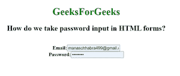

# 如何以 HTML 形式进行密码输入？

> 原文:[https://www . geesforgeks . org/we-how-do-take-password-input-in-html-forms/](https://www.geeksforgeeks.org/how-do-we-take-password-input-in-html-forms/)

在本文中，我们将学习如何在 html 中创建密码输入字段，这可以通过使用 **<输入>** 标记来完成，该标记带有设置为值“**密码**的 t **类型**属性。它涉及用户数据的敏感信息。在对第三方隐藏的视图中，输入密码字段中的文本将被更改为项目符号。

**语法**

```html
<input type="password">
```

**示例代码:**

## 超文本标记语言

```html
<!DOCTYPE html>
<html>
   <head>
      <title>
         How do we take password input in HTML forms?
      </title>
   </head>
   <body style="text-align:center;">
      <h1 style="color:green;">
         GeeksForGeeks
      </h1>
      <h2>How do we take password input in HTML forms? </h2>
      <h4>
         <br>
         Email:<input type="email" id="myemail"><br>
         Password:<input type="password" id="mypasswd"
                         value="geeks12"> 
      </h4>
   </body>
</html>
```

**输出**

