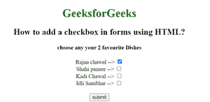

# 如何使用 HTML 在表单中添加复选框？

> 原文:[https://www . geeksforgeeks . org/如何使用 html 在表单中添加复选框/](https://www.geeksforgeeks.org/how-to-add-a-checkbox-in-forms-using-html/)

在本文中，我们将学习如何在 HTML 表单中添加复选框。基本上，复选框用于从各种选项中选择一个或多个选项。它是一个多控制单元，将在屏幕上显示为一个小方块。通常，复选框有 3 种状态，即-选中，未选中&不确定。当用户允许选择多个选项时，它在表单中是必需的。

**方法:**我们有一个简单的方法来完成下面给出的任务-

*   首先，创建一个包含<input>标签的 HTML 文档。
*   现在使用带有<input>元素的类型属性。
*   将类型属性设置为值“复选框”

**语法**

```html
<input type="checkbox">
```

**示例:**

## 超文本标记语言

```html
<!DOCTYPE html>
<html>

<head>
    <title>
        How to add a checkbox in 
        forms using HTML?
    </title>
</head>

<body style="text-align: center;">
    <h1 style="color:green;">
        GeeksforGeeks
    </h1>

    <h2>
        How to add a checkbox in 
        forms using HTML?
    </h2>

    <form>
        <h4>
            choose any your 2 favourite Dishes
        </h4>

        Rajna chawal -->
        <input type="checkbox" name="dish1" 
            id="GFG" value="Rajma chawal" checked>
        <br>

        Shahi paneer -->
        <input type="checkbox" name="dish2" 
            value="Shahi paneer">
        <br>

        Kadi Chawal -->
        <input type="checkbox" name="dish3" 
                value="kadi Chawal">
        <br>

        Idli Sambhar -->
        <input type="checkbox" name="dish4" 
            value="Idli sambhar">
        <br>
        <input type="submit" value="submit">
    </form>
    <br>
</body>

</html>
```

**输出:**

