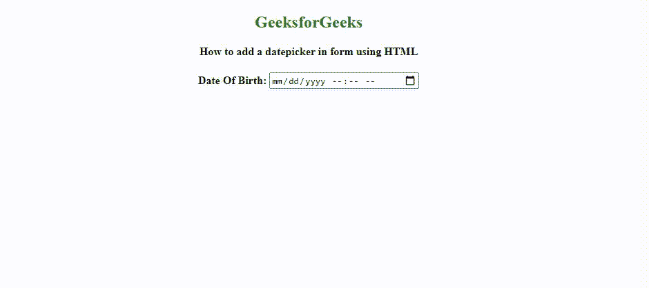

# 如何使用 HTML 在表单中添加日期选择器？

> 原文:[https://www . geesforgeks . org/how-add-a-date picker-in-form-use-html/](https://www.geeksforgeeks.org/how-to-add-a-datepicker-in-form-using-html/)

我们知道日期选择器用于从日历中选择特定的日期。日期选择器是一个交互式的下拉菜单，可以很容易地从日历中选择日期，而不是手动输入。它通常用于保存用户的出生日期，或者在许多情况下也可以使用。

在本文中，我们将学习如何使用 HTML5 在表单中添加日期选择器。

**进场:**

*   创建一个包含带有输入字段的[表单](https://www.geeksforgeeks.org/html-form-tag/)的 HTML 文档。
*   在输入元素中使用设置为**“**[**日期时间-本地**](https://www.geeksforgeeks.org/html-input-typedatetime-local/) **的类型属性。**

**语法:**

```html
<input type="datetime-local">
```

**HTML 代码:**

## 超文本标记语言

```html
<!DOCTYPE html>
<html>

<head>

    <style>                
        body {
            text-align: center;
        }
    </style>
</head>

<body>

    <h2 style="color:green">GeeksforGeeks</h1>

    <b> How to add a datepicker in form using HTML
    </b>

    <br>

    <h4>Date Of Birth:
      <input type="datetime-local" id="Test_DatetimeLocal">
    </h4>
</body>

</html>                    
```

**输出:**



Datepicker 模式