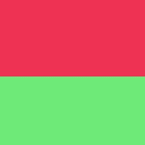
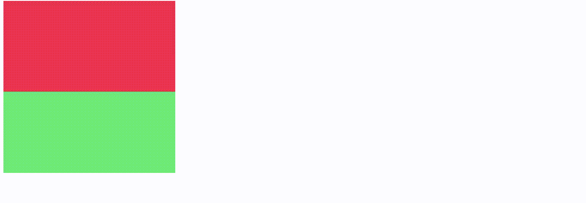

# 如何在 HTML 中的图像顶部添加命中图？

> 原文:[https://www . geesforgeks . org/如何在 html 图像顶部添加点击地图/](https://www.geeksforgeeks.org/how-to-add-a-hit-map-on-top-of-an-image-in-html/)

[HTML](https://www.geeksforgeeks.org/html-tutorials/) 是一种用来设计网页的标记语言。当我们需要制作一个图像也作为链接时，我们使用 **<一个>** 标签，但是在这个标签中，我们的整个图像只链接到一个页面。如果我们想让图像的每个部分都链接到不同的资源，我们会怎么做？于是，这张**地图**的标签就出现了。有了地图，我们可以在图像上创建不同的可点击区域。它包含几个活动区域，每个区域都链接到图像的不同部分。

### **在 HTML 中的图像上添加点击图的步骤:**

**插入图像:**首先，使用< img >标签插入图像，并在 img 标签内添加 **usemap** 属性，如下所示。

## 超文本标记语言

```html
<!DOCTYPE html>
<html>

<head>
    <title>Add hit map in image</title>
</head>

<body>
    <!-- Added a picture using img tag and inserted 
       usemap attribute with a value-->
    
</body>

</html>
```

**创建地图:**添加图像后，使用 **<地图>** 标签添加地图元素，并使用**名称**属性将图像链接到该地图，并使用与我们在 **usemap** 属性中使用的值相同的值，如下所示。

## 超文本标记语言

```html
<!DOCTYPE html>
<html>

<head>
    <title>Add hit map in image</title>
</head>

<body>
    <!-- Added picture using img tag and inserted 
       usemap attribute with a value-->
    

    <!-- Added map tag and inserted name attribute
       with the value we used in usemap-->
    <map name="hitmap"></map>
</body>

</html>
```

**现在在地图标签中添加属性:**我们将在**地图**标签中使用以下属性。

*   **区域**–我们将通过此标签创建可点击区域。
    *   **形状**–我们将在这些值的帮助下定义区域内的形状:矩形、圆形、多边形、默认。
    *   **坐标**–我们将根据形状以像素为单位定义可点击区域的坐标。
        *   rect–我们将使用左上角和右下角的 x 和 y 坐标提供两个坐标。
        *   圆–我们将提供中心的 x 和 y 坐标，后跟半径的长度
        *   poly–我们提供每个角落的 x 和 y 坐标。所以我们至少要取 6 个值。
        *   默认-它占据整个图像。
    *   **href**–我们将使用这个标签来指定区域将指向哪里以及它将打开哪个链接。

## 超文本标记语言

```html
<map name="hitmap">

    <!-- For circle coordinates are- 
      first two coords for starting: 1 is 
      from the left & 2 is from the top.
      and last coordinate is for radius: 
      ex- 150\. -->
    <area shape="circle" coords="1,2,150" 
        href="www.geeksforgeeks.org">

    <!-- For rect coordinates are- 
      first two coords for starting: 1 is 
      from the left & 10 is from the top.
      last two coords for ending: 400 
      from the left, & 500 from the top. -->
    <area shape="rect" coords="1,10,400,500"
        href="www.google.com/gfg">
</map>
```

**在图片顶部创建地图的 HTML 代码:**下图中，点击红色部分会打开[Geeksforgeeks.org](https://www.geeksforgeeks.org/)但是点击绿色部分会打开[Google.com](http://google.com/)。

我们使用了两个矩形的区域标签，并根据位置声明了它们的坐标值。我们需要分配给极客或谷歌。之后，我们使用 href 标签打开他们的网页链接。下面同样提到了这方面的代码。



## 超文本标记语言

```html
<!DOCTYPE html>
<html>
<head>
    <title>Add hit map in image</title>
</head>

<body>

    <!-- Added picture using img tag and inserted 
         usemap attribute with a value-->
    

    <!-- Created map tag with name attribute and 
         value that we have used in usename -->
    <map name="hitmap">

  <!-- Added areaa tags with shape, 
       coords & href attributes-->
  <area shape="rect" 
        coords="0,0,200,200" 
        alt="Gfg" 
        href="https://ide.geeksforgeeks.org/">
  <area shape="rect" 
        coords="0,200,400,400" 
        alt="Google"
        href="www.google.com">
    </map>
</body>

</html>
```

**输出:**



**文章要点:**

*   首先，检查你的图像尺寸，你将使用点击地图，然后根据它使用坐标。
*   **名称**属性必须与您将在 img 标签中的 usemap 中使用的值相同。
*   在形状属性中使用**矩形、圆形和多边形**值。
*   使用地图内区域属性。