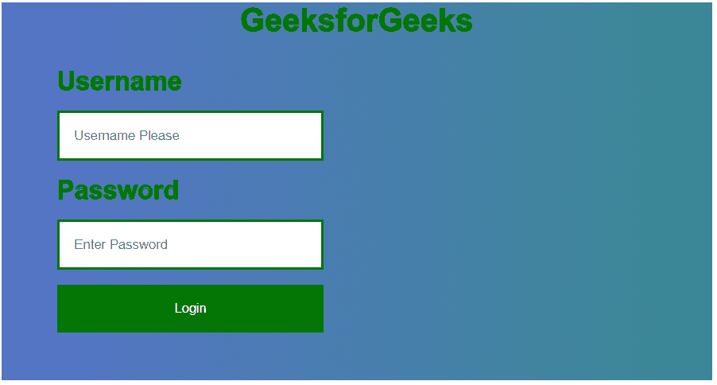
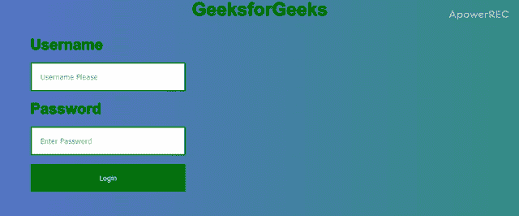

# 如何使用 HTML 和 CSS 向图片添加登录表单？

> 原文:[https://www . geesforgeks . org/如何使用 html 和 css 将登录表单添加到图像/](https://www.geeksforgeeks.org/how-to-add-a-login-form-to-an-image-using-html-and-css/)



许多网站都使用图像上的登录表单。比如包含酒店图片的酒店网站，或者组织一些特殊活动的组织，这些活动的图片和登录表单都在上面。在这种情况下，您可以在该图片上设计登录或注册表单。这种设计将使网站比常规登录或注册表单更具吸引力。要在图像上创建登录表单，您只需要 HTML 和 CSS。下面的例子将说明这个概念的方法。
**创建结构:**在本节中，我们将创建一个基本的网站结构，以在图像上创建登录表单。

*   **HTML 代码:**使用 HTML 代码设计登录表单的结构。

## 超文本标记语言

```html
<!DOCTYPE html>
<html>

<head>
    <meta name="viewport"
          content="width=device-width, initial-scale=1">
</head>

<body>
    <div class="bg-img">
        <h1>GeeksforGeeks</h1>

        <form class="container">
            <b>Username</b>
            <input type="text" placeholder="Username Please"
                    name="username" required>

            <b>Password</b>
            <input type="password" placeholder="Enter Password"
                    name="password" required>

            <button type="submit" class="button">Login</button>
        </form>
    </div>
</body>

</html>
```

**设计结构:**在上一节中，我们已经创建了基础网站的结构。在本节中，我们将设计登录表单的结构。

*   **CSS 结构代码:**

## 半铸钢ˌ钢性铸铁(Cast Semi-Steel)

```html
    <style>
        body {
            height: 100%;
            font-family: Arial, sans-serif;
        }

        * {
            box-sizing: border-box;
        }

        h1 {
            text-align:center;
            color:green;
            -webkit-text-stroke: 1px black;
        }

        /* styling background image */
        .bg-img {
            background-image: url(
"https://media.geeksforgeeks.org/wp-content/uploads/20191212174641/bg1.png");
            min-height: 380px;
            background-size: cover;
        }

        /* Styling the form container */
        .container {
            position: absolute;
            left: 28px;
            top: 50px;
            margin: 20px;
            max-width: 300px;
            padding: 16px;
        }

        b {
            color: green;
            font-size:26px;
            -webkit-text-stroke: 1px black;
        }

        /* Full-width input */
        input[type=text],
        input[type=password] {
            width: 100%;
            padding: 15px;
            margin: 15px 0px;
            border: 2px solid green;
        }

        /* Styling the submit button */
        .button {
            background-color: green;
            color: white;
            padding: 16px 16px;
            border: none;
            cursor: pointer;
            width: 100%;
        }

        .button:hover {
            transform: scale(1.1);
            transition: transform 0.3s;
        }
    </style>
```

**合并 HTML 和 CSS 代码:**这是合并以上两部分后的最终代码。您可以看到，与普通登录表单相比，图像上的左对齐登录表单更有吸引力。

## 超文本标记语言

```html
<!DOCTYPE html>
<html>

<head>
    <meta name="viewport"
        content="width=device-width, initial-scale=1">
    <style>
        body {
            height: 100%;
            font-family: Arial, sans-serif;
        }

        * {
            box-sizing: border-box;
        }

        h1 {
            text-align:center;
            color:green;
            -webkit-text-stroke: 1px black;
        }

        /* styling background image */
        .bg-img {
            background-image: url(
"https://media.geeksforgeeks.org/wp-content/uploads/20191212174641/bg1.png");
            min-height: 380px;
            background-size: cover;
        }

        /* Styling the form container */
        .container {
            position: absolute;
            left: 28px;
            top: 50px;
            margin: 20px;
            max-width: 300px;
            padding: 16px;
        }

        b {
            color: green;
            font-size:26px;
            -webkit-text-stroke: 1px black;
        }

        /* Full-width input */
        input[type=text],
        input[type=password] {
            width: 100%;
            padding: 15px;
            margin: 15px 0px;
            border: 2px solid green;
        }

        /* Styling the submit button */
        .button {
            background-color: green;
            color: white;
            padding: 16px 16px;
            border: none;
            cursor: pointer;
            width: 100%;
        }

        .button:hover {
            transform: scale(1.1);
            transition: transform 0.3s;
        }
    </style>
</head>

<body>
    <div class="bg-img">
        <h1>GeeksforGeeks</h1>

        <form class="container">
            <b>Username</b>
            <input type="text" placeholder="Username Please"
                    name="username" required>

            <b>Password</b>
            <input type="password" placeholder="Enter Password"
                    name="password" required>

            <button type="submit" class="button">Login</button>
        </form>
    </div>
</body>

</html>
```

**输出:**

