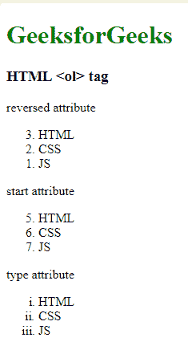

# 如何在 HTML 中给几个标签添加一个父标签？

> 原文:[https://www . geeksforgeeks . org/如何在 html 中添加一个父标签到多个标签/](https://www.geeksforgeeks.org/how-to-add-a-parent-to-several-tags-in-html/)

[< li >标签](https://www.geeksforgeeks.org/html-li-tag/)用于使用 HTML 表示项目列表。它必须包含在父元素中。
**类型列表:**

*   有序列表
*   无序列表
*   定义列表

**有序列表:**[<ol>标签](https://www.geeksforgeeks.org/html-ol-tag/)用于创建有序列表。每个列表项目都以标签< li >开始。
有序列表中使用的属性有:

*   **类型:**可以有五个值(1，A，A，I)。
*   **开始:**设置是否有数值。
*   **值:**用于改变列表中间的编号顺序。

**语法:**

```html
<ol>
   <li>Item1</li>
   <li>Item2</li>
   <li>Item3</li>
</ol>
```

**例:**

## 超文本标记语言

```html
<!DOCTYPE html>
<html>

<head>
    <title>HTML ol tag</title>
</head>

<body>
    <h1 style="color:green;">GeeksforGeeks</h1>
    <h3>HTML <ol> tag</h3>

<p>reversed attribute</p>

    <ol reversed>
        <li>HTML</li>
        <li>CSS</li>
        <li>JS</li>
    </ol>

<p>start attribute</p>

    <ol start=5>
        <li>HTML</li>
        <li>CSS</li>
        <li>JS</li>
    </ol>

<p>type attribute</p>

    <ol type="i">
        <li>HTML</li>
        <li>CSS</li>
        <li>JS</li>
    </ol>

</body>

</html>
```

**输出:**



**无序列表:**ul>标签用于创建无序列表项目。每个列表以< li >标记开始。可以用< li >标记指定的属性有 FILLROUND、CIRCLE、SQUARE。默认情况下，使用磁盘表示。没有必要使用< /li >来结束列表。
**语法:**

```html
<ul>
   <li>Item1</li>
   <li>Item2</li>
   <li>Item3</li>
</ul>
```

**例:**

## 超文本标记语言

```html
<!DOCTYPE html>
<html>

<head>
    <title>HTML ul tag</title>
</head>

<body>
    <h1>GeeksforGeeks</h1>

    <h2>HTML <ul> tag</h2>

<p>GeeksforGeeks courses List:</p>

    <ul>
        <li>Geeks</li>
        <li>Sudo</li>
        <li>Gfg</li>
        <li>Gate</li>
        <li>Placement</li>
    </ul>
</body>

</html>
```

**输出:**


**定义列表:**[<dl>标签](https://www.geeksforgeeks.org/html-dl-tag/)用于创建定义列表。
定义列表由两部分组成:

*   定义术语
*   定义描述

**语法:**

```html
<ul>
   <li>Item1</li>
   <li>Item2</li>
   <li>Item3</li>
</ul>
```

**例:**

## 超文本标记语言

```html
<!DOCTYPE html>
<html>

<head>
    <title>dl tag</title>
    <style>
        h1,
        h2 {
            text-align: center;
        }

        h1 {
            color: green;
        }

        dl {
            margin-left: 20%;
        }
    </style>
</head>

<body>
    <h1>GeeksforGeeks</h1>
    <h2>dl Tag</h2>
    <dl>
        <dt>GeeksforGeeks</dt>

        <dd>
            A Computer Science
            Portal For Geeks
        </dd>
    </dl>
</body>

</html>          
```

**输出:**

