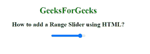

# 如何使用 HTML 添加范围滑块？

> 原文:[https://www . geesforgeks . org/如何使用 html 添加范围滑块/](https://www.geeksforgeeks.org/how-to-add-a-range-slider-using-html/)

在本文中，我们将学习如何在 HTML 中添加范围滑块。因此，正如我们所知，极客使用范围滑块从一系列数字中选择特定的值。我们有从 0 到 100 的默认范围值。

按照给定的步骤完成任务–

**进场:**

*   首先，我们创建一个包含

    <form>元素的 HTML 文档。</form>

*   在表单元素下创建一个<input>元素。
*   使用带有<input>元素的类型属性。
*   将类型属性设置为值“范围”。
*   我们还可以使用最小值、最大值、步长和值属性来设置范围滑块的限制。

**语法:**

```html
<input type="range">
```

**示例:**

## 超文本标记语言

```html
<!DOCTYPE html>
<html>

<head>
    <title>
        How to add a Range Slider using HTML?

    </title>

    <style>
        #Geek_p {
            font-size: 30px;
            color: green;
        }
    </style>
</head>

<body style="text-align:center;">

    <h1 style="color:green;">
        GeeksForGeeks
    </h1>

    <h2>
        How to add a Range Slider using HTML?
    </h2>
    <input type="range" id="Geek_Range" value="90">
</body>

</html>
```

**输出:**

