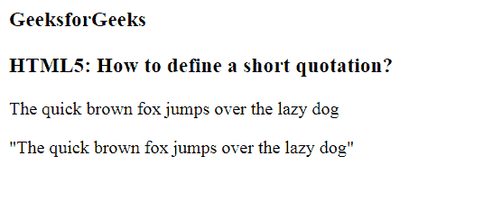
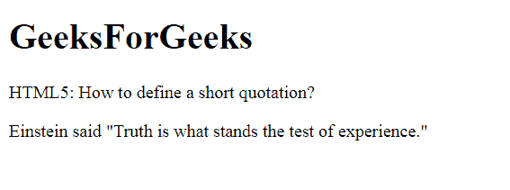

# 如何使用 HTML5 添加短报价？

> 原文:[https://www . geesforgeks . org/how-add-a-short-quote-use-html 5/](https://www.geeksforgeeks.org/how-to-add-a-short-quotation-using-html5/)

在本文中，我们将通过使用 [< q >标签](https://www.geeksforgeeks.org/html-q-tag/)来定义一个简短的引用。它用于在网页上插入引用文本，即不同于正常文本的文本部分。

**语法:**

```html
<q> Quotation Text... </q>
```

**例 1:**

```html
<!DOCTYPE html>
<html>

<head>
    <title>
        Define a short quotation
    </title>
</head>

<body>
    <h3>GeeksforGeeks</h3>

    <h3>
        HTML5: How to define 
        a short quotation?
    </h3>

    <p>
        The quick brown fox jumps 
        over the lazy dog
    </p>

    <!--Inside quotes-->
    <p><q>
        The quick brown fox jumps 
        over the lazy dog
    </q></p>
</body>

</html>
```

**输出:**


**例 2:**

```html
<!DOCTYPE html>
<html>

<head>
    <meta charset="utf-8">
    <title>
        How to define a 
        short quotation
    </title>
</head>

<body>
    <h1>
        GeeksForGeeks
    </h1>

    <h2>
        Define a short quotation?
    </h2>

    <p>
        Einstein said <q>Truth is what
        stands the test of experience.</q>
    </p>
</body>

</html>
```

**输出:**


**支持的浏览器:**

*   谷歌 Chrome
*   微软公司出品的 web 浏览器
*   火狐浏览器
*   歌剧
*   旅行队