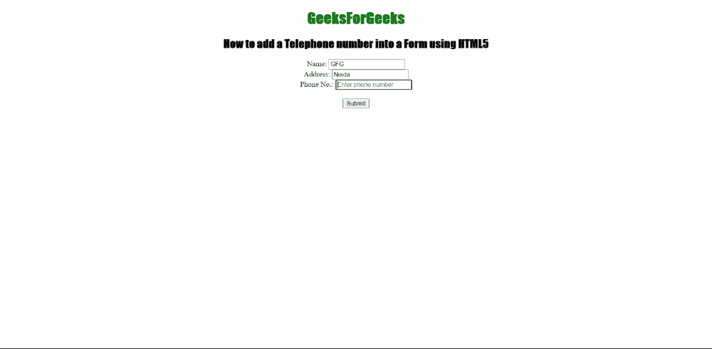

# 如何使用 HTML5 将电话号码添加到表单中？

> 原文:[https://www . geesforgeks . org/如何使用 html5 将电话号码添加到表单中/](https://www.geeksforgeeks.org/how-to-add-a-telephone-number-into-a-form-using-html5/)

在本文中，我们将学习如何将用户的电话号码插入到一个 HTML 表单中。我们知道电话号码有很多优点。电话号码字段是表单的重要组成部分。在与用户直接接触的情况下。用户还可以获得关于表单服务的各种消息或通知。

**方法:**下面是完成任务的基本简单方法。步骤如下

*   创建一个包含 [<输入>](https://www.geeksforgeeks.org/html-input-tag/) 标签的 HTML 文档。
*   使用带有<input>标记的类型属性，该标记被设置为值“tel”。

**语法**

```html
<input type="tel">  
```

**例 1:**

## 超文本标记语言

```html
<!DOCTYPE html>
<html>

<head>
    <title>
        How to add a Telephone number 
        into a Form using HTML5
    </title>

    <style>
        #Geek_p {
            font-size: 30px;
            color: green;
        }

        h1,
        h2 {
            font-family: impact;
        }
    </style>
</head>

<body style="text-align: center">
    <h1 style="color: green">GeeksForGeeks</h1>

    <h2>
        How to add a Telephone number
        into a Form using HTML5
    </h2>
    <form>
        Name:
        <input type="text" 
            placeholder="Enter your name here--" />
        <br />

        Address:
        <input type="text" 
            placeholder="Enter your  permanent Address" />
        <br />

        Phone No.:
        <input type="tel" 
            placeholder="Enter phone number" />
        <br />
        <br />

        <button>Submit</button>
    </form>
</body>

</html>
```

**输出:**



**例 2:**

## 超文本标记语言

```html
<!DOCTYPE html>
<html>

<head>
    <title>
        How to add a Telephone number 
        into a Form using HTML5
    </title>

    <style>
        #Geek_p {
            font-size: 30px;
            color: green;
        }

        h1,
        h2 {
            font-family: impact;
        }
    </style>
</head>

<body style="text-align: center">
    <h1 style="color: green">
        GeeksForGeeks
    </h1>

    <h2>
        How to add a Telephone number
        into a Form using HTML5
    </h2>

    <form>
        Phone No.:
        <input type="tel" 
            placeholder="Enter phone number" />
        <br />
        <br />

        <button>Get OTP</button>
    </form>
</body>

</html>
```

**输出:**

