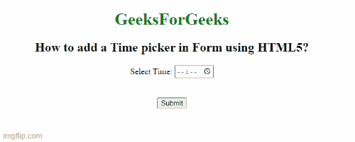

# 如何使用 HTML5 在表单中添加时间选择器？

> 原文:[https://www . geesforgeks . org/如何使用 html5 添加表单中的时间选择器/](https://www.geeksforgeeks.org/how-to-add-a-time-picker-in-form-using-html5/)

我们知道**时间选择器**用于从预先确定的集合中提供 tp 选择单个值。基本上，它创建了一个接受时间的输入字段。我们可以通过点击时钟图标来打开时间选择器。时间选择器的用户界面设计因浏览器而异。

按照以下方法完成任务:

*   首先，我们创建一个包含表单元素的 HTML 文档。
*   在表单下添加一个 [<输入>标记](https://www.geeksforgeeks.org/html-input-tag/)。
*   输入元素使用类型属性。
*   将类型属性设置为值“时间”。

**语法:**

```html
<input type="time"> 
```

**示例:**

## 超文本标记语言

```html
<!DOCTYPE html>
<html>

<head>
    <title>
        How to add a Time picker 
        in Form using HTML5?
    </title>
</head>

<body style="text-align:center;">
    <h1 style="color:green;">
        GeeksForGeeks
    </h1>

    <h2>
        How to add a Time picker 
        in Form using HTML5?
    </h2>

    <form action="#">
        <legend>
            Select Time: 
            <input type="time" name="time">
        </legend>

        <br><br>
        <input type="submit" value="Submit">
    </form>
</body>

</html>
```

**输出:**

