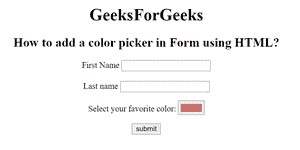

# 如何使用 HTML 在表单中添加拾色器？

> 原文:[https://www . geesforgeks . org/如何使用 html 添加表单颜色选择器/](https://www.geeksforgeeks.org/how-to-add-color-picker-in-a-form-using-html/)

在这篇文章中。我们将学习如何使用 [HTML](https://www.geeksforgeeks.org/html-tutorials/) 在表单中添加颜色选择器。众所周知，颜色选择器也被称为颜色选择器。这是一个用户可以从多种背景颜色集合中选择单一颜色的界面。

**进场:**

*   首先，我们创建一个包含<input>标签的 HTML 文档。
*   使用带有<input>元素的类型属性。
*   将类型属性设置为值“color”。

**语法**

```html
<input type="color">
```

**示例:**

## 超文本标记语言

```html
<!DOCTYPE html>
<html>

<head>
    <title>
        How to add a color picker 
        in form using HTML?
    </title>
</head>

<body style="text-align: center;">
    <h1>
        GeeksForGeeks
    </h1>

    <h2>
        How to add a color picker 
        in Form using HTML?
    </h2>

    <form>
        <label>First Name</label>
        <input type="text" name="fname"><br /><br>
        <label>Last name</label>
        <input type="text" name="lname"><br />
        <p>
            Select your favorite color:
            <input type="color" value="red" id="color" />
        </p>
        <input type="submit" value="submit">
    </form>
</body>

</html>
```

**输出:**

