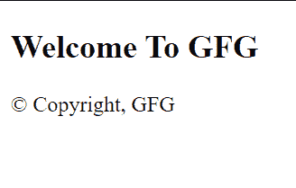

# 如何给你的 HTML 文档添加版权符号？

> 原文:[https://www . geesforgeks . org/如何将版权符号添加到您的 html 文档/](https://www.geeksforgeeks.org/how-to-add-copyright-symbol-to-your-html-document/)

普通键盘上找不到各种符号，包括技术符号、数学符号和货币符号。

有三种方法可以将这样的符号添加到 HTML 文档中

1.  使用十六进制代码
2.  使用超文本标记语言代码
3.  使用 HTML 实体

在本文中我们将说明如何添加**版权** 符号。

**1。使用十六进制代码:**版权符号的十六进制代码为“”。

## 超文本标记语言

```html
<!DOCTYPE html>
<html>

<head>
    <title>Add copyright symbol</title>
</head>

<body>
    <h2>Welcome To GFG</h2>
    <p>© Copyright, GFG</p>
</body>

</html>
```

**输出:**



**2。使用 HTML 代码:**版权符号的 HTML 代码为“”。

## 超文本标记语言

```html
<!DOCTYPE html>
<html>

<head>
    <title>Add copyright symbol</title>
</head>

<body>
    <h2>Welcome To GFG</h2>
    <p>© Copyright, GFG</p>
</body>

</html>
```

**输出:**


**3。使用 HTML 实体:**版权符号的 HTML 实体为“”。

## 超文本标记语言

```html
<!DOCTYPE html>
<html>

<head>
    <title>Add copyright symbol</title>
</head>

<body>
    <h2>Welcome To GFG</h2>
    <p>© Copyright, GFG</p>
</body>

</html>
```

**输出:**


也可以类似地添加其他符号，使用它们各自的代码。