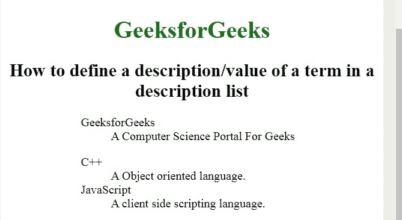
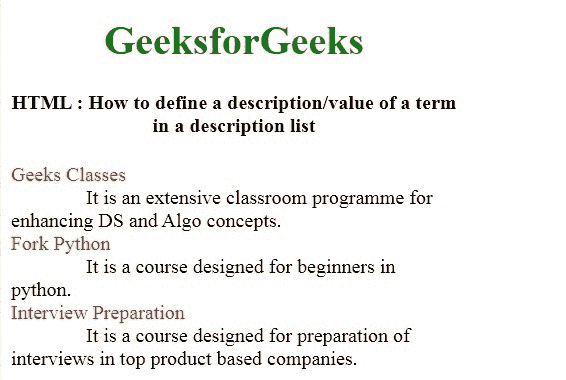

# 如何用 HTML 添加一个元素的描述列表？

> 原文:[https://www . geesforgeks . org/如何使用 html 添加描述元素列表/](https://www.geeksforgeeks.org/how-to-add-description-list-of-an-element-using-html/)

为了定义元素的描述，使用了 **[< dl >标记](https://www.geeksforgeeks.org/html-dl-tag/)** 。此标签与**[<【dt】>](https://www.geeksforgeeks.org/html-dt-tag/)**和 **[< dd >](https://www.geeksforgeeks.org/html-dd-tag/)** 标签一起使用。在 HTML4.1 中定义了定义列表，在 HTML5 中定义了描述列表。

**语法:**

```html
<dl> Contents... </dl>
```

**例 1:**

```html
<!DOCTYPE html>
<html>

<head>
    <title>
        How to add description list
        of an element using HTML?
    </title>

    <style>
        h1,
        h2 {
            text-align: center;
        }

        h1 {
            color: green;
        }

        dl {
            margin-left: 20%;
        }
    </style>
</head>

<body>
    <h1>GeeksforGeeks</h1>

    <h2>
        How to define a description/value
        of a term in a description list
    </h2>

    <dl>
        <dt>GeeksforGeeks</dt>
        <dd>A Computer Science Portal For Geeks</dd>
    </dl>

    <dl>
        <dt>C++</dt>
        <dd>A Object oriented language.</dd>
        <dt>JavaScript</dt>
        <dd>A client side scripting language.</dd>
    </dl>
</body>

</html>
```

**输出:**


**例 2:**

```html
<!DOCTYPE html>
<html>

<head>
    <title>
        How to add description list
        of an element using HTML?
    </title>

    <style>
        h1 {
            color: green;
        }

        h1,
        h2 {
            text-align: center;
        }

        body {
            width: 70%;
        }

        dt {
            color: red;
        }

        dd {
            display: inline;
            margin-left: 60px;
        }
    </style>
</head>

<body>
    <h1>GeeksforGeeks</h1>
    <center>
        <h4>
            How to define a description/value
            of a term in a description list
        </h4>
    </center>

    <dl>
        <dt>Geeks Classes</dt>
        <dd>
            It is an extensive classroom programme
            for enhancing DS and Algo concepts.
        </dd>
        <br />

        <dt>Fork Python</dt>
        <dd>
            It is a course designed for 
            beginners in python.
        </dd>

        <br />
        <dt>Interview Preparation</dt>
        <dd>
            It is a course designed for 
            preparation of interviews in 
            top product based companies.
        </dd>
    </dl>
</body>

</html>
```

**输出:**


**支持的浏览器:**

*   谷歌 Chrome
*   微软公司出品的 web 浏览器
*   火狐浏览器
*   歌剧
*   旅行队