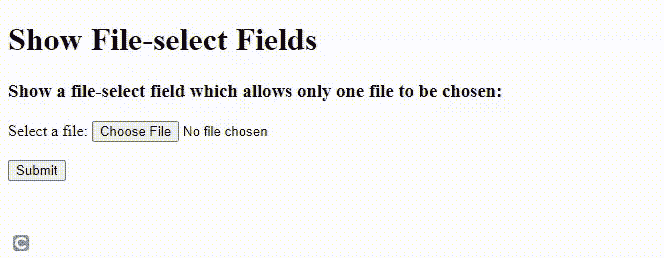

# 如何在 HTML 中给网页增加文件上传功能？

> 原文:[https://www . geesforgeks . org/how-add-file-uploads-function-to-a-网页 in-html/](https://www.geeksforgeeks.org/how-to-add-file-uploads-function-to-a-webpage-in-html/)

当您想要以文档、图像或文件的形式从用户那里获取数据时，允许文件上传到您的网站就变得很有必要。HTML 允许您在 [<输入>](https://www.https://www.geeksforgehttps://www.geeksforgeeks.org/html-input-tag/eks.org/html-input-tag/geeksforgeeks.org/html-input-tag/) 标签的帮助下，通过在网页上添加文件上传按钮，将文件上传功能添加到您的网站。

**[<输入类型=“文件”>](https://www.geeksforgeeks.org/html-input-typefile/)** 定义了一个文件选择字段和一个用于文件上传的**浏览**按钮。****

******语法:******

```html
**<input type="file" id="myfile" name="myfile" />**
```

******示例 1:** 具有文件上传功能的代码如下图所示。输出显示一个文件上传按钮，上面写着“选择文件”。在这个按钮的帮助下，我们可以将文件上传到特定的网站。****

## ****超文本标记语言****

```html
**<!DOCTYPE html>
<html>

<body>
    <h1>Show File-select Fields</h1>

    <h3>
        Show a file-select field which allows
        only one file to be chosen:
    </h3>

    <form action="/action_page.php" 
        enctype="multipart/form-data">

        <label for="myfile">Select a file:</label>
        <input type="file" id="myfile" name="myfile" />
        <br /><br />
        <input type="submit" />
    </form>
</body>

</html>**
```

******输出:**



文件上传

**示例 2:** 要定义允许选择多个文件的文件选择字段，请添加 [' **多个**](https://www.geeksforgeeks.org/how-to-select-multiple-files-using-html-input-tag/) **'** 属性，如下所示。

**语法:**

```html
<input type="file" id="myfile" name="myfile" multiple>
```

这样，我们可以创建一个文件按钮并上传到我们的网站。为了确保从文件中读取文件数据并将其发送到服务器，请确保在表单标签中使用**“enctype = " multipart/form-data "**属性。如果不使用此属性，将不会读取文件数据，而只会读取文件名。

## 超文本标记语言

```html
<!DOCTYPE html>
<html>

<body>
    <h1>Show File-select Fields</h1>

    <h3>
        Show a file-select field which allows
        multiple files to be chosen:
    </h3>

    <form action="/action_page.php" 
        enctype="multipart/form-data">

        <label for="myfile">Select a file:</label>

        <input type="file" id="myfile" 
            name="myfile" multiple="multiple" />

        <br /><br />

        <input type="submit" />
    </form>
</body>

</html>
```

**输出:**

****