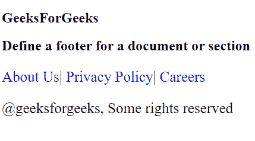

# 如何使用 HTML5 为文档或章节添加页脚？

> 原文:[https://www . geesforgeks . org/如何使用 html5 为文档或节添加页脚/](https://www.geeksforgeeks.org/how-to-add-footer-for-a-document-or-section-using-html5/)

在本文中，我们使用 **[<页脚>标记](https://www.geeksforgeeks.org/html5-footer-tag/)** 来定义文档或节的页脚。HTML 中的这个标签用来定义 HTML 文档的页脚。此部分包含页脚信息(作者信息、版权信息、载体等)。正文标签中使用了 **<页脚>** 标签。**页脚**标签在 HTML5 中是新的。页脚元素需要开始标记和结束标记。

**语法:**

```html
<footer> Contents... </footer>
```

页脚元素通常包含作者信息、版权信息、联系信息、站点地图、返回顶部链接、相关文档等。

**示例:**

```html
<!DOCTYPE html>
<html>

<head>
    <title>
        HTML footer Tag
    </title>

    <style>
        a {
            font-size: 25px;
            text-decoration: none;
        }

        p {
            font-size: 25px;
        }
    </style>
</head>

<body>
    <h2>
        GeeksForGeeks
    </h2>

    <h2>
        Define a footer for a 
        document or section
    </h2>

    <footer>
        <nav>
            <p>
                <a href=
"https://www.geeksforgeeks.org/about/">
                    About Us
                </a>|

                <a href=
"https://www.geeksforgeeks.org/privacy-policy/">
                    Privacy Policy
                </a>|

                <a href=
"https://www.geeksforgeeks.org/careers/">
                    Careers
                </a>
            </p>
        </nav>
        <p>
            @geeksforgeeks, Some 
            rights reserved
        </p>
    </footer>
</body>

</html>   
```

**输出:**


**支持的浏览器:**

*   谷歌 Chrome
*   微软公司出品的 web 浏览器
*   火狐浏览器
*   歌剧
*   旅行队