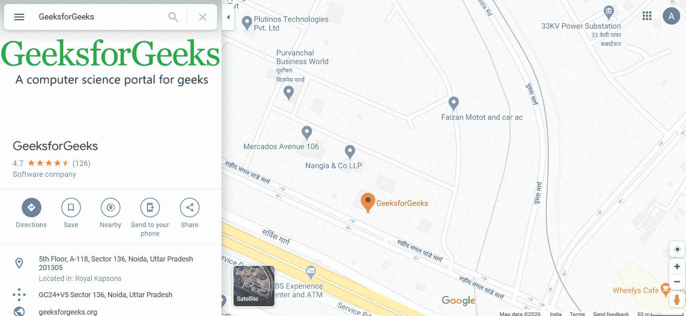
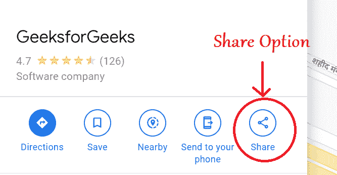
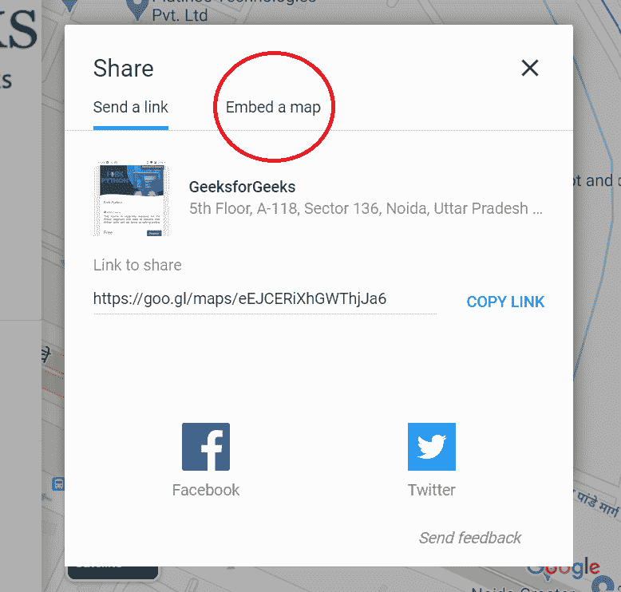
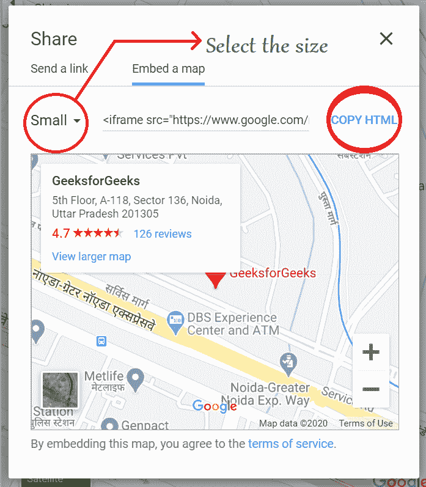
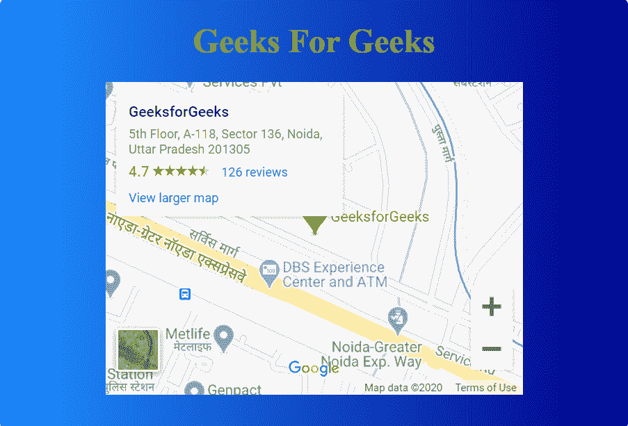

# 如何在 html 页面内部不使用 API 键添加谷歌地图？

> 原文:[https://www . geesforgeks . org/如何添加-Google-map-inside-html-page-无需使用-api-key/](https://www.geeksforgeeks.org/how-to-add-google-map-inside-html-page-without-using-api-key/)

在 HTML 页面中添加谷歌地图有两种方法:

1.  使用应用编程接口密钥
2.  不使用应用编程接口密钥

要学习第一种情况，您可以遵循[文章](https://www.geeksforgeeks.org/add-google-maps-marker-website/)，而要学习另一种情况，请遵循本文。

要在 HTML 页面中插入谷歌地图，请执行以下步骤:

1.  Go to the google maps and search your desired location.

    

2.  Now, you will see share option, click on it.

    

3.  Now, a dialog box will appear go to embed a map option.

    

4.  A new option will be seen inside the dialog box **to copy html**. And you can also select the size of the map you want to embed inside your page.

    

5.  现在把它粘贴到你的 html 页面中。

**示例:**如何在 HTML 页面内部不使用 API 键添加谷歌地图。

```html
<!DOCTYPE html>
<html>

<head>
    <meta charset="utf-8">
    <title>Customize the scroll-bar</title>

    <style media="screen">
        body {
            background-image: linear-gradient(
                to right, dodgerblue, darkblue);
        }
    </style>
</head>

<body>
    <center>
        <h1 style="color:lawngreen;">
            Geeks For Geeks
        </h1>

        <div>
            <!-- Google Map Copied Code -->
            <iframe src=
"https://www.google.com/maps/embed?pb=!1m18!1m12!1m3!1d3506.2233913121413!2d77.4051603706222!3d28.50292593193056!2m3!1f0!2f0!3f0!3m2!1i1024!2i768!4f13.1!3m3!1m2!1s0x390ce626851f7009%3A0x621185133cfd1ad1!2sGeeksforGeeks!5e0!3m2!1sen!2sin!4v1585040658255!5m2!1sen!2sin"
                    width="400"
                    height="300"
                    frameborder="0"
                    style="border:0;"
                    allowfullscreen=""
                    aria-hidden="false"
                    tabindex="0">
            </iframe>
        </div>
    </center>
</body>

</html>
```

**输出:**


**注意:**这个技术的问题是没有使用 API，所以地图没有自动更新，所以每次都要通过改变地图的 HTML 代码来手动更新地图。