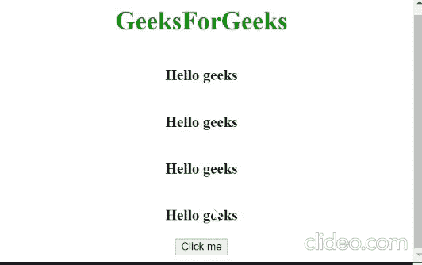

# 如何使用 JavaScript 动态添加 HTML 元素？

> 原文:[https://www . geesforgeks . org/how-add-html-elements-dynamic-use-JavaScript/](https://www.geeksforgeeks.org/how-to-add-html-elements-dynamically-using-javascript/)

在本文中，我们将学习如何使用 JavaScript 动态添加 HTML 元素。需要对 HTML、CSS 和 javascript 有基本的了解。这里我们将使用一个按钮，通过点击这个按钮，我们可以在这个例子中动态地添加一个 HTML 元素。

**方法:**创建一个任意名称的 HTML 文件(Ex-index.html)，然后编写外部的 HTML 模板，取一个按钮，这样当有人点击按钮时，一个 HTML 就会以列表的形式一个一个地动态添加。我们在按钮上附加了一个 onclick 事件侦听器，当有人立即单击该按钮时，该事件将触发并执行回调函数内部附加到该事件侦听器的回调函数，我们需要提到在 onclick 事件触发后我们希望发生的某个任务。

下面是上述方法的实现:

## index.html

```html
<!DOCTYPE html>
<html>

<head>
    <style>
        h1 {
            color: green;
            display: flex;
            justify-content: center;
        }

        #mybutton {
            display: block;
            margin: 0 auto;
        }

        #innerdiv {
            display: flex;
            flex-direction: column;
            justify-content: center;
            align-items: center;
        }
    </style>
</head>

<body>
    <h1>
        GeeksforGeeks
    </h1>
    <div id="innerdiv"></div>
    <button id="mybutton">
        click me
    </button>
    <script>
        document.getElementById("mybutton").
            addEventListener("click", function () {
         document.getElementById("innerdiv").
            innerHTML += "<h3>Hello geeks</h3>";
        });
    </script>
</body>

</html>
```

**输出:**

