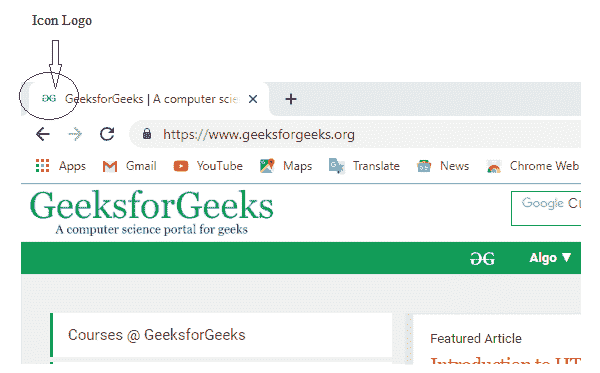
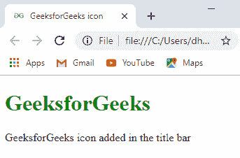

# 如何用 HTML 在标题栏添加图标 logo？

> 原文:[https://www . geesforgeks . org/how-add-icon-logo-in-title-bar-use-html/](https://www.geeksforgeeks.org/how-to-add-icon-logo-in-title-bar-using-html/)

大多数网站在标题栏添加图标或图像标志。图标标志也被称为 favicon。添加收藏夹图标也被认为有利于网站的搜索引擎优化。收藏夹图标是收藏夹图标的组合。

链接属性用于添加 favicon。


**语法:**

```
<link rel="icon" href="icon_path" type="image/icon type">
```

**示例:**

```
<!-- HTML code to add icon in the title bar -->
<!DOCTYPE html>
<html>
    <head>
        <meta charset = "utf-8" />

        <title>
            GeeksforGeeks icon
        </title>

        <!-- add icon link -->
        <link rel = "icon" href = 
"https://media.geeksforgeeks.org/wp-content/cdn-uploads/gfg_200X200.png" 
        type = "image/x-icon">

    </head>

    <body>
        <h1 style = "color:green;">
            GeeksforGeeks
        </h1>

        <p>
            GeeksforGeeks icon added in the title bar
        </p>
    </body>
</html>                    
```

**输出:**
