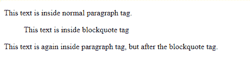
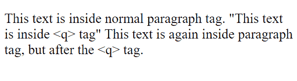
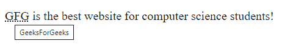
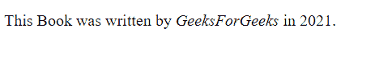

# 如何用 HTML 给网页添加引文和引文？

> 原文:[https://www . geeksforgeeks . org/如何使用 html 向网页添加引文和引文/](https://www.geeksforgeeks.org/how-to-add-quotations-and-citations-to-the-web-pages-using-html/)

在本文中，我们将看到如何使用 HTML 向网页添加引文和引文。当我们创建一个网站或博客时，我们会面临许多想要突出某个文本的情况。我们可以用 HTML 来做同样的事情。HTML 为我们提供了许多标签，如

> , <q>, <abbr>and <cite>to perform different types of text highlighting.</cite></abbr></q>

**1。 [< blockquote >标签](https://www.geeksforgeeks.org/html-blockquote-tag/):**HTML 中的< blockquote >标签用于显示长引号，即它定义了文档中引用了另一个来源的部分。它是块级元素，通常用于长报价。

**语法:**

```html
<blockquote> Contents... </blockquote>
```

**示例:**显示 *< blockquote >* 标签的用法就是一个简单的例子。

## 超文本标记语言

```html
<!DOCTYPE html>
<html>

<body>

    <p>
        This text is inside normal paragraph tag.
    </p>

    <!--Blockquote starts -->
    <blockquote>
        This text is inside blockquote tag
    </blockquote>
    <!--Blockquote ends -->

    <p>
        This text is again inside paragraph 
        tag, but after the blockquote tag.
    </p>
</body>

</html>
```

**输出:**



**2。 [< q >标签](https://www.geeksforgeeks.org/html-q-tag/):**HTML 中的< q >标签用于简短引语。浏览器呈现用引号括起来的写在这个标签中的文本。它是一个内联元素。

**语法:**

```html
<q> Contents... </q>
```

**示例:**显示< q >标签的用法是一个简单的示例。

## 超文本标记语言

```html
<!DOCTYPE html>
<html>

<body>

    <p>
        This text is inside normal paragraph tag.

        <!--q starts -->
        <q>This text is inside <q> tag</q>
        <!--q ends -->

        This text is again inside paragraph 
        tag, but after the <q> tag.
    </p>
</body>

</html>
```

**输出:**



**3。 [<缩写>标签](https://www.geeksforgeeks.org/html-abbr-tag/):**HTML 中的<缩写>标签用于定义元素的缩写。这是一个非常有用的标签，为浏览器、搜索引擎等提供有用的信息。该标签采用属性 ***标题*** ，该属性具有缩写文本的完整形式或实际信息。这个标签是一个内嵌标签。

**语法:**

```html
<abbr> Contents... </abbr>
```

**示例:**显示<缩写>标签的用法就是一个例子。

## 超文本标记语言

```html
<!DOCTYPE html>
<html>

<body>
    <p>
        <abbr title="GeeksForGeeks"> GFG </abbr>
        is the best website for computer 
        science students!
    </p>
</body>

</html>
```

**输出:**



**注意:**如果我们将鼠标悬停在缩写文本上，会得到写在 ***标题*** 属性中的信息作为工具提示。

**4。 [<引用>标签](https://www.geeksforgeeks.org/html-cite-tag/):**HTML 中的<引用>标签用于定义作品的标题。它以*斜体*格式显示文本。这个标签也是内嵌的。

**语法:**

```html
<cite> Contents... </cite>
```

**示例:**显示<引用>标签的用法就是一个例子。

## 超文本标记语言

```html
<!DOCTYPE html>
<html>

<body>
    <p>
        This Book was written by 
        <cite>GeeksForGeeks</cite> in 2021.
    </p>
</body>

</html>
```

**输出:**

