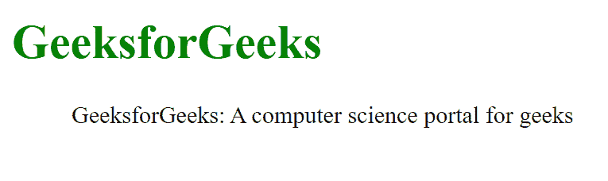

# 如何使用 HTML 添加引用自其他来源的章节？

> 原文:[https://www . geesforgeks . org/如何使用 html 添加引用自其他来源的部分/](https://www.geeksforgeeks.org/how-to-add-section-that-is-quoted-from-another-source-using-html/)

HTML 中的 **< blockquote >标签**用于显示长引语(引用自其他来源的部分)。它会改变对齐方式，使其与众不同。它包含开始和结束标签。

**语法:**

```html
<blockquote> Contents... </blockquote>

```

**例 1:**

## 超文本标记语言

```html
<!DOCTYPE html>
<html>

<body>
    <h1 style="color:green;">
        GeeksforGeeks
    </h1>

    <blockquote>
        GeeksforGeeks: A computer
        science portal for geeks
    </blockquote>
</body>

</html>
```

**输出:**



**例 2:**

## 超文本标记语言

```html
<!DOCTYPE html>
<html>

<body>
    <h1 style="color:green;">
        GeeksforGeeks
    </h1>

    <blockquote cite="www.geeksforgeeks.org">
        GeeksforGeeks:A computer
        science portal for geeks
    </blockquote>
</body>

</html>
```

**输出:**


**支持的浏览器:**

*   谷歌 Chrome
*   微软公司出品的 web 浏览器
*   火狐浏览器
*   旅行队
*   歌剧