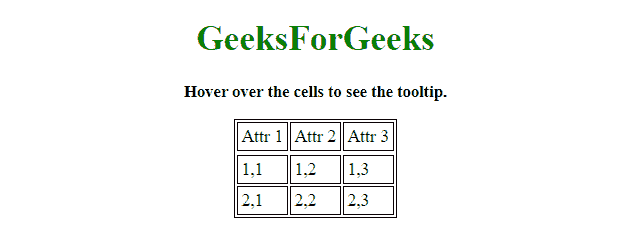
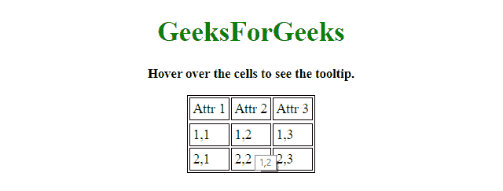
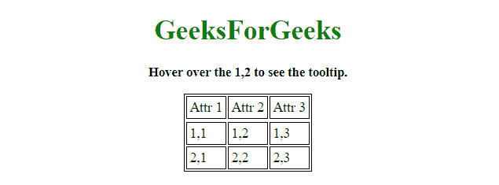
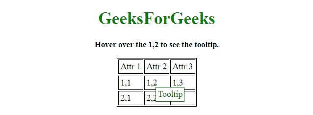

# 如何在不使用 JavaScript 的情况下给 HTML 表格单元格添加工具提示？

> 原文:[https://www . geesforgeks . org/如何将工具提示添加到 html-table-cell-不使用 javascript/](https://www.geeksforgeeks.org/how-to-add-tooltip-to-html-table-cell-without-using-javascript/)

给定一个 HTML 表格，任务是在不使用 JavaScript 的情况下向表格单元格添加工具提示。有两种方法可以解决这个问题，讨论如下:

**方法 1:**

*   创建一个 HTML 表格。
*   将 title 属性(title = "someTitle ")添加到表格单元格以添加工具提示。

**示例 1:** 该示例实现了上述方法。

```html
<!DOCTYPE HTML> 
<html> 

<head> 
    <title> 
        How to add tooltip to HTML table
        cell without using JavaScript ?
    </title>

    <style>
        #MyTable{
            border: 1px solid black;
        }
        #MyTable td{
            border: 1px solid black;
            padding: 3px;
        }
    </style>
</head> 

<body align = "center"> 

    <h1 style = "color:green;" > 
        GeeksForGeeks 
    </h1> 

    <p id = "GFG_UP" style = 
        "font-size: 15px; font-weight: bold;"> 
    </p>

    <center>
        <table id="MyTable">
            <thead>
                <tr>
                    <td>Attr 1</td>
                    <td>Attr 2</td>
                    <td>Attr 3</td>
                </tr>
            </thead>

            <tbody>
                <tr>
                    <td title="1, 1">1, 1</td>
                    <td title="1, 2">1, 2</td>
                    <td title="1, 3">1, 3</td>
                </tr>
                <tr>
                    <td title="2, 1">2, 1</td>
                    <td title="2, 2">2, 2</td>
                    <td title="2, 3">2, 3</td>
                </tr>
            </tbody>
        </table>
    </center>

    <script> 
        var el_up = document.getElementById('GFG_UP');

        el_up.innerHTML = "Hover over the cells "
                        + "to see the tooltip.";
    </script> 
</body> 

</html>
```

**输出:**

*   **悬停在单元格上方前:**
    
*   **悬停在细胞上方后:**
    

**方法 2:**

*   创建一个 HTML 表格。
*   在我们想要添加工具提示的表格单元格中创建一个元素。
*   初始设置**显示:< span >元素无**。
*   每当用户悬停在该特定元素上时，只需将属性更改为**显示:阻止**。

**示例 2:** 该示例实现了上述方法。

```html
<!DOCTYPE HTML> 
<html> 

<head> 
    <title> 
        How to add tooltip to HTML table
        cell without using JavaScript ?
    </title>

    <style>
        #MyTable{
            border: 1px solid black;
        }
        #MyTable td{
            border: 1px solid black;
            padding: 3px;
        }
        .parentCell{
            position: relative;
        }
        .tooltip{
            display: none;
            position: absolute; 
            z-index: 100;
            border: 1px;
            background-color: white;
            border: 1px solid green;
            padding: 3px;
            color: green; 
            top: 20px; 
            left: 20px;
        }
        .parentCell:hover span.tooltip{
            display:block;
        }
    </style>
</head> 

<body align = "center"> 

    <h1 style = "color:green;" > 
        GeeksForGeeks 
    </h1> 

    <p id = "GFG_UP" style = 
            "font-size: 15px; font-weight: bold;">
        Hover over the 1, 2 to see the tooltip. 
    </p>

    <center>
        <table id="MyTable">
            <thead>
                <tr>
                    <td>Attr 1</td>
                    <td>Attr 2</td>
                    <td>Attr 3</td>
                </tr>
            </thead>

            <tbody>
                <tr>
                    <td>1, 1</td>
                    <td class="parentCell">1, 2
                        <span class="tooltip">Tooltip</span>
                    </td>
                    <td>1, 3</td>
                <tr>
                    <td>2, 1</td>
                    <td>2, 2</td>
                    <td>2, 3</td>
                </tr>
            </tbody>
        </table>
    </center>
</body> 

</html>
```

**输出:**

*   **悬停在单元格上方前:**
    
*   **悬停在细胞上方后:**
    