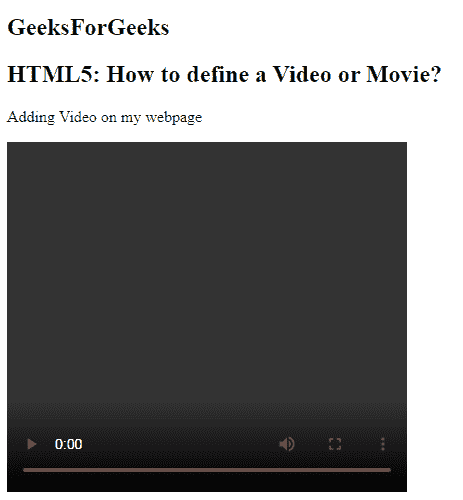

# 如何在 HTML5 中添加视频？

> 原文:[https://www.geeksforgeeks.org/how-to-add-video-in-html5/](https://www.geeksforgeeks.org/how-to-add-video-in-html5/)

在本文中，我们将定义如何使用文档中的 **[<视频>元素](https://www.geeksforgeeks.org/html5-video/)** 添加视频内容。在 HTML5 出现之前，视频只能使用 flash 这样的插件在浏览器中播放，但是在 HTML5 发布之后，在网页中添加视频就像添加图像一样简单。HTML5“视频”元素指定了在网页中嵌入视频的标准方式。网络浏览器通常支持三种不同的格式——MP4、Ogg 和 WebM。下表列出了不同浏览器支持的格式:

**语法:**

```html
<video src="" controls></video>

```

**示例:**

```html
<!DOCTYPE html>
<html>

<head>
    <title>
        Define a Video or move?
    </title>
</head>

<body>
    <h2>
        GeeksForGeeks
    </h2>
    <h2>
        HTML5: How to define 
        a Video or Movie?
    </h2>

    <p>
        Adding Video on my webpage
    <p>
        <video width="400" height="350" controls>
            <source src="myvid.mp4" type="video/mp4">
            <source src="myvid.ogg" type="video/ogg">
        </video>
</body>

</html> 
```

**输出:**



**支持的浏览器:**

*   谷歌 Chrome
*   微软公司出品的 web 浏览器
*   火狐浏览器
*   歌剧
*   旅行队