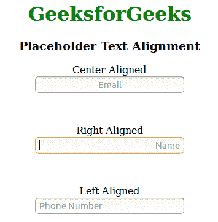
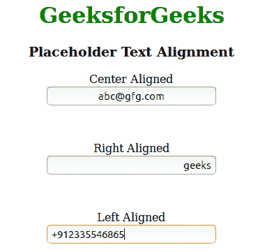

# 如何对齐 HTML 中的占位符文本？

> 原文:[https://www . geesforgeks . org/如何对齐-占位符-html 中的文本/](https://www.geeksforgeeks.org/how-to-align-placeholder-text-in-html/)

占位符属性指定一个简短的提示，描述输入字段/文本区域的预期值。在用户输入值之前，短提示会显示在字段中。在大多数浏览器中，占位符文本通常靠左对齐。选择器使用文本对齐属性来设置占位符中的文本对齐方式。
此选择器可将浏览器改为浏览器。例如:

*   对于 Chrome、Mozilla 和 Opera 浏览器:

    ```html
    ::placeholder
    ```

*   对于互联网浏览器:

    ```html
    :-ms-input-placeholder
    ```

**示例 1:** 此示例仅描述了占位符对齐，它不对齐占位符值。

```html
<!DOCTYPE html>
<html>
    <head>
        <title>Change Placeholder alignment</title>
        <style>
            input[type="email"]::placeholder { 

                /* Firefox, Chrome, Opera */
                text-align: center;
            }
            input[type="text"]::placeholder { 

                /* Firefox, Chrome, Opera */
                text-align: right;
            }
            input[type="tel"]::placeholder { 

                /* Firefox, Chrome, Opera */
                text-align: left;
            }
            input[type="email"]:-ms-input-placeholder {

                /* Internet Explorer 10-11 */
                text-align: center;
            }
            input[type="email"]::-ms-input-placeholder { 

                /* Microsoft Edge */
                text-align: center;
            }
            body {
                text-align:center;
            }
            h1 {
                color:green;
            }
        </style>
    </head>
    <body>
        <h1>GeeksforGeeks</h1>
        <h3>Placeholder Text Alignment</h3>
        <p>Center Aligned<br><input type="email" 
        placeholder="Email"></p><br>

        <p>Right Aligned<br><input type="text" 
        placeholder="Name"></p><br>

        <p>Left Aligned<br><input type="tel" 
        placeholder="Phone Number"></p>
    </body>
</html>                    
```

**输出:**


**示例 2:** 本示例描述了占位符和占位符值对齐。

```html
<!DOCTYPE html>
<html>
    <head>
        <title>Change Placeholder alignment</title>
        <style>
            input[type="email"]{ 
                text-align: center;
            }
            input[type="text"] { 
                text-align: right;
            }
            input[type="tel"] { 
                text-align: left;
            }
            body {
                text-align:center;
            }
            h1 {
                color:green;
            }
        </style>
    </head>
    <body>
        <h1>GeeksforGeeks</h1>
        <h3>Placeholder Text Alignment</h3>
        <p>Center Aligned<br><input type="email" 
        placeholder="Email"></p><br>

        <p>Right Aligned<br><input type="text" 
        placeholder="Name"></p><br>

        <p>Left Aligned<br><input type="tel" placeholder="Phone Number"></p>
    </body>
</html>                    
```

**输出:**
