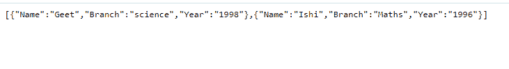

# 如何使用 PHP 通过 HTML 形式在 JSON 文件中追加数据？

> 原文:[https://www . geesforgeks . org/如何通过 html 表单使用 php 在 json 文件中追加数据/](https://www.geeksforgeeks.org/how-to-append-data-in-json-file-through-html-form-using-php/)

本文的目的是使用 PHP 通过 HTML 形式将数据追加到一个 JSON 文件中。

**方法 1:** 如果没有创建 JSON 文件，那么我们创建一个新的 JSON 文件，向它发送数据，并在其中追加数据。要了解如何通过从 HTML 表单中获取数据来创建一个 JSON 文件，[请参考此链接。](https://www.geeksforgeeks.org/how-to-send-data-of-html-form-directly-to-json-file/#:~:text=We%20want%20to%20send%20the,array%20into%20json_encode()%20function.)

**方法 2:** 如果已经创建了 JSON 文件，那么我们直接将数据追加到 JSON 文件中。为了将数据从 HTML 表单发送到 json 文件，我们使用了 **json_encode()** 函数，该函数返回一个 JSON 编码的字符串。

我们正在制作一个用户在 HTML 表单中填写的值数组。然后我们把这个数组传入 **json_encode()** 函数。函数的作用是:返回一个 json 编码的字符串。为了创建一个 JSON 文件，我们使用了 PHP **file_put_contents()** 来将数据写入一个文件。我们在 **file_put_contents()** 函数中传递 2 个参数。第一个参数是我们的文件名，我们希望在其中以 JSON 格式存储数据，第二个参数是我们的 PHP **get_data()** 函数。

根据第一种方法，我们将使用 **json_encode()** 函数成功创建一个 JSON 文件。现在我们的 JSON 文件被创建了。下一个任务是向该 JSON 文件追加数据。要将数据追加到 JSON 文件中，我们必须将之前的数据存储到一个变量中。要获取我们的 JSON 文件的数据，我们将使用**文件 _ 获取 _ 内容()**函数。 **file_get_contents()** 将文件读入一个字符串。为了对字符串进行解码，使用了 **json_decode()** 函数，这是 PHP 中用于对 json 字符串进行解码的内置函数。该函数将 JSON 编码的字符串转换为 PHP 变量。数组中的 HTML 数据被分配给我们解码后的字符串。 **json_encode()** 函数和 **file_put_contents()** 分别用于对字符串进行编码和将内容放入 json 文件。

**示例:**下面的 HTML 和 PHP 代码演示了上述方法。

## 超文本标记语言

```html
<html> 

<head> 
    <meta charset="UTF-8"> 

    <style> 
        h3 { 
            text-align: center; 
        } 

        img { 
            display: block; 
            margin: auto; 
            height: 150px; 
            width: 150px; 
        } 

        .input { 
            margin: 6px; 
            padding: 10px; 
            display: block; 
            margin: auto; 
            color: palevioletred; 
            font-size: 30px; 
        } 

        input { 
            width: 90%; 
            display: block; 
            margin-left: 12px; 
            background: none; 
            background-color: lightyellow; 
        } 

        select { 
            width: 90%; 
            display: block; 
            margin-left: 12px; 
            background: none; 
            background-color: lightyellow; 
        } 

        #heading { 
            font-family: cursive; 
            text-align: center; 
            color: green; 
            padding-top: 20px; 

        } 

        #form_page { 
            height: 500px; 
            width: 50%; 
            display: flex; 
            flex-wrap: wrap; 
            flex-direction: row; 
            margin: auto; 

        } 

        #form_body { 
            border-radius: 12px; 
            height: 330px; 
            width: 450px; 
            background-color: beige; 
            border: 1px solid pink; 
            margin: auto; 
            margin-top: 12px; 
        } 

        #text { 
            color: red; 
            width: 100px; 
        } 

        #head { 
            border-bottom: 2px solid red; 
            height: 100px; 
            background-color: aliceblue; 
        } 

        #submit { 
            background-color: white; 
            width: 70px; 
        } 
    </style> 
</head> 

<body> 
    <form method="post" action="gfg.php"> 

        <div id="form_page"> 

            <div id="form_body"> 
                <div id="head"> 
                    <h1 id="heading">GFG</h1> 
                </div> 
                <br /> 
                <div id="input_name" class="input"> 
                    <input id="name" type="text"
                        Placeholder="Name" name="name"
                        required> 
                </div> 
                <div id="input_class" class="input"> 
                    <input type="text" placeholder= 
                        "Branch" name="branch" required> 
                </div> 
                <div id="input_year" class="input"> 
                    <input id="school" type="text"
                        name="year"
                        placeholder="Year"> 
                </div> 

                <div class="id input"> 
                    <input id="submit" type="submit"
                        name="submit" value="submit"
                        onclick="on_submit()"> 
                </div> 
            </div> 
        </div> 
    </form> 
</body> 

</html> 
```

**PHP 代码:**以下是上述 HTML 文件中使用的“gfg.php”文件。

## 服务器端编程语言（Professional Hypertext Preprocessor 的缩写）

```html
<?php

if ($_SERVER['REQUEST_METHOD'] == 'POST') {

    function get_data() {
        $name = $_POST['name'];
        $file_name='StudentsData'. '.json';

        if(file_exists("$file_name")) { 
            $current_data=file_get_contents("$file_name");
            $array_data=json_decode($current_data, true);

            $extra=array(
                'Name' => $_POST['name'],
                'Branch' => $_POST['branch'],
                'Year' => $_POST['year'],
            );
            $array_data[]=$extra;
            echo "file exist<br/>";
            return json_encode($array_data);
        }
        else {
            $datae=array();
            $datae[]=array(
                'Name' => $_POST['name'],
                'Branch' => $_POST['branch'],
                'Year' => $_POST['year'],
            );
            echo "file not exist<br/>";
            return json_encode($datae);   
        }
    }

    $file_name='StudentsData'. '.json';

    if(file_put_contents("$file_name", get_data())) {
        echo 'success';
    }                
    else {
        echo 'There is some error';                
    }
}

?>
```

**输出:**“studentdata . json”文件的内容以 JSON 格式显示数据。

