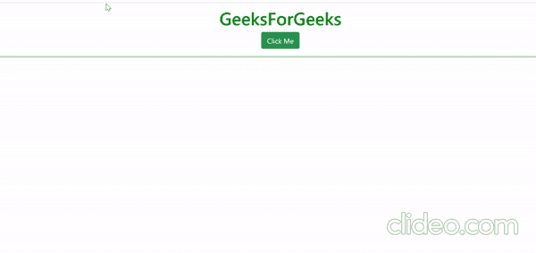

# 如何给克隆的 html 的子标签分配一个 id？

> 原文:[https://www . geesforgeks . org/如何向克隆 html 的子标签分配 id/](https://www.geeksforgeeks.org/how-to-assign-an-id-to-a-child-tag-of-the-cloned-html/)

这里我们用基本的 HTML、CSS、JavaScript、jQuery 和 Bootstrap 来构建这个小示例项目。jQuery 是一个开源库，它简化了 web 应用程序的创建和导航。我们将使用三种 jQuery 方法，如 clone()，append()和 attr()方法来解决这个例子。

> clone()方法复制 select 元素
> 
> attr()方法，用于更改 id、类等属性的名称
> 
> append()方法用于追加 jQuery 集合中每个元素的最后一个子元素

在这里，我们将克隆引导卡，该卡具有名为“cloneme”的 id，并具有子标签，如“**”、“<button>”、“

”标签。</button>** 

**步骤:-**

1.  当用户按下网页用户界面部分的“点击我”按钮时，它将在点击监听器回调时运行。
2.  在这个回调函数中，我们简单地复制了一个 id 为“cloneme”的 HTML 标记。也可以带属性类的 HTML 标签。
3.  在克隆了 Html 代码之后，我们将通过使用标签的属性名称(如 id、class)查找标签来更改**和<button>标签的子标签的 ID。</button>**
4.  在使用标签的属性名找到标签后，我们将通过 jQuery attr()方法更改它的属性名。
5.  将克隆的 HTML 代码附加到目标。

## 超文本标记语言

```
<!DOCTYPE html>
<html>

<head>
    <link href=
"https://cdn.jsdelivr.net/npm/bootstrap@5.0.0-beta1/dist/css/bootstrap.min.css"
          rel="stylesheet"
          integrity=
"sha384-giJF6kkoqNQ00vy+HMDP7azOuL0xtbfIcaT9wjKHr8RbDVddVHyTfAAsrekwKmP1"
          crossorigin="anonymous">
    <meta charset="utf-8">
    <meta name="viewport"
          content="width=device-width">
    <title>geeksforgeeks</title>
</head>

<body>
    <h1 style="margin-top:10px;color:green;text-align:center;">
       GeeksForGeeks
      </h1>
    <button type="button"
            class="btn btn-success"
            id="clickme"
            style="display: block;
  margin-left: auto;
  margin-right: auto;
  justify-content: center;">Click Me</button>
    <hr style="color:green; border: 2px solid">
    <div id="cloneme"
         style="margin-left:10px;display:none;
                margin-top:10px;">
        <div class="card" style="width: 18rem;">
            
            <div class="card-body">
                <p class="card-text" style="text-align:center;">
                    <b id="setID">My Id is 0</b></p>

<p>
                    GeeksforGeeks.org was created with a goal
                     in mind to provide well written, well
                      thought and well explained solutions
                       for selected questions. The core team
                       of five super geeks constituting of
                        technology lovers and computer science
                        enthusiasts have been
                    constantly working in this direction.
                </p>

                <button type="button"
                        id="cancel"
                        class="btn btn-success"
                         style="justify-content:center;margin-left:auto;
                         margin-right:auto;">
                            Cancel
                </button>
            </div>
        </div>
    </div>
    <div id="bucket" class="container-fluid">
        <div>
            <script src="script.js"></script>
            <script src=
"https://cdnjs.cloudflare.com/ajax/libs/jquery/3.5.1/jquery.min.js">
           </script>
            <script>
                let c = 0

                function IDgenerate() {
                    return c++
                }
                $("#clickme").on("click", function() {
                    var cn = IDgenerate();
                    //clone the html code
                    let clone = $("#cloneme").clone()
                        //change the css of parent
                    clone.css("display", "inline-block")
                        //change the id attribute of child tag '<b>'
                    clone.find('#setID').attr("id", cn)
                        //change the text inside the child tag '<b>'
                    clone.find("#" + cn).text("My ID is " + cn)
                        //change the id attribute of child tag '<button>'
                    clone.find("#cancel").attr("id", "cancel" + cn)
                        //add on click listener to the cancel button
                    clone.find("#cancel" + cn).on("click", function() {
                            clone.css("display", "none")
                        })
                        // append the clone to the destination
                    $("#bucket").append(clone)
                })
            </script>
</body>

</html>
```



项目的工作模式