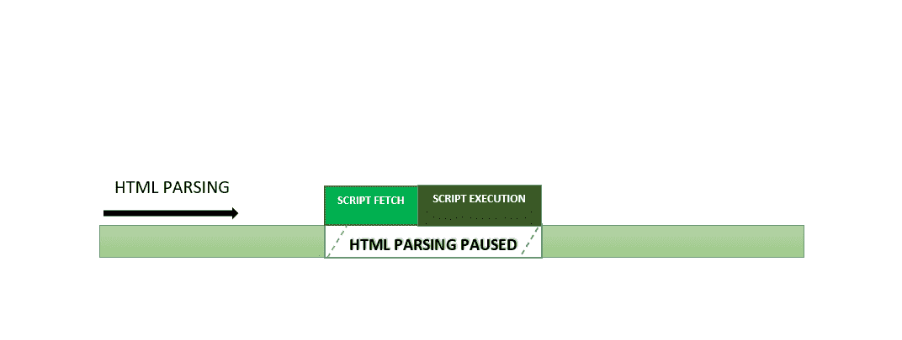
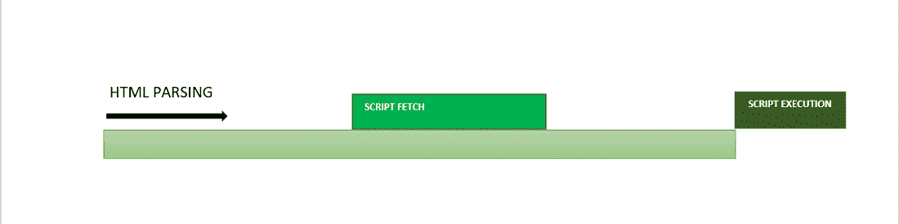
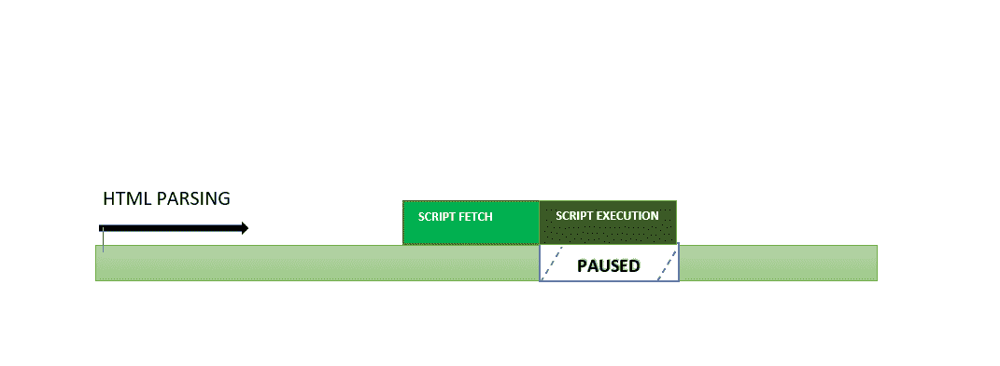

# 如何创作快速加载的 HTML 页面？

> 原文:[https://www . geesforgeks . org/如何创作-快速加载-html-pages/](https://www.geeksforgeeks.org/how-to-author-fast-loading-html-pages/)

一般来说，由于花费时间下载 cookies &图像、样式表和脚本等资产，我们已经看到大多数时候网页加载速度很慢，这反过来又会降低整体用户体验以及网站的流量。这个问题可以通过优化网页来解决，优化网页不仅可以提供高效的性能，而且有助于使网站具有响应能力，同时减少网络服务器和互联网连接的负载。因此，优化网站可以帮助[搜索引擎优化(SEO)](https://www.geeksforgeeks.org/search-engine-optimization-seo-basics/) ，这将提高网站在搜索引擎中的排名(可见性)。这种优化技术可以帮助大，复杂&浩如烟海的网站。

在本文中，我们将学习如何通过最小化文件数量以及减少域查找来保留小文件。还有，如何通过使用外部 CSS 和 JavaScript 文件，缩小和压缩图像和 SVG 资产的大小来优化网页的性能& JavaScript 中

我们将讨论优化网站的所有方面，并通过示例了解它们。

**保持较小的页面大小:**保持较小的页面大小有助于减少页面权重，包括消除不必要的空白、额外的注释、使用外部脚本而不是内联 CSS 文件。

## 超文本标记语言

```html
<!DOCTYPE html>
<html>
<head>
<title>     Page Title
  </title>
</head>
<body>
    <h2>  Welcome To GFG             </h2>

<p> Hello there!.
  </p>

</body>
</html>
```

编写混乱的代码(添加许多空白、注释或不必要的元素)会降低网页的性能。它给页面增加了额外的重量，因此它们变得更重，使网站加载更慢。一些工具可以帮助你摆脱这种无关的代码，比如 HTML Tidy，或者查看[谷歌推荐的工具](https://developers.google.com/speed/docs/insights/MinifyResources)。

我们可以避免使用内嵌的 HTML 属性，这些属性很容易被 CSS 属性替换，例如:

**对齐:**这个属性已经被 CSS 属性-文本-对齐、浮动和垂直-对齐的组合所取代。

## 超文本标记语言

```html
<h2>Welcome To GFG</h2>

<!--Don't write this way-->
<p align="left">Bad code.</p>
```

这可以由以下代码代替:

## 超文本标记语言

```html
<html>

<head>
    <style>
    .left {
        text-align: left;
    }
    </style>
</head>

<body>
    <h2>Welcome to GFG</h2>
    <div class="left">
        <p>
            Use the text-align property 
            to align the text
        </p>
    </div>
</body>

</html>
```

**bgcolor** **和背景:**不使用这些属性来应用背景颜色和图像，而是使用 CSS 属性-背景-图像和背景-颜色。

## 超文本标记语言

```html
<!--Don't write this way-->

<body bgcolor="green">
<h2>Welcome To GFG</h2>

<p>Bad code.</p>

</body>
```

**首选代码:**

## 超文本标记语言

```html
<html>

<head>
    <style>
    body {
        background-color: green;
    }
    </style>
</head>

<body>
    <h1>Welcome To GFG</h1>

<p>
        Use the background-color property
        to set the color of the background
    </p>

</body>

</html>
```

**高度和宽度**:使用同名的 CSS 属性可以达到同样的效果。

## 超文本标记语言

```html
<h2>Welcome To GFG</h2>
<!--Don't write this way-->


<p>Bad code.</p>
```

**首选代码:**

## 超文本标记语言

```html
<html>

<head>
    <style>
    .GFG {
        width: 500px;
        height: 600px;
    }
    </style>
</head>

<body>
    <h3>
        Use the width and height property
        to set the height and weight of an element.
    </h3>
     
</body>

</html>
```

**边框:**使用 CSS 属性-边框应用边框，而不是使用这个 HTML 属性。

## 超文本标记语言

```html
<h1>Welcome To GFG</h1>

<p>Bad Code</p>

<!--Don't write this way-->

```

**首选代码:**

## 超文本标记语言

```html
<html>

<head>
    <style>
    img {
        border: 5px solid #555;
    }
    </style>
</head>

<body>
    <h2>Welcome To GFG</h2>
    <p>
        Use the border property
        to add a border to an image:
    </p>
    
</body>

</html>
```

**最小化文件数量:**文件越多意味着下载一个网页需要的 HTTP 连接越多，因此加载的时间会更长。例如，如果您在网页上使用了太多的图像，那么每个图像文件都需要一个到服务器的连接。这就是为什么太多的文件不仅会增加负载，而且还会通过发送超过允许的 HTTP 请求来阻塞服务器。

减少图像数量并不总是可能的。在这种情况下，您可以使用将多个图像组合成单个图像文件的 CSS 图像精灵，这减少了 HTTP 请求的数量。当您使用单个图像的不同部分时，只需调整尺寸和位置即可使用它。在每个背景图像的情况下，这个技巧都不起作用。

**例:**这个单幅图像的不同部分可以用在不同的地方。假设你想在某个地方只使用第一个符号。


我们可以像下面的例子一样使用 single

## 超文本标记语言

```html
<!DOCTYPE html>
<html>

<head>
    <title>Image Sprites</title>

    <style>
    #navlist {
        position: relative;
    }

    #navlist li {
        margin: 0;
        padding: 0;
        list-style: none;
        position: absolute;
        top: 0;
    }

    #navlist li,
    #navlist a {
        height: 250px;
        display: block;
    }

    .gfg {
        width: 550px;
        left: 0px;
        background: url(
'https://media.geeksforgeeks.org/wp-content/uploads/20211118183409/gfg.jpg');
    }

    .gfg1 {
        width: 60px;
        left: 0px;
        background: url(
'https://media.geeksforgeeks.org/wp-content/uploads/20211118183409/gfg.jpg');
        }
    }
    </style>
</head>

<body>
    <ul id="navlist">
        <li class="gfg">
            <a href="#"></a>
        </li>
        <li class="gfg1">
            <a href="#"></a>
        </li>
    </ul>
</body>

</html>
```

**输出:**


**减少域查找:**每个单独的服务器域在 DNS 查找中花费时间。我们添加到 HTML 文件中的网址越多，就需要更多的 DNA 查找。我们可以使用 Pingdom 网站速度测试工具来检查这一点。这些域名系统查找增加了加载时间，因为在域名系统查找完成之前，无法加载任何其他内容。

请记住，DNS 只查询特定域一次。因此，只有唯一的域名系统查找时间被添加到加载时间。

**注意:**当你通过 Pingdom 运行你的网站不止一次时，它会缓存 DNS，因为它已经知道 IP 信息了。所以，当你第二次测试你的网站时，你会比以前更快地找到你的网站。

**使用外部 CSS 和 JavaScript:** 每当浏览器遇到<脚本>标记时，它就停止处理 HTML，并启动一个 JavaScript 解释器实例来编译 JavaScript 代码。每当它看到<脚本>标签时，它就会这样做，并且只在完成之后处理 HTML。同样的事情发生在内嵌 CSS 的情况下，它被加载到 HTML 页面的<头>标签中。所以，它处理得更快。然而，内嵌显示所有的 CSS 会降低加载速度，因为访问者现在必须在每个页面视图上下载 CSS，而不是从服务器下载一次。最佳实践是使用外部 CSS 和 JavaScript，并且仅在需要时使用内联脚本。

**缩小和压缩图像和 SVG 资产的大小:**大多数 SVG 绘图应用程序都会生成包含大量不必要元数据的 SVG。可以通过配置服务器和应用 gzip 压缩来删除它们。创建更干净的结果 SVG 代码也有助于页面更快地加载。

加载高分辨率图像需要大量时间。在网页上使用图像之前，请调整图像大小。你可以使用任何图像处理工具，如 Photoshop、GIMP、CorelDRAW 等。在线图像调整网站也是有效的。

**使用<脚本异步>和<脚本延迟>在 JavaScript:** 浏览器将停止解析 HTML，只要它看到一个<脚本>标签。因此，如果你使用的是一个缓慢的服务器和一个沉重的脚本，那么这将影响页面加载速度。这就是为什么我们通常在 body 标签的末尾添加所有的脚本。这样，浏览器将首先生成 DOM，然后一个接一个地执行所有脚本。



[**脚本延期**](https://www.geeksforgeeks.org/html-script-defer-attribute/) **:** 当我们添加<脚本延期>时，浏览器会下载页面中包含的脚本，但只有在 HTML 解析完成后才会执行。defer 属性确保按照脚本在文档中出现的相同顺序执行脚本。



[**脚本异步**](https://www.geeksforgeeks.org/html-script-async-attribute/) **:** 异步属性用于告诉浏览器脚本文件可以异步执行。这意味着解析器不必一到达脚本标签就停止提取和执行。下载脚本后，浏览器可以执行脚本，但提取可以与文档解析并行完成。下载完成后，解析器将暂停，等待脚本执行。异步脚本会在脚本加载后立即执行，因此与延迟不同，脚本的顺序可能不一样。



当脚本相互依赖并且执行顺序对您很重要时，可以使用 defer。对于独立的脚本，可以使用异步属性。

**注意:**如果你是在 body 标签之前写你的脚本，那么你就不需要使用 async 或者 defer，因为没有太多的解析可以被阻止。然而，不管出于什么原因，您的脚本被放在其他地方，您可以使用这些属性。