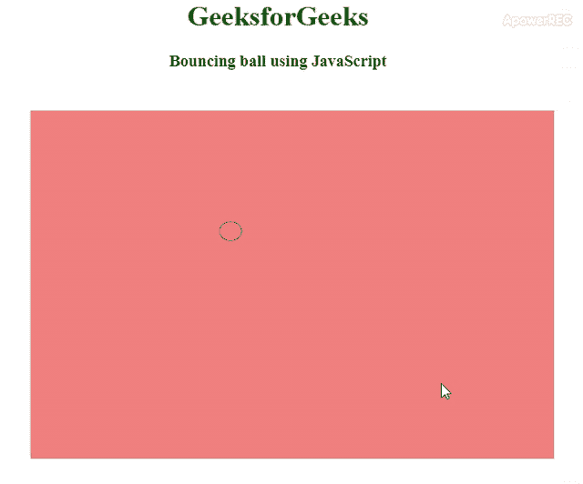

# 如何用 HTML 和 JavaScript 搭建弹球？

> 原文:[https://www . geeksforgeeks . org/如何用 html 和 javascript 构建弹球/](https://www.geeksforgeeks.org/how-to-build-a-bounce-ball-with-html-and-javascript/)


弹跳球可以通过使用 HTML、CSS 和 JavaScript 来创建，并对该球执行一些弹跳操作。可以看相关文章 [**如何使用 CSS 制作平滑弹跳动画。**](https://www.geeksforgeeks.org/how-to-make-smooth-bounce-animation-using-css/) 。
本文将分为两个部分，1 <sup>st</sup> 部分我们将决定弹跳球进行弹跳的区域，基本上，我们将创建一个进行弹跳的画布。2 <sup>和</sup>部分将设计弹跳球，并在其上添加一些弹跳功能。
**HTML & CSS 代码:** HTML 和 CSS 代码用来创建一个球会反弹的画布区域。我们将使用一个画布标签，通过使用 JavaScript，我们将为画布内的球构造圆。画布区域和画布区域的背景颜色由 CSS 定义。

## 超文本标记语言

```html
<!DOCTYPE HTML>
<html>

<head>
    <title>
        Bouncing Ball!!
    </title>
    <style>
        h1 {
            color: green;
        }

        canvas {
            background-color: #F08080;
            width: 600px;
            height: 400px;
            position: absolute;
            top: 20%;
            left: 20%;
        }
    </style>
</head>

<body>
    <center>
        <h1>GeeksforGeeks</h1>
        <h3>Bouncing ball using JavaScript</h3>
        <canvas>
        </canvas>
    </center>
</body>

</html>
```

**JavaScript 代码:**这是本文的核心部分，我们将在这里构造球并执行弹跳任务。我们将分配 4 个变量，2 个用于创建的圆(球)坐标，另外两个用于反弹球的速度。半径变量用于球的半径。我们还需要清除画布区域，为此我们将使用 [**clearReact()功能**](https://www.geeksforgeeks.org/html-canvas-clearrect-method/) 。所有的弹跳和坐标将由 [**数学随机()函数**](https://www.geeksforgeeks.org/javascript-math-random-function/) 决定。

## java 描述语言

```html
<script>
    var canvas = document.querySelector("canvas");

    canvas.width = window.innerWidth;
    canvas.height = window.innerHeight;

    var l = canvas.getContext('2d');

    // x and y are the coordinates of the circle
    // vx and vy are the respective speeds
    var x = Math.floor(Math.random() * innerWidth);
    var y = Math.floor(Math.random() * innerHeight);
    var vx = Math.floor(Math.random() * 2);
    var vy = Math.floor(Math.random() * 4);
    var radius = 20;

    move();

    // This function will do the animation
    function move() {
        requestAnimationFrame(move);

        // It clears the specified pixels within
        // the given rectangle
        l.clearRect(0, 0, innerWidth, innerHeight);

        // Creating a circle
        l.beginPath();
        l.strokeStyle = "black";
        l.arc(x, y, radius, 0, Math.PI * 2, false);
        l.stroke();

        // Conditions so that the ball bounces
        // from the edges
        if (radius + x > innerWidth)
            vx = 0 - vx;

        if (x - radius < 0)
            vx = 0 - vx;

        if (y + radius > innerHeight)
            vy = 0 - vy;

        if (y - radius < 0)
            vy = 0 - vy;

        x = x + vx;
        y = y + vy;

    }
</script>
```

**完整代码:**是以上两部分的组合，即结合 HTML、CSS 和 JavaScript 代码。这段代码将创建一个输出，其中一个设计值将以随机模式反弹。

## 超文本标记语言

```html
<!DOCTYPE HTML>
<html>

<head>
    <title>
        Bouncing Ball!!
    </title>
    <style>
        h1 {
            color: green;
        }

        canvas {
            background-color: #F08080;
            width: 600px;
            height: 400px;
            position: absolute;
            top: 20%;
            left: 20%;
        }
    </style>

</head>

<body>
    <center>
        <h1>GeeksforGeeks</h1>
        <h3>Bouncing ball using JavaScript</h3>
        <canvas>
        </canvas>
        <script>
            var canvas = document.querySelector("canvas");

            canvas.width = window.innerWidth;
            canvas.height = window.innerHeight;

            var l = canvas.getContext('2d');

            // x and y are the co-ordinates of the circle

            // vx and vy are the respective speeds

            var x = Math.floor(Math.random() * innerWidth);
            var y = Math.floor(Math.random() * innerHeight);
            var vx = Math.floor(Math.random() * 2);
            var vy = Math.floor(Math.random() * 4);
            var radius = 20;

            move();

            // This function will do the animation
            function move() {
                requestAnimationFrame(move);

                // It clears the specified pixels within
                // the given rectangle
                l.clearRect(0, 0, innerWidth, innerHeight);

                // Creating a circle
                l.beginPath();
                l.strokeStyle = "black";
                l.arc(x, y, radius, 0, Math.PI * 2, false);
                l.stroke();

                // Conditions sso that the ball bounces
                // from the edges
                if (radius + x > innerWidth)
                    vx = 0 - vx;

                if (x - radius < 0)
                    vx = 0 - vx;

                if (y + radius > innerHeight)
                    vy = 0 - vy;

                if (y - radius < 0)
                    vy = 0 - vy;

                x = x + vx;
                y = y + vy;

            }
        </script>
    </center>
</body>

</html>
```

**输出:**

