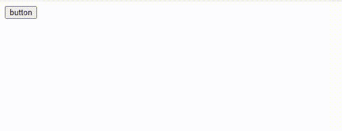

# 如何在 HTML 中调用 JavaScript 函数？

> 原文:[https://www . geesforgeks . org/how-call-JavaScript-function-in-html/](https://www.geeksforgeeks.org/how-to-call-javascript-function-in-html/)

在本文中，我们将看到如何用下面讨论的两种方法在 HTML 中调用 [JavaScript 函数](https://www.geeksforgeeks.org/functions-in-javascript/)。

**方法 1:** 首先，通过输入标签取一个按钮。单击按钮后，您可以看到屏幕上弹出一个对话框，该对话框已经在 JavaScript 函数中声明为警报。 *点击事件 **()*** 功能允许在使用 [**onclick()**](https://www.geeksforgeeks.org/html-dom-onclick-event/) 方法点击该按钮时执行 ***警报()*** 。

**示例:**

## 超文本标记语言

```html
<!DOCTYPE html>
<html>

<body>
    <input type="button" onclick="clickEvent();"
        value="button" />
    <script>
        function clickEvent() {
            alert("Whoo!! You have discovered");
        }
    </script>
</body>

</html>
```

**输出:**



**方法二:**使用 JavaScript 中的*display()**T5】方法，可以看到 h1 标签中的输出 *GeeksForGeeks* 。***

****示例:****

## **超文本标记语言**

```html
<!DOCTYPE html>
<html>

<head>
    <title>Call JavaScript function in HTML</title>
</head>

<body>
    <script>
        function display() {
            document.write("<h1>GeeksForGeeks</h1>");
        }
        display();
    </script>
</body>

</html>
```

****输出:****

**

h1 标签**