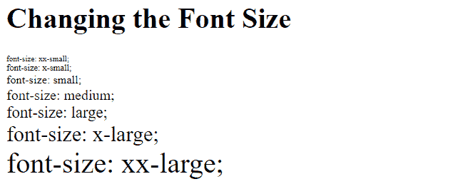

# 如何在 HTML 中改变字体大小？

> 原文:[https://www . geesforgeks . org/how-to-change-font-size-in-html/](https://www.geeksforgeeks.org/how-to-change-font-size-in-html/)

要改变任何文本的字体大小，我们可以使用 [CSS 字体大小属性](https://www.geeksforgeeks.org/css-font-size-property/)，或者一些 HTML 关键字有一些固定的字体大小，但是我们也可以通过使用这个 CSS 属性来改变它们。

**语法:**

```html
font-size: medium|xx-small|x-small|small|large|x-large|
xx-large|smaller|larger|length|initial|inherit;
```

**示例:**

## 超文本标记语言

```html
<!DOCTYPE html> 
<html> 
    <head> 
        <title> 
            CSS font-size property 
        </title> 

        <!-- CSS style to set font-size property -->
        <style> 
            .xxsmall { 
                font-size:xx-small; 
            } 
            .xsmall { 
                font-size:x-small; 
            } 
            .small { 
                font-size:small; 
            } 
            .medium { 
                font-size:medium; 
            } 
            .large { 
                font-size:large; 
            } 
            .xlarge { 
                font-size:x-large; 
            } 
            .xxlarge { 
                font-size:xx-large; 
            } 
        </style> 
    </head> 

    <body> 
        <h1>Changing the Font Size</h1> 

        <div class = "xxsmall">font-size: xx-small;</div> 
        <div class = "xsmall">font-size: x-small;</div> 
        <div class = "small">font-size: small;</div> 
        <div class = "medium">font-size: medium;</div> 
        <div class = "large">font-size: large;</div> 
        <div class = "xlarge">font-size: x-large;</div> 
        <div class = "xxlarge">font-size: xx-large;</div> 
    </body> 
</html>
```

**输出:**



字体大小